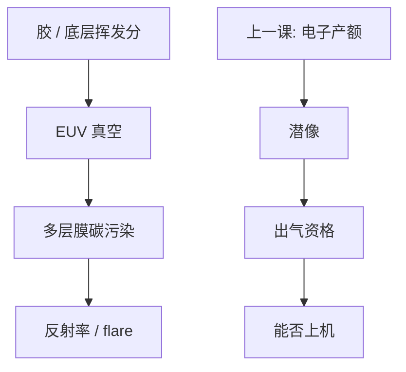

# 放气

真空里胶会吐分子；吐到多层膜上就是污染光学，灵敏度再好也过不了出气签核。

<footer>—— 据 ASML 与抗蚀剂厂商对 EUV 胶放气 / 光学污染的公开讨论整理</footer>

[上一课](/litho/euv-secondary-electron)把二次电子产额写成潜像核。缺口是同一套膜在真空扫描时还会挥发：碳氢与酸、配体碎片打到投影镜的 Mo/Si 多层膜上，反射率与 flare 一起坏。本课钉放气。随机缺孔留给[下一课](/litho/stochastic-holes），不在这里用平均 CD 代替缺陷尾。

## 问题

EUV 在真空中投影。CAR 的 PAG、淬灭剂、残留溶剂，锡氧胶的配体与小分子，底层的挥发分，都会在曝光与烘烤后继续出气。DUV 浸没有镜头最后表面与水的污染账；EUV 换成多层膜与膜（pellicle）的碳污染、氧化。ASML 公开把抗蚀剂出气资格当作上机条件：不是实验室对比度够就能进 NXE。

缺口不是再提高产额，而是卫生。把「更敏」写成无条件目标，会选出出气最凶的配方。把污染全部写成光源锡屑，会漏掉晶圆侧的碳氢。

### 出气资格不是灵敏度曲线

公开流程用见证片（witness sample）一类方法看膜层反射率损失或碳生长，再决定这支胶能不能进量产腔。数字与规程是厂商与用户合同，本课不编阈值、不编小时数。要记住的是：签核对象是光学寿命，不是 CD。

氢环境可以清一部分碳，却也带来膜与胶的其他化学。出气合格不等于「可以随便加剂量」。剂量高，曝光时间长，同一挥发速率下积分污染更大——与产能会计同一条时间轴。

## 方法

栈一起管：胶、底层、面涂（若有）、烘烤把溶剂赶掉的程度。底层课已经说过它可以当阻挡，也可以自己成为源。换胶族必须重做出气，不能假设锡氧比 CAR 更干净或更脏——配体挥发与有机 PAG 是不同物种。轨道上的后烘、延迟时间改变残留溶剂，出气指纹会变。

机台侧：气流、温度、氢清洗、pellicle 是否挡住一部分物种。这些是设备课，本课只要求胶的出气数据与机台资格匹配，而不是只报 RLS。

### 与成像正交、与窗口相关

出气不直接改 TCC。它改长期 flare 与反射率，从而慢慢改剂量到达和对比。短期则是资格门槛：过不了门，再好的 NILS 也印不成。CD 窗签核必须附带「这支胶已出气合格」，否则工艺窗是实验室窗。

## 机制

曝光打断键，小分子从自由体积里扩散到真空。EUV 每次吸收能量高，碎片通道比 DUV 光解更杂。物种落到多层膜上，改变周期膜的光学厚度与吸收，局部反射率下降，散射上升，像面台基（flare）抬高——暗区剂量上升，化学上又去打淬灭剂库存。于是卫生失败会回头变成成像失败，只是时间尺度是镜片寿命，不是单场。

锡氧胶的无机骨架本身不易挥发，配体和溶剂仍会。CAR 的酸与淬灭剂是已知的 DUV 污染源，在真空里同样在场。公开讨论把「低出气」写成与灵敏度并列的配方约束，而不是验收之后的环保附录。

计量胶、BARC、底部抗反射在 DUV 轨道上的出气经验，不能直接当 EUV 多层膜合同。真空、氢、13.5 nm 光学是另一套材料兼容表。

## 边界

不写见证片的具体纳米碳厚规格，不编某型号镜片的寿命小时。不把光源 tin debris 与胶放气合成一个「污染」桶——锡屑是光源课，碳氢是本课。随机缺失下一课才成为良率墙；出气合格的胶仍可以因光子稀疏而缺孔。

DUV 193 nm 镜头出气/浸出已在面涂课；本课对象是 EUV 真空光学。不要把浸没 leaching 的水分析仪方法原样搬来当 EUV 资格。二次电子产额再高，也买不走出气门：上一课的灵敏度与本课的卫生是两条签核，缺一不可。

## 小结

- EUV 胶与底层的挥发分污染多层膜；出气资格是上机门槛。
- 更敏若换来更凶的出气，不是净收益；剂量积分放大污染。
- 底层可挡可源；换胶族必须重做资格。
- 污染抬 flare，长期会回头改成像，短期则是能不能进腔。
- 缺孔统计下一课；本课不代替随机尾。
- 灵敏度与出气资格是两条签核，缺一不可。
- 出处：ASML 对 EUV 抗蚀剂出气与光学污染的公开要求；胶栈公开讨论。
