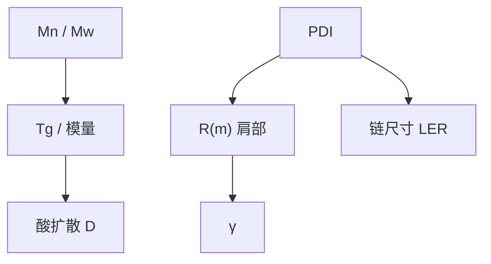

# 聚合物分子量与分布

平均分子量定膜的内聚、溶解与 $T_g$；分布宽度定有没有一群短链先溶、一群长链留下毛边。一个 $M_w$ 不够签核。

<footer>—— 据聚合物 Flory–Fox / 分子量分布通称；抗蚀剂溶解与 LER 叙述见 Mack</footer>

[上一课](/litho/underlayer-adhesion)把失败分成界面剥与体内撕。缺口是体内：成膜聚合物的平均分子量与多分散性（PDI）。本课钉这两项，作为「从光子到轮廓」课序的收束。下一单元换成计数噪声，从[酸与淬灭剂计数](/litho/acid-quencher-counting)起。

## 问题

抗蚀剂树脂不是单一链长。$M_n$、$M_w$ 与 $\mathrm{PDI}=M_w/M_n$ 决定：$T_g$（Flory–Fox 方向）、溶解速率对脱保护的敏感、显影时链是整根离开还是碎片脱落、膜的模量与倒塌。$M_w$ 太低：暗侵蚀高、膜软、倒得早；$M_w$ 太高：清底慢、残胶、内聚过强但溶解开关变钝。

缺口不是再写 $R(m)$ 公式，而是：$R$ 的参数来自一群链的统计。PDI 宽，短链在阈值以下就开始溶，肩变圆，$\gamma$ 看起来掉了；长链尾巴贡献颗粒感 LER。把 LWR 全部写成酸扩散，会漏掉这一截材料散粒。

### 保护基分数不是分子量

RD 的 $m$ 是保护基还在的比例，沿同一根链可以不均匀。高分子量链要许多次脱保护才整根可溶，这是 Notch 形状的聚合物来源之一。换 $M_w$ 等于换 Notch，不必换显影液。

GPC 测的是溶液里的分布，交联或团聚会撒谎。批次资格用同一套 GPC 方法，不要混用绝对光散射与相对聚苯乙烯标样还不声明。

## 方法

资格：GPC 的 $M_n$、$M_w$、PDI，加上 $T_g$、$E_0$、暗侵蚀、LWR。实验：只换分子量批次、固定 PAG/碱，看衬度曲线肩部与高频 LER。与[自由体积](/litho/tg-free-volume)联合：分子量升，$T_g$ 升，$D$ 往往降——PEB 核与溶解开关同时动，必须成套冻结。

金属氧化物胶的「分子量」换成团簇尺寸分布，统计角色类似，化学不同。本课默认有机树脂；MOR 随机课再换语言。

## 机制

显影是溶剂化链进入溶液。短链扩散快、所需极性翻转少，在争夺带暗侧先被挖走，边缘出现缺口；长链拖在亮侧，留下须状。酸扩散核把这些事件在空间上抹一层，但抹不掉链尺寸这一档的散粒——它会进后课 PSD 的中高频。倒塌：模量大致随 $M_w$ 升，深宽比可以多活一点，代价是溶解。

PAG 加载很高时，小分子本身也增塑、并贡献另一套计数；树脂 $M_w$ 的影响被稀释。配方是联合的，本课禁止只报「树脂 10k」而不报 PAG。

交联负胶把「分子量」在 PEB 里做大，分布被反应改写。正胶脱保护则是把有效可溶分子量降下来。极性相反，分布统计仍在。

## 边界

不把某树脂 8 kDa 写成所有 ArF 层标准。不发明 GPC 谱图。平均场轮廓仿真用一个 $R(m)$，等于忽略 PDI；随机 MC 才会抽样链。下一单元从酸/碱分子计数开始，聚合物链是并列的离散源，本课只把分布当作那次抽样的材料前置。

## 小结

- $M_n$、$M_w$、PDI 改 $T_g$、溶解开关与链尺寸 LER。
- Notch 与 $\gamma$ 的肩有一部分来自链长统计，不只来自 $R$ 公式形状。
- 换分子量批次等于换核与换显影参数，要成套资格。
- 下一单元进入计数噪声，平均场到此收束。
- 出处：Flory–Fox 量级；Mack 对抗蚀剂溶解与聚合物的讨论。
