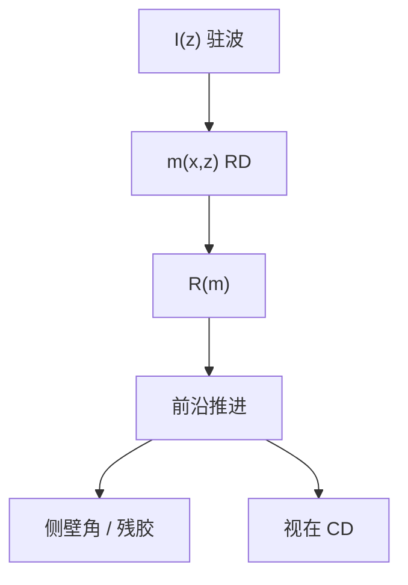

# 胶轮廓仿真

集总模型给出一条边的位置；刻蚀要的是侧壁角、残胶与底部圆角。轮廓仿真把 $R$ 在三维里走完。

<footer>—— 据 Mack 对显影前沿与抗蚀剂剖面；PROLITH / SAMPLE 一类仿真的公开框架整理</footer>

[上一课](/litho/lumped-parameter-model)用 LPM 预言 CD。缺口是几何：同一 CD 可以配直壁、T-top、footing 或波纹，刻蚀偏置完全不同。本课钉胶轮廓仿真。衬度 $\gamma$ 作为从剖面读出的材料规格，留给[下一课](/litho/resist-gamma)。

## 问题

溶解前沿是运动界面。算法上可以是元胞去除、水平集或射线追踪，物理输入仍是上一课之前的那条链：Dill / 产酸 → PEB RD → $R(m)$。输出是 $z=h(x,y)$ 的浮雕，以及是否清底。LPM 把 $h$ 收成「穿或没穿」的一条 $x$；轮廓仿真保留 $h(x)$ 的形状。

缺口不是再写 Mack 四参数，而是：何时必须付三维代价。侧壁角进干法、残胶进开短路、驻波波纹进 LER 的 $z$ 向分量——这些 LPM 看不见。[驻波与 BARC](/litho/standing-wave-barc) 已经说明 $I(z)$ 振荡；本课是它在剖面上的读出。

### 计量切在哪一层

CD-SEM 俯视把三维收成一条「视在边」，受充电、收缩、算法阈值影响。仿真要对的是声明过的计量，而不是把顶 CD、底 CD、中高 CD 混报。主干 [CD-SEM](/litho/cd-sem-scatterometry) 会再写仪器；本课只要求轮廓输出可切多层。

Oldham / Neureuther 的 SAMPLE 与 Mack 的 PROLITH 是这条链的历史实现，不是两套物理。课标是框架，不是软件手册。

## 方法

网格：横向分辨率要能看见 NILS 与 $\ell$，轴向要能看见驻波半周期 $\lambda/(2n)$。边界：基底不溶、顶部可有表面抑制（胺、TARC）。时间步积到工艺显影时间，再加过显影看暗侵蚀。校准仍用 FEM + 剖面 SEM 或 AFM，不能只用俯视 CD——那会把 LPM 重新装回「看起来像轮廓仿真」。

OPC 全芯片不跑这套。轮廓仿真用在层资格、热区、High-NA 薄膜能否清底。[紧凑胶模型](/litho/resist-compact-model) 吃的是本课标定过的有效边，不是替代本课。

## 机制

表面抑制剂让顶部 $R$ 下降，形成 T-top；底部剂量不足或界面二次电子过多形成 footing——后者在 EUV 底层课出现过，轮廓仿真是它的几何。驻波给出侧壁条纹，酸扩散沿 $z$ 糊一部分，于是「看起来直」可能是核把波纹熨平，而不是 BARC 已经够好。换 PEB 让剖面变直时，要问 LWR 有没有一起糊掉。

倒塌是显影后的毛细力学，仿真若只做到干的浮雕，不会自动倒。[图形倒塌](/litho/pattern-collapse) 是另一次加载；本课输出是倒塌分析的几何输入。

负胶 / NTD 前沿从「该留下的」一侧长，算法符号要翻。金属氧化物网络的「溶解」可能是配体区被去掉，水平集仍可用，速率函数要换族。

## 边界

不写具体求解器的 CFL 条件。不把某次会议的剖面 SEM 当所有 ArF 层的标准壁角。随机单元之前，轮廓是平均场；MC 会在同一几何上叠毛边，本课不抽分子。

下一课从均匀垫的剩余厚度定义 $\gamma$，那是轮廓仿真在大面积极限下的退化，不是另一套显影物理。

## 小结

- 轮廓仿真推进 $R$ 的三维前沿，补上 LPM 丢掉的侧壁与残胶。
- 校准必须含剖面，不能只用俯视 CD。
- 驻波、T-top、footing 是 $I(z)$ 与表面/界面条件的读出。
- 全芯片仍走紧凑边；本课服务资格与热区。
- 出处：Mack 抗蚀剂剖面；SAMPLE / PROLITH 公开框架。
