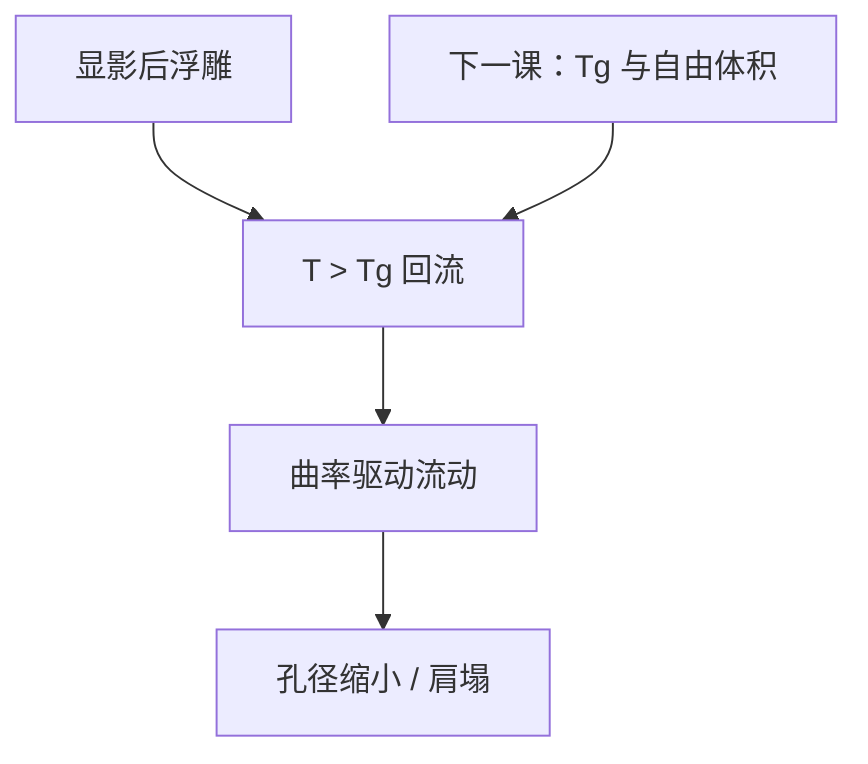

# 胶的热流与回流

显影已经切出浮雕之后，再加热可以把棱角流圆、把孔收小：这是黏滞流动，不是第二次 PEB 催化。

<footer>—— 据产线回流（resist reflow）工艺通称；聚合物流动见 Tg 以上的黏度语言</footer>

[上一课](/litho/dose-focus-coupling)把曝光–显影窗写到平均 CD。缺口是显影后还可以再动一次几何：热回流。接触孔缩小、侧壁修圆、有时故意把线端变钝，都走这条路。本课钉回流。流动能不能发生，取决于玻璃化温度与自由体积，留给[下一课](/litho/tg-free-volume)。

## 问题

PEB 发生在显影前，对象是酸与保护基。回流发生在显影后（有时在硬烘），对象是已经成形的聚合物浮雕。温度够高、时间够长，表面张力驱动材料从高曲率处流向低曲率处：孔的顶角变圆、孔径缩小，线的肩变塌。光学剂量没有再写一次，CD 却变了——故障隔离时若仍去拧扫描机，会拧错执行器。

缺口不是再讲 Arrhenius 催化，而是：这是流体力学尺度的质量守恒，潜像化学已经冻结（除非残留溶剂还在塑化）。把回流写成「又一次 PEB」，会把酸核和黏度混成一个烘箱配方。

### 故意回流与事故回流

孔层有时故意回流来买更小的 ADI 孔。线层通常禁止：肩一塌，CD 与侧壁角一起漂，刻蚀转移失控。同一条热板程序，对孔是工艺，对线是缺陷。规格必须按图形类别写。

回流改变的是显影后体积分配，不增加衬度。NILS 不够的孔回流之后可以变圆变小，但随机缺孔不会被「流没」；材料从四周挤入，LCDU 可能更差。

## 方法

旋钮：温度相对 $T_g$ 的距离、时间、升温斜率、胶厚与图形密度。表征：回流前后 CD、侧壁、孔椭圆度、膜厚。密集图形之间的材料竞争会造成邻近相关的 CD 漂移，看起来像 OPE——要用「只回流、不改曝光」的对照矩阵拆开。

仿真：连续介质黏流 + 表面张力，输入黏度 $\eta(T)$。不需要再解 Dill 方程。OPC 若在回流层上做，必须把回流核标定进紧凑模型，否则平均边会对，孔阵列的密度效应会撒谎。

## 机制

聚合物在 $T_g$ 以上进入高弹/黏流区，有效黏度下降若干数量级。表面能最小化让凸肩塌、凹孔收。厚胶、大曲率（小孔、尖线端）流动更快。残留溶剂当增塑剂，把有效 $T_g$ 压低，同一热板设定下流得更狠——下一课与 PAB 课会接这句话。

酸催化在回流温度也可能继续，若显影后仍有活酸。那是污染项：正胶残留酸会让回流伴随额外体积收缩。工艺上要声明是「纯流动」还是「流动 + 残余反应」。

193 nm CAR 的 $T_g$ 常靠近 PEB 设定，回流窗口窄。i 线 novolac 硬烘回流是更老的工作点，不要把两套温度表复印。

## 边界

不写某供应商的回流食谱。不把回流当 RET：它改的是已印图形的三维，救不了零级偏置。下一课给出 $T_g$ 与自由体积，使「为什么这条胶流、那条不流」有聚合物语言。老化与保质会改残留溶剂与 $T_g$，再下一课。

## 小结

- 回流是显影后的黏滞流动，不是 PEB 催化的别名。
- 孔可故意缩小；线肩塌通常是事故。
- 邻近密度会进入回流 CD，对照实验要关掉曝光变量。
- 残留溶剂降低有效 $T_g$，同一热板结果不同。
- 出处：产线 resist reflow 通称；聚合物 $T_g$ 以上流动；Mack / Levinson 工艺叙述。
