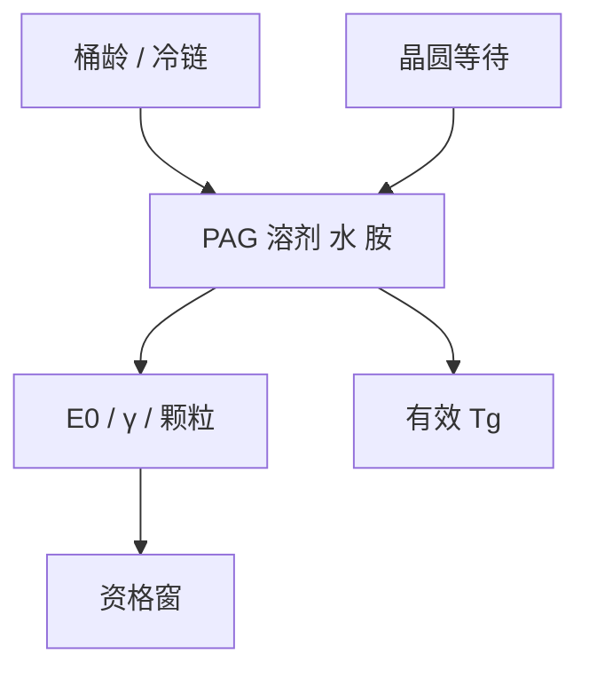

# 胶的老化与保质

配方在桶里也会走：溶剂挥发、PAG 分解、吸水与胺污染把 $E_0$ 和 $T_g$ 一起搬走。保质期是化学库存，不是物流标签。

<footer>—— 据抗蚀剂贮存与老化的产线通称；PAG 稳定性讨论见 Mack / 配方公开叙述</footer>

[上一课](/litho/tg-free-volume)把 $T_g$ 与自由体积写成膜内坐标。缺口是时间：同一桶胶，开封前后、冷藏断链、晶圆上涂完再等，材料已经不是标定批次。本课钉老化与保质。涂完立刻那一截溶剂账，留给[下一课](/litho/pab-solvent)的 PAB。

## 问题

未开封冷藏主要防 PAG 热分解与溶剂配比漂移。开封后多了吸湿、环境胺、瓶内液面上空间的挥发。结果：$E_0$ 抬或降（视 PAG 损失还是增塑上升）、暗侵蚀变、颗粒升、$\gamma$ 钝。把「剂量环自己漂了」当成扫描机故障，有时只是胶龄过了资格窗。

晶圆上的延迟：涂胶到曝光、曝光到 PEB，属于轨道时间规，不是桶的保质期，但机制同类——胺与湿气。本课两者都承认，签核要分开写：桶龄 vs 晶圆等待。

缺口不是再写 CAR 循环，而是：ABC、$E_0$、$\ell$ 都对龄期敏感，模型版本必须与批次日期绑定。

### 灵敏度上升不一定是好事

部分老化路径让抑制剂或淬灭剂先耗掉，看起来更敏，暗区起雾、T-top 一起到。只盯 $E_0$ 下降会把过期胶当成「更优配方」。

EUV 金属氧化物分散液的团聚与沉淀是另一族老化，颗粒和 LCDU 先坏。不要把 CAR 冷藏规则复印到 MOR 瓶上。

## 方法

资格：强制冷藏温度、开封后使用时数、避光、氮封。监控：黏度（固含）、含水量、$E_0$ 监控片、缺陷密度。断冷链要重新资格，不能靠「看起来还能涂」。轨道上：涂–曝、曝–PEB 延迟矩阵是老化的晶圆版，与[淬灭剂](/litho/pag-quencher)课的环境胺实验是同一类判据。

换批次验收必须含老化加速（高温短时）与真实冷藏对照，方向一致才承认机制，不能只用加速来外推年。

## 机制

PAG 热分解减少产酸，抬 $E_0$。溶剂挥发提高固含，膜厚与黏度变，swing 工作点挪。吸水增塑，自由体积涨，$\ell$ 与回流窗口变。胺中和顶部酸，T-top。颗粒来自团聚或析出，成为随机缺陷的系统伪装——重复出现在同一涂胶头指纹上的，不是光子泊松。

Dill $C$ 对老化 PAC 会变；CAR 的有效 $C$ 同样。紧凑模型不重提参数，只是把整套 $E_0$ 当新胶。

光管与黄光区不是无限安全：近紫外仍能慢曝光 PAG。避光规对开封瓶有效，对已经涂在晶圆上的膜更有效。

## 边界

不写某品牌的月数保质。不把加速老化的 Arrhenius 外推当成物理定律。下一课 PAB 处理的是涂布后受控赶溶剂，对象是新鲜膜；用 PAB 去「救」过期桶，只是把固含问题变成另一张不合格膜。

## 小结

- 保质期改 PAG、溶剂、水、胺，从而改 $E_0$、$\gamma$、颗粒与有效 $T_g$。
- 桶龄与晶圆等待要分规；两者都能扮扫描机剂量故障。
- 更敏可能是淬灭剂先死，不是更好的胶。
- 模型与批次日期绑定。
- 出处：抗蚀剂贮存通称；Mack 对配方稳定性与延迟 PEB 的讨论。
