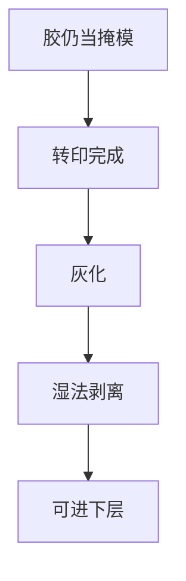

# 胶去除与灰化

转印结束，胶从掩模变成污染物。灰化与湿法剥离要拿得干净，又不能伤已刻的衬底和硬掩模。

<footer>—— 对照 resist strip / O₂ ash 在图形化后的公开步骤</footer>

[上一课](/litho/barc-open-etch)仍把胶当掩模。本课是轨道补层最后一课：图形已经在下层，去掉胶和残碳。缺口不是再写显影，而是剥离选择比与残留。后课曝光机子系统从准分子激光另起。

## 问题

干法灰化快，但对注入、金属、低 k 可能伤。湿法（溶剂、胺、酸）对硬化、离子注入胶可能去不净。植入后胶「皮」交联，要先灰化再湿法。把残留当「缺陷检测漏检」，会漏掉剥离窗口。

## 方法

常见：O₂ 灰化去大部分有机，湿法清灰与金属杂质，再漂洗。含硅 SOG 不能靠 O₂ 当有机胶去。金属氧化物胶要专用剥离，勿套 CAR 灰化。终点：表面亲水、XPS/缺陷可接受、衬底损失在预算内。

灰化会氧化衬底表面，金属线可能需要后续还原或清洗。剥离配方与「下一层是什么」绑定。

## 机制

氧化等离子体把碳氢变成挥发物。交联与植入损伤降低反应速率，留下壳。湿法从壳下钻蚀。选择比来自衬底是否也被氧化或腐蚀。

## 边界

本课结束涂胶显影轨道。不写主刻蚀化学（集成课）。扫描仪光源、物镜、工件台是下一课程。

## 小结

- 剥离是转印后的清洁合同，选择比针对已形成的衬底。
- 植入胶、金属胶、含硅层不能共用一条灰化。
- 出处：resist strip / ash 通识；接续开口课。
