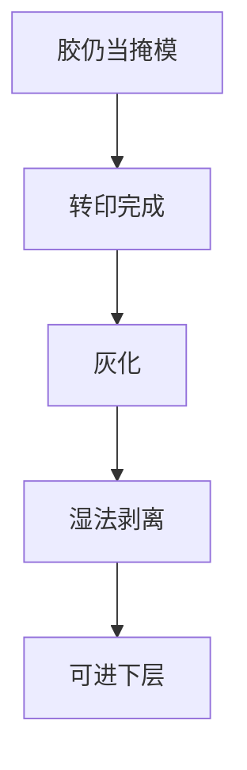

# 胶去除与灰化

转印结束，胶从掩模变成污染物。灰化与湿法剥离要拿得干净，又不能伤已刻的衬底和硬掩模。

<footer>—— 对照 resist strip / O₂ ash 在图形化后的公开步骤</footer>

[上一课](/litho/barc-open-etch)仍把胶当掩模。本课是轨道补层最后一课：图形已经在下层，去掉胶和残碳。缺口不是再写显影，而是剥离选择比与残留。后课曝光机子系统从准分子激光另起。工序位置决定合同条款：下层图形已经成形，任何过激化学都是不可回退的损伤，所以剥离窗口永远是「除胶速率」对「衬底损失」的比值游戏。

## 问题

干法灰化快，但对注入、金属、低 k 可能伤。湿法（溶剂、胺、酸）对硬化、离子注入胶可能去不净。植入后胶「皮」交联，要先灰化再湿法。把残留当「缺陷检测漏检」，会漏掉剥离窗口。

把受害者点名：FEOL 高剂量注入使胶表面非晶化、碳化成硬壳，溶剂进不去，直接湿法必残留；BEOL 多孔低 k 靠碳桥撑 k 值，O₂ 灰化把碳拔走，k 值与后续刻蚀速率一起漂，损伤不可逆；铝线怕含氯残留引发腐蚀，金属栅与高 k 怕氧化。另一头是去不净：刻蚀过程把胶烧结、侧壁聚合物沉积，普通溶剂剥不动。还有一类新对象——EUV 金属氧化物胶根本不是碳氢网络，O₂ 灰化只剩金属氧化物渣，剥离化学要整个重写（[EUV 胶](/litho/euv-resist)）。把残留当成检测的漏检去追，方向就错了：检测看见的是结果，窗口在剥离配方里。

## 方法

常见：O₂ 灰化去大部分有机，湿法清灰与金属杂质，再漂洗。含硅 SOG 不能靠 O₂ 当有机胶去。金属氧化物胶要专用剥离，勿套 CAR 灰化。终点：表面亲水、XPS/缺陷可接受、衬底损失在预算内。

展开成流程：首选下游远端等离子体，O₂（或 O₂/N₂/H₂O 混合）在 150–300 °C 把体胶氧化成 CO/CO₂ 挥发，只留薄层残壳；残壳交给湿法——未硬化 CAR 用 NMP/DMSO 类溶剂，硬化与植入胶用 SPM（硫酸/双氧水，120–150 °C），侧壁聚合物用胺系配方，随后充分漂洗防腐蚀。低 k 层改全湿法或极温和灰化；含硅 SOG 对 O₂ 是「惰性残渣」，要含氟化学单开一条（[三层膜 SOG](/litho/trilayer-soc-sog)）。验收走三条线：接触角或 XPS 碳含量卡残留，暗场与电子束复查（[缺陷复查](/litho/defect-inspection-optical-ebeam)）卡颗粒，Si 凹陷与氧化层损失卡在埃到纳米的预算内。配方与「下一层是什么」绑定，不是通用耗材。

```mermaid
flowchart TD
  MASK["胶仍当掩模"] --> XFER["转印完成"]
  XFER --> ASH["灰化"]
  ASH --> WET["湿法剥离"]
  WET --> CLEAN["可进下层"]
```

灰化会氧化衬底表面，金属线可能需要后续还原或清洗。剥离配方与「下一层是什么」绑定。

## 机制

氧化等离子体把碳氢变成挥发物。交联与植入损伤降低反应速率，留下壳。湿法从壳下钻蚀。选择比来自衬底是否也被氧化或腐蚀。

补上动力学：灰化速率由氧原子到达率与胶的交联密度共同决定，硬壳段速率掉一个量级，这就是「先快后慢」的终点曲线；湿法剥离靠溶剂从未硬化的底面钻入，把壳整片掀起，所以灰化只负责「破壳」，不负责「除净」，两者边界画错就会出现剥壳不净或钻蚀过度。选择比的化学来源很直接：胶的氧化产物是气体，衬底的「氧化产物」是不可逆损伤——Si 变氧化层、低 k 失碳、铝生腐蚀坑，每一种都有独立的预算行。descum 与本课是同一化学的两端：刻蚀前轻灰去浮渣，转印后重灰清残胶（[descum](/litho/descum)）。

## 边界

本课结束涂胶显影轨道。不写主刻蚀化学（集成课）。扫描仪光源、物镜、工件台是下一课程。选择比的通用算法留在 [刻蚀选择比](/litho/selectivity-arde)与硬掩模课，本课只管「胶已失去掩模价值之后」的清洁合同。

## 小结

- 剥离是转印后的清洁合同，选择比针对已形成的衬底。
- 植入胶、金属胶、含硅层不能共用一条灰化。
- 灰化破壳、湿法除净，边界画错就是残留或钻蚀。
- 出处：resist strip / ash 通识；接续开口课。
