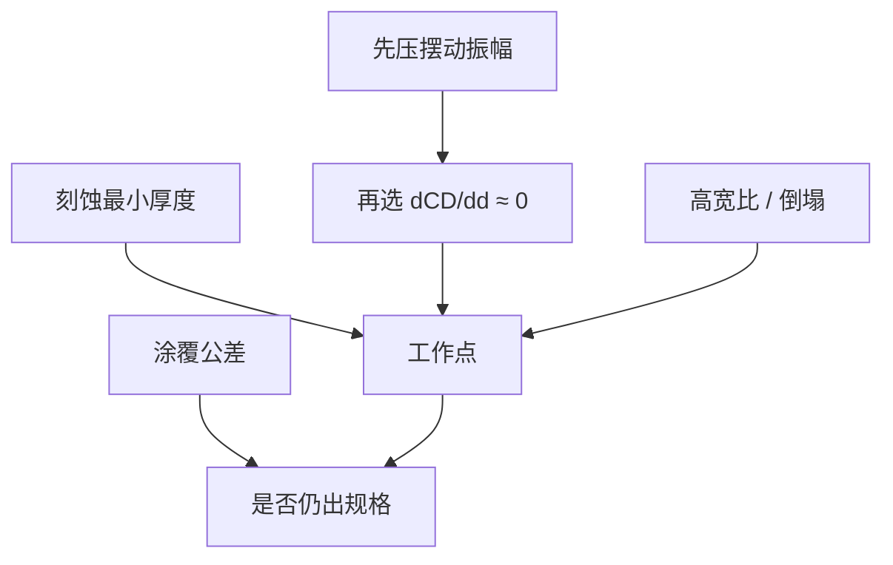

# 胶厚选择与反射控制

工作点要落在摆动曲线斜率接近零的地方，同时满足刻蚀掩模厚度与高宽比；减反把振幅压小，选厚才有窗口。

<footer>—— Mack 对 swing 工作点与 BARC 的论述；刻蚀掩模预算见 Levinson 一类工艺讨论</footer>

[上一课](/litho/swing-curve)画出了 CD$(d)$。缺口是：**在曲线上落哪一点**，以及反射控制与选厚谁先谁后。本课钉工作点与约束，不展开 TARC 配方（下一课）也不展开多层 BARC 结构。不把选厚写成「越薄分辨率越好」的 $k_1$ 叙事。

## 问题

摆动的极值处 $d\mathrm{CD}/dd\approx 0$，涂覆公差对 CD 最不敏感——这是光学选厚的第一判据。极值有多个，还要满足：作为刻蚀掩模够厚、不倒塌的高宽比、光学密度（EUV 吸收）够、与 BARC 开口刻蚀的选择比。只盯第一个反射零点，可能落到刻蚀穿通或倒塌区。

反射控制（压 $|r|$、压顶面反射）决定振幅。振幅大时，即使落在极值，峰谷之间的 CD 差仍可能大于规格，极值也不安全。顺序应是：先把振幅压进预算，再在剩余曲线上选斜率平坦且满足膜厚的点。

### 薄胶不是免费的分辨率

胶薄，驻波节点少、有时对比积分更好，EUV 还减随机体积——但刻蚀预算先死。光学选厚不能无视转印。主干倒塌、BARC 开口刻蚀课管轨道与刻蚀；本课只要求选厚表上必须有一行「刻蚀最小厚度」。

同一光学极值，正胶与负胶、明场与暗场的 CD 斜率符号可不同，工作点要按该层的 $E_\mathrm{size}$ 定义重测，不能抄上一层的纳米厚度。

## 方法

测或算 CD$(d)$（或 NILS$(d)$、$E_\mathrm{size}(d)$），标出极值。叠涂覆 $3\sigma$、台阶局域厚度（后课形貌）。若涂覆公差 × 斜率 > CD 规格，回退去减反，而不是把极值「选得更准」。BARC 厚度同样有自己的减反极值，要与胶厚联立：改 BARC 会平移胶的 swing 相位。

浸没与干式顶面不同，工作点不能共用一张表。换波长更是整张重做：周期 $\propto\lambda/n$。

### 与 EPE 预算的接口

选厚失败表现为全片 CD 随涂胶指纹走，EPE 的光学行出现与场无关、与涂覆径向指纹相关的分量。这与镜头场曲不同：改 BARC 或改目标 $d$，涂覆指纹项先动；改调平，场曲项先动。

## 机制

极值来自往返相位的驻点：厚度微扰不改一阶耦合。减反降低 $|r|$，把余弦项的振幅掐掉，曲线变平，极值附近的二阶也变小，窗口变宽。若只加剂量把平均 CD 拉回，工作点仍在斜坡上，涂覆一漂 CD 照样走——剂量环与选厚不互替。

## 边界

本课不指定 193 nm 或 EUV 的「标准胶厚」。金属氧化物胶、干法显影胶的光学 $n$ 不同，周期另测。禁止用未公开的某厂厚度窗口当课文数据。TARC 会再改顶面振幅，选厚与 TARC 联立，细节下一课；本课只保留「顶头未压时极值仍可能不够平」。

## 小结

- 先减反压振幅，再选摆动极值，并满足刻蚀与倒塌。
- 剂量闭环不替代选厚；换波长 / 浸没必须重选。
- BARC 厚与胶厚联立，相位耦合。
- 涂覆指纹进 EPE 时，先查工作点斜率。
- 下一课：顶部抗反射单独管顶头。
- 出处：Mack；Levinson；Born &amp; Wolf 的薄膜周期。
