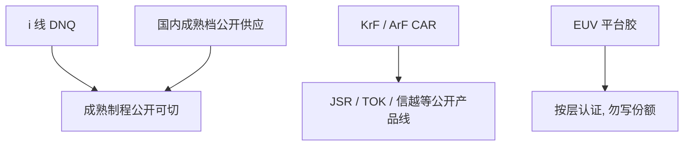

# 胶与供应商

胶是配方、纯化与认证年周期，不是扫描机附赠的化学品。公开舞台上的名字是 JSR、TOK、信越、富士胶片等；份额不要在没有出处的表里发明。

<footer>—— 对照各厂公开的光刻胶产品线角色，以及成熟制程国产胶的公开供应，不编造市场份额</footer>

[上一课](/litho/mask-shop-flow)走完掩模厂。缺口是晶圆上的记录介质从哪来：抗蚀剂供应商与掩模 blank 不是同一张采购单。[国产替代](/litho/china-litho-supply-chain)已经按波长档位写过短板；本课只钉公开角色名单，不把百分比写进标题。图形化检测设备从下一课起换工具类别，不再点名胶厂。

## 问题

同一台浸没机，换一桶未认证的胶，缺陷和窗口可以整层报废。客户资格认证绑定机台照明、BARC、显影和层别，以年计。上一课的掩模厂周期是天；胶的切换周期是资格。缺口是：谁在公开文本里出现在哪一档波长，而不是「国产化率」。

供应链课写过日系主导 DUV 胶、EUV 胶仍是短板。本课补的是名字与分工：谁做 KrF/ArF CAR，谁做 i 线 DNQ，谁做 EUV 平台胶——以厂商公开产品线为准，不做排名。

### 不要把掩模胶和晶圆胶写成一家

掩模电子束胶、晶圆 ArF 胶、EUV 胶，树脂和金属杂质规格不同。信越等既出现在硅片和部分材料叙述里，也出现在胶；TOK、JSR 以光刻胶与相关化学为公开主业。混厂采购会把杂质规格写错。

本课不引用任何「占全球百分之几」的数字。公开角色够用：能供哪一档波长、是否宣称 EUV 平台。

## 方法

读产品线，不读传闻份额。i 线 / g 线：DNQ–酚醛，供应商面更宽，国内北京科华、南大光电等公开服务成熟制程。KrF / ArF：化学放大胶，JSR、东京应化（TOK）、信越、富士胶片、住友、杜邦等出现在公开资料中。EUV：同一批国际厂商的平台胶与金属氧化物路线并行研发，认证仍按层、按机台。

国产替代的方法仍是档位：成熟 KrF 可切，浸没关键层维持已认证进口直到国产跑完窗口。本课不增加新的许可法律意见。

### 涂显与胶是一对资格

胶换了，轨道的温度、排气、浸没配套要重认证。供应商合同往往是胶 + 应用工程师 + 缺陷响应，不是一桶溶剂。把胶写成可以在现货市场即插即用，会低估认证。

## 机制

杂质与颗粒在先进节点变成随机缺陷。日系厂商的公开优势叙述包括纯化、过滤和包装，而不只是「会写分子式」。浸没胶还要抗水浸出。EUV 还要出气和金属沾污。这些机制在胶化学课已经按物理讲过；本课只强调它们被**哪一类供应商工业**接住。

计算光刻的紧凑胶核按供应商批次校准。换供应商等于换模型族，OPC 要重签。这是采购决定会打进 DTCO 的原因，不是商务花絮。

富士胶片、默克 / AZ 等也出现在公开光刻材料目录中。名单是「有公开产品线的角色」，不是排行榜，可随厂商改名而更新。

## 边界

禁止编造份额、禁止把研究所分辨率写成晶圆厂资格。禁止把 EUV 胶新闻填进 28 nm 浸没胶缺口——档位课已经禁过，本课名单同样禁。下一课的检测设备（KLA 等）会量胶的缺陷和 CD，但不生产胶；工具类别不要和配方工业吞并。

也不要把 Chiplet 写成可以少用胶：每颗裸片仍要涂。封装用另一类光刻胶/干膜，不在本名单里冒充 ArF。

出处：JSR、TOK、Shin-Etsu、Fujifilm 等公开产品与技术叙述；国产成熟制程胶企业的公开供应。不使用无出处的市场份额表。

## 小结

- 晶圆胶供应商与掩模厂、扫描机是三条采购链。
- 公开角色：JSR、TOK、信越、富士胶片等；国内成熟档有公开供应。
- 不写份额；认证绑定层与机台。
- 换胶等于换 OPC 胶核与涂显资格。
- 图形化检测工具下一课。
- 出处：各厂公开产品线；不编造百分比。
