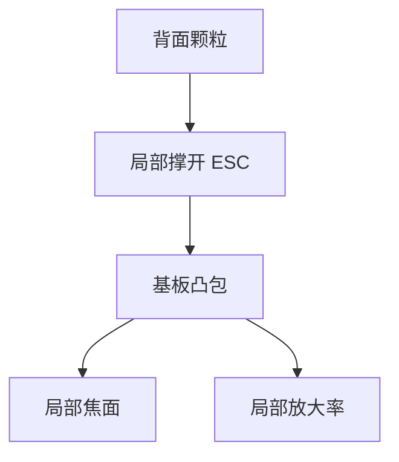

# 掩模背面颗粒

正面颗粒挡多层、投阴影；背面颗粒夹在吸盘与基板之间，把版顶出一个局部凸包，全场焦面和放大率跟着走。

<footer>—— 对照 EUV 掩模背面颗粒与静电吸盘的公开讨论；ASML 洁净搬运</footer>

[上一课](/litho/euv-reticle-chuck)把夹持力写成静电压力。缺口是压力对间隙极其敏感：一颗微米级颗粒就能局部撑开吸盘，掩模变成「带鼓包的反射镜」。本课钉背面颗粒。光源与光学课序收到这里；下一单元从[低 n 吸收体](/litho/low-n-absorber)起，改看正面图形材料。

## 问题

吸盘课假设背面贴合。真实背面有搬运划伤、镀膜颗粒和库内沉降。真空中没有气体阻尼，颗粒一旦夹入就不易被气流吹走。凸包高度按颗粒尺寸和基板刚度分配，到正面可以是纳米到数十纳米的面形——正好落在焦深和套刻预算里。它不像正面缺陷那样在硅片上印出硬点子，而像一层随夹持电压变的场曲，排查时容易被当成工件台或镜头热。

缺口是把背面当成成像面的一部分，而不是洁净室附录。pellicle 保护正面，不保护背面。无 pellicle 运行时两边都裸，风险叠加，后课再写。

DUV 透射版的背面颗粒主要挡光或离焦；EUV 背面颗粒的第一效应是机械面形，因为光不从背面穿过来。

## 方法

防：背面洁净规格、专用盒、机械手接触点、吸盘表面本身的产尘控制。检：上机前背面检测，吸盘上的真空/静电贴合传感器看局部间隙。纠：吹扫有限，通常要下机清洗或报废；反复夹持可能把颗粒压进基板，变成永久坑。

与套刻：鼓包引起的局部放大率和旋转像一层「伪 overlay」，层间若两次夹持颗粒不同，套刻飘。因此背面事件要进 SPC，不能只看正面缺陷图。

### 检测必须在夹持态或等价载荷下

未夹持的背面光学检查能看见颗粒，估不准凸包高度——刚度、电压和颗粒硬度一起决定。上机贴合传感器或夹持后面形图才能把事件判到焦深预算里。下机清洗若把颗粒压进基板，检测会从「颗粒」变成「坑」，更难清。接触点设计比事后吹扫有效。

## 机制

接触力学：硬颗粒当支点，静电压力试图把板压回去，弯曲能量与颗粒高度平衡，凸包半径可达毫米–厘米，高度衰减但仍在纳米。扫描时惯性可能让颗粒移位，指纹变成时变。氢和 EUV 不直接「烧掉」这颗颗粒，除非它在等离子体里被刻蚀——背面通常不在强 EUV 足迹下。

不要把背面凸包修进 OPC。它是夹持态缺陷，换一次吸盘或清一次背面就会变。

## 边界

本课不写吸收体 n、k，那是下一单元第一课。不重写掩模厂背面抛光工艺——后一课程「掩模制造」会从数据准备另起，本课只把扫描机侧的背面风险钉死。正面 pellicle 不降低本课的夹持力学。出处：ASML 掩模搬运与吸盘；EUV 背面颗粒公开讨论；吸盘课。

## 小结

- 背面颗粒通过 ESC 变成版面凸包，进入焦面与套刻，而不是印硬缺陷。
- pellicle 不管背面；检测和接触点设计是主防线。
- 光源与光学课序结束；下一单元从正面吸收体材料接着。
- 出处：ASML；EUV reticle backside 公开讨论。
