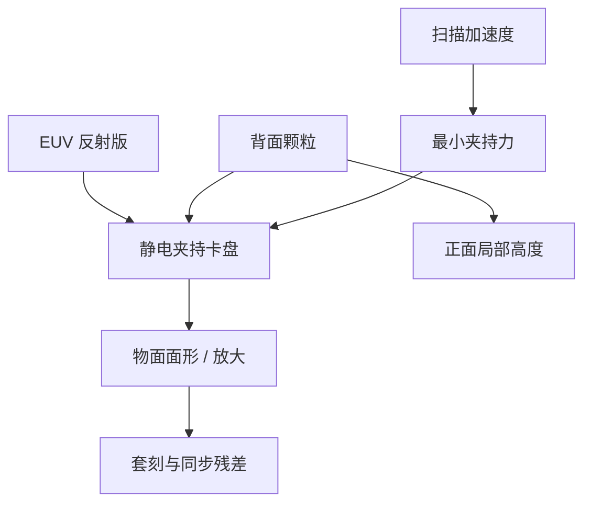

# 掩模夹持

反射版在真空里不能靠大气压吸住；静电夹持把背面钉在卡盘上，夹持力本身也是一张套刻与面形指纹。

<footer>—— 对照 ASML 对 EUV 掩模静电夹持（electrostatic clamp）的公开说明</footer>

[上一课](/litho/reticle-stage-sync)把掩模台与晶圆台锁在倍率轨迹上。缺口是版如何贴在这张台上：同步环假定物面是刚性平面，夹持却在纳米尺度上改面形、放大和局部位移。本课钉掩模夹持。随机效应如何把欠剂量写成缺陷，不在本课展开。

## 问题

DUV 透射版常用真空吸盘：大气压把版压向卡盘。EUV 扫描腔是真空，这条力没了。公开方案是静电夹持：卡盘电极与掩模背面之间的库仑力把 6 英寸反射版吸住，扫描加速度下不能滑、不能振。力不够则同步课写的轨迹跟不住；力过大或电极图案不均，则把背面颗粒压成正面鼓包，或把夹持应力写成放大/畸变。

背面颗粒是一等良率项。夹持把颗粒变成物面的局部高度，反射几何下双程相位更敏感。上一课的同步误差是时间域；本课是物面边界条件。

### 夹持指纹不是「台子没对准」

换版、换卡盘、清洁背面之后，夹持力分布会变。产品套刻里会出现随夹持周期重复的指纹，看起来像倍率或三次畸变，其实是静电垫与版背面形貌的卷积。把它补进台子网格，下一块版又对不上。

EUV 掩模夹持在背面；成像在正面多层。pellicle 框、背面涂层导电性、电极分区，都进夹持刚度。不要把晶圆静电吸盘的针尖布局直接画到掩模卡盘上。

## 方法

卡盘分区电极提供可调的夹持力与（公开讨论中的）面形微调。测量位或曝光位用对准和高度传感器看见夹持后的物面，把可重复部分收进补偿；不可重复部分（颗粒、接触不良）只能靠清洁与拒收。加速度规格把最小夹持力钉死：扫描向速度高，夹持必须抗切向惯性。

热：扫描剂量加热多层与吸收体，夹持又提供热阻和约束。自由胀和被卡盘钉住的胀，套刻模型不同。[掩模加热](/litho/reticle-heating) 课写温度场；本课写机械边界——同一张热图，夹持刚度不同，位移不同。

### 与变形倍率

[4×/8×](/litho/anamorphic-mask-mag) 下，物面两个方向的场和刚度贡献不同。夹持引起的局部斜率在狭缝向和扫描向进套刻的杠杆不同。补偿表必须各向异性，与同步课的方向倍率一致。

## 机制

静电垫是离散的。版在垫之间会微弯，反射角和局部倍率跟着弯。背面导电层若均匀性差，力分布随湿度残留和清洁度变——真空里仍可能有残余，只是没有大气压那一项。扫描时洛伦兹力与夹持力叠加，动态面形进入有效离焦和同步残差。

颗粒：直径微米级的背面粒子，夹持后可在正面造成纳米到数十纳米量级的高度印，打印成局部失焦或相位缺陷。这是掩模厂与机台的联合合同：背面洁净度、卡盘清洁、夹持力上限。

「静电夹持」不是电离锡，也不是晶圆的静电吸盘课。对象是掩模背面电极。后课晶圆吸盘会再写硅片侧，不要提前合并。

## 边界

本课不重写磁浮六自由度，也不给电极电压表。不要编造夹持力牛顿数。后课默认：说到掩模台，先问版是否以可重复的静电边界条件贴住，再谈同步误差。

引用以 ASML 真空掩模夹持公开说明为准。

无 pellicle 阶段颗粒在正面；有 pellicle 后正面颗粒风险下降，背面夹持颗粒仍在。两条不要写成同一张清洁单。

## 小结

- 真空里 EUV 版靠静电夹持，不靠大气压真空吸盘。
- 夹持力分布是套刻与面形指纹，与台子网格补偿要分开。
- 背面颗粒被夹持印到正面高度，是缺陷而不是对准偏差。
- 最小夹持力由扫描加速度钉死；过大则应力畸变。
- 出处：ASML EUV 掩模静电夹持公开材料。
