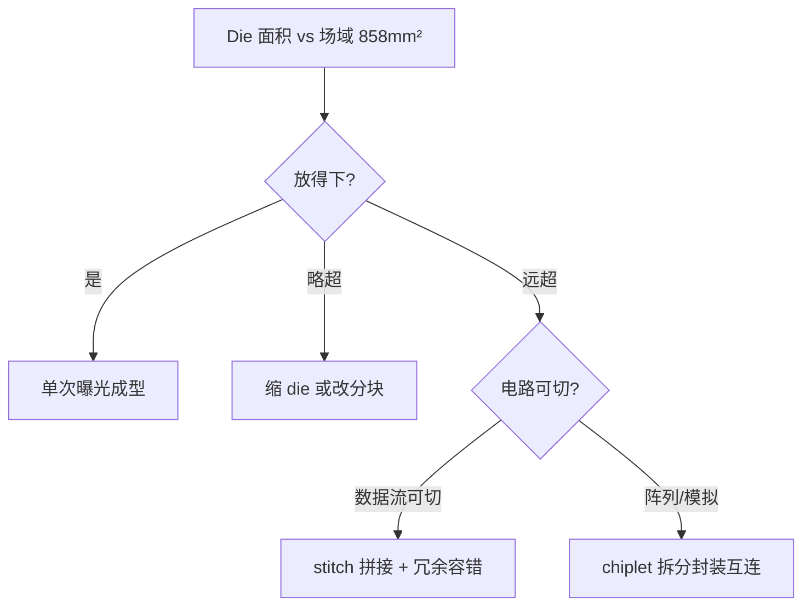
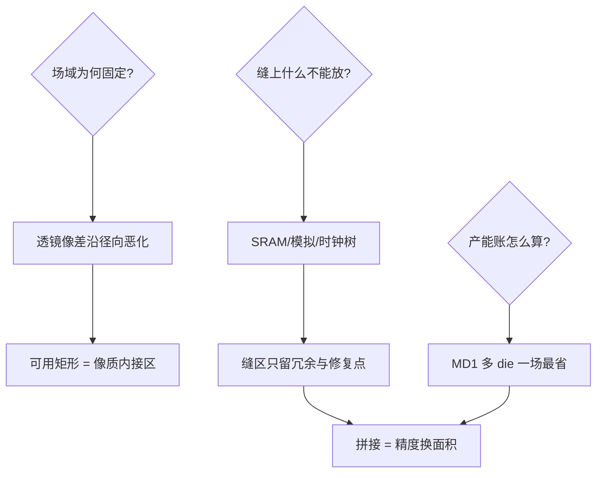

# 掩模版与场域极限

光罩就那么大一块玻璃：26×33mm 的场域是整条产线的宪法——芯片放不下就切割，切割不了就拼接，拼接不了就限制你的设计。

<footer>—— 据 ASML TWINSCAN NXT/EUV 场域规格；SEMI 标准光罩尺寸 6 英寸</footer>

[虚拟填充与密度规则](/litho/dummy-fill-density)管版图的均匀性，本课管版图的**疆界**：投影透镜的像方场域固定为 26×33mm，所有芯片必须住进去。缺口是**场域约束**——reticle field limit 如何从物理常数变成设计规则，以及切缝（stitch）与场域拼接的代价。本课不做光罩写版的次序优化。

## 问题

投影系统的像差校正只对一个圆内的像质有保证，现代 EUV/浸没式透镜把这个圆切成 26×33mm 矩形用足。设计侧的麻烦：Die 尺寸逼近或超过场域怎么办（GPU/SoC 常 600mm² 以上，而场域 858mm² 一颗都放不满两颗）；跨场域的大电路怎么办（数据通路、时钟树被切缝劈开）。缺口：把「玻璃的大小」翻译成设计与分割的语言。

术语翻译：reticle field（场域）= 投影一次成像的最大面积，4:3  legacy 与 EUV 的 26×33mm；stitch（切缝）= 把超过场域的图形拆到两次曝光、晶圆上对齐拼接；stitch error = 拼接处的套刻与 CD 失配。

数字实例：场域 26×33=858mm²。300mm 晶圆产出的 die 数受「场域内能摆几颗」硬约束：600mm² 的 GPU 一场一颗、浪费 258mm²；320mm² 的可一场两颗。同设计面积翻倍到 640mm² 后一颗一场，wafer 利用率骤降——这是「单 die 变 dual chiplet」的产能数学。

## 方法

设计响应分三档。**缩 die 进场**：最省事，规模天花板即场域面积；**chiplet 拆分**：把大设计切成多 die 各自进场，代价是互连（D2D 接口功耗/带宽）与封装；**切缝拼接**：同一 die 跨场域两次曝光在晶圆上拼接——只对「可切」的电路成立（横向数据流可切、SRAM 阵列与模拟电路不可切），且切缝处的套刻失配要设计容错（冗余线、可修复逻辑）。光罩侧的对应操作：field stitching 的两条 reticle 各含半幅图形 + 对准标记。

直觉类比：场域像「复印机的最大复印幅面」——A3 玻璃就那么大；大图纸要么缩印（缩小 die），要么拆成两张分别复印再对齐拼贴（chiplet），要么复印两次精确接缝（stitch）；接缝处再对齐也有毫米级误差，重要文字（SRAM）绝不能骑缝。

## 机制

光学机制：透镜像差（场曲、像散、畸变）沿径向恶化，「可用矩形」是像质达标的内接区——扩大场域意味着更难的透镜设计与更贵的系统，26×33 是 EUV 反射镜组的工程平衡点。拼接机制：两次曝光的图形在晶圆上以套刻精度对齐（EUV ~2nm 级、浸没式 ~3-5nm），切缝误差表现为图形的 CD 突变与位置错动——设计侧用「缝区冗余」吸收：把不可精确的边界放在无关紧要的位置（如重复单元的间隙），配 eFuse 修复。产能机制：每片晶圆的曝光次数 = 场域数 + 缝合开销，多 die 单场（MD1）比单 die 多场便宜且快。

常见误区：以为 die 大小只受晶圆面积限制——wafer 是约 70,686mm² 的圆盘（π×150²），场域只有 858mm² 矩形，两套几何各自卡脖子；另一误区是「stitch 是免费的」——它要求两次曝光、两次对准、缝区冗余设计，良率敏感电路绕行是常态。

## 边界

High-NA EUV 的场域砍半（26×16.5mm）：单次成像面积小一半，成为 Intel/TSMC 引入 High-NA 时最大的流程重构项——0.55NA 的镜筒用更小的场域换更高的分辨率，chiplet 与 stitching 从「可选项」变「必答题」。设计侧的场域意识：physical design 工具的「reticle awareness」（虚场域规划、切缝规划）在 3nm 以下节点已是标准动作。与[混合匹配与套刻拼接](/litho/mix-and-match-overlay)的接续：stitch 是同机双 reticle（各含半幅）拼接，mix-and-match 是不同光刻机接力同一层——两者共享「套刻是货币」的经济学。

直觉类比：High-NA 场域减半像「换了一台放大倍率更高的投影仪」——画面更精细，但幕布同宽下能投的画面变小；原来一幕放下的戏（单 die）现在要么拆成上下半场（chiplet），要么学会换幕衔接（stitch）。

## 小结

- 26×33mm 是透镜像差内接的工程宪法，产量账从这里算起。
- 超场域三策：缩 die、chiplet 拆分、stitch 拼接，各有互连/套刻代价。
- 缝区只放冗余；High-NA 减半场域把拼接推向必答题。
- 出处：ASML NXE/EXE 场域规格书；SEMI P1 光罩标准；chiplet 经济性研究（Resetting the Canvas 等）。
