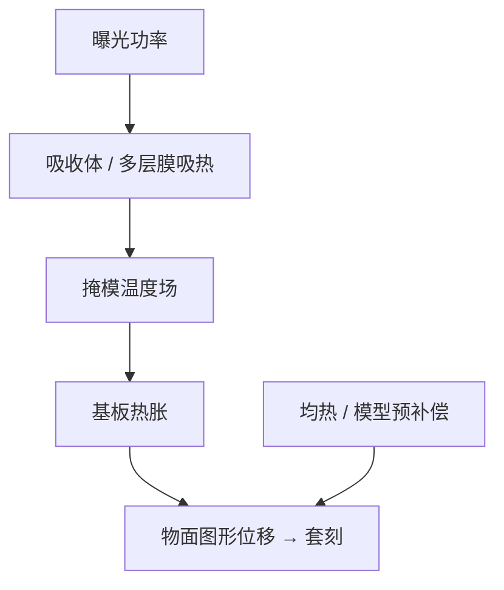

# 掩模加热

掩模吸收的那一截曝光能量会变成温度场；石英或多层膜一胀，图形在物面挪动，套刻指纹跟着扫描热量走。

<footer>—— 据 ASML 等对 overlay 热贡献源的公开论述：掩模（reticule）加热是独立于工件台的一项</footer>

[上一课](/litho/alignment-spm)把曝光前网格钉在晶圆标记与 SPM 上。缺口是曝光期间掩模自己在热：吸收体和膜堆吃光，热膨胀进套刻，对准再密也测不到这块——它发生在物面。本课钉掩模加热。晶圆侧的曝光热与卡盘冷却留给[下一课](/litho/wafer-thermal-overlay）。

## 问题

扫描机把高功率准分子或 EUV 打到掩模上。透射版的铬/MoSi 吸一部分；EUV 反射版的吸收体和多层膜也吸一部分。热量沿版扩散、向 pellicle 和周围辐射，温度场随场内容图形密度和时间变。石英（或 EUV 基板）热胀系数虽小，乘上 4× 物面尺寸，落到晶圆上仍是纳米级放大与畸变。

上一课的对准在晶圆侧。掩模台有自己的对准与夹持，但温度场在扫描开始后还在爬，稳态与第一场不同。把「前几片套刻差」写成晶圆翘曲，会漏掉掩模瞬态。

### 加热不是镜头像差

镜头有热像差和 ILLIAS 一类校正；掩模加热是物面几何。两者都随时间变，校正旋钮不同。混在「热 overlay」一个桶里，会去拧错的补偿表。

图形疏密不同的版，热指纹不同。同一台机器、同一剂量，换版就能换 overlay 形状。

## 方法

公开治理分三层。减吸收：EUV 高透过 pellicle、更优吸收体，让热量少进基板。均热与等待：让版在曝光功率下接近准稳态再跑产品，或用前几场专用校正。模型补偿：按剂量、扫描方向和版的热模型预畸变曝光网格，或场间更新。ASML 套刻叙事把掩模加热与晶圆加热、镜头漂移并列，而不是单一「热」开关。

计量：用套刻标记读到的放大、偏扭，要分层归因——掩模热往往沿扫描方向有特征时间，换卡盘实验可以和晶圆热拆开。本课不写未公开的毫开尔文或纳米表。

### EUV 与 DUV 的热路径不同

DUV 透射，热量在吸收图案与石英里；EUV 反射，热量在多层与吸收体，还要过真空与 pellicle 气载约束。pellicle 自己也热、也胀，会改有效透过和局部波前，但首先仍是剂量与污染项。不要把 pellicle 课整段搬来；这里只承认 EUV 掩模热路径更长。

## 机制

热胀把掩模坐标变成时间的函数。4× 缩比把物面位移缩到晶圆，但物面尺度大，净 overlay 仍可观。扫描狭缝下的局部加热随瞬时图形密度变，密金属版比稀疏植入版热得狠。瞬态：第一批场在爬温，套刻放大项漂移；稳态：形成与冷却平衡的指纹，仍可能随环境与流量变。

对准网格若只在晶圆上加密，补偿不了物面在动。必须把掩模台位置、版夹持和热模型放进同一套刻预算，见 overlay 贡献源分解的公开分法：设备、掩模、工艺。掩模热跨设备和掩模两栏。

MEF 放大的是掩模 CD 误差；热胀放大的是掩模位置。两个「掩模贡献」不要加进同一个纳米。

## 边界

不要发明某国产掩模台的热控指标。不要把镜头热像差的 Zernike 校正当成已经修好掩模胀。本课不重写 pellicle 材料。晶圆热是下一课：卡盘、浸没水和曝光剂量在硅片上的温度场，指纹形状与掩模热不同，拆不开就谈不上 holistic overlay。曝光功率一改，两套热源都会动，实验必须换版与换剂量交叉，不能只看一场套刻放大项。

出处：ASML 对 overlay 热源（含 reticle heating）的公开产品与 SPIE 论述。不编造未公布的掩模温升曲线。

## 小结

- 掩模吸收曝光能量，热胀进入套刻，对准网格测的是晶圆不是这块物面瞬态。
- 与镜头热像差、晶圆热是不同贡献源。
- 减吸收、均热、模型补偿是公开的三层治理。
- 图形密度决定热指纹，换版即换形状。
- 晶圆热套刻下一课。
- 出处：ASML overlay 热源公开论述。
