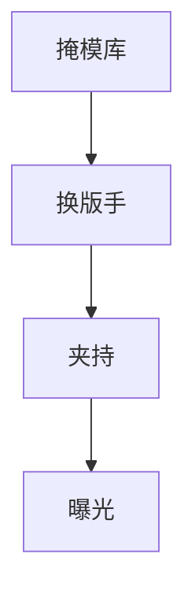

# 掩模库与交换

扫描仪旁的库把多块掩模换成场间几秒。交换慢，产能死；交换脏，缺陷和热漂移一起进。

<footer>—— 对照 reticle library / reticle stage swap；[掩模台同步](/litho/reticle-stage-sync)</footer>

[上一课](/litho/wafer-load-prealign)上片。缺口是上版：库、机械手、夹持、条码。本课钉掩模库与交换，不写掩模厂制版。

## 问题

一层多版（LELE 颜色、切割）要换版。库容量、交换时间、夹持重复性进套刻与产能。 Pellicle 碰撞、颗粒从库落到版上，是轨道缺陷之外的来源。

## 方法

条码/RFID 对配方。交换路径最短、气流不直吹版面。夹持力与 [掩模夹持](/litho/reticle-clamp) 课（若已写）一致。热：刚从库到曝光，版温未平衡会胀，要等待或补偿。

## 机制

版在光路里吸收 193 nm 会热胀，库温与机内温差造成第一次场的放大率误差。交换加速度类似台，但负载是版+pellicle。

## 边界

下一课机台匹配：换到另一台扫描仪，库里同一块版的放大率指纹不同。

## 小结

- 换版时间是产能；夹持与热是套刻。
- 库是缺陷源之一，要管气流与碰撞。
- 出处：掩模台课；产能课。
