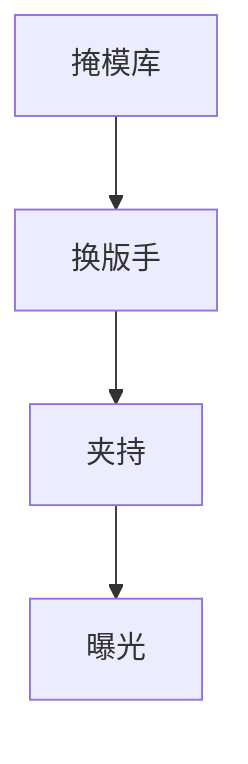
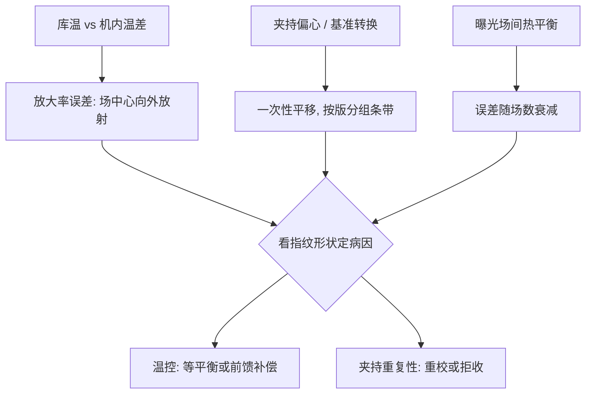

# 掩模库与交换

扫描仪旁的库把多块掩模换成场间几秒。交换慢，产能死；交换脏，缺陷和热漂移一起进。

<footer>—— 掩模存储与运输的机械接口见 SEMI E100（Reticle SMIF Pod）规格</footer>

[上一课](/litho/wafer-load-prealign)上片。缺口是上版：库、机械手、夹持、条码。本课钉掩模库与交换，不写掩模厂制版。片有缺口当零点，版没有——它靠库与夹持的机械基准定位，交换同时欠产能与套刻两笔账。

## 问题

一层多版（LELE 颜色、切割）要换版。库容量、交换时间、夹持重复性进套刻与产能。 Pellicle 碰撞、颗粒从库落到版上，是轨道缺陷之外的来源。

展开：换版频度定权重——每片换版（cut 层、双大版）直接进产能公式，一批一换则摊薄。库存侧风险是放错槽位、记错朝向，靠条码/RFID 与读后核验兜底；插拔路径风险是 pellicle 刮碰与落尘——版面朝下存放挡自上而下的灰，插拔瞬间的气流扰动仍可能把颗粒带上版面。夹持不一致时，同一块版每次上架的面内位置与高度都不同，套刻与焦面各吃一份随机量。

直觉类比：版没有缺口零点，像一把没有钥匙齿的钥匙插进锁——全靠库与夹持的机械基准「记住」它的位置。每次插拔都重掷一次「定位骰子」，散布直接记在套刻账上。

## 方法

条码/RFID 对配方。交换路径最短、气流不直吹版面。夹持力与 [掩模夹持](/litho/reticle-clamp) 课一致。热：刚从库到曝光，版温未平衡会胀，要等待或补偿。

工程流程：上版前条码/RFID 与 job 里的掩模 ID 核验，防上错版；交换位与曝光位分开，插拔路径不穿主气流；库与机内同用一套基准，夹持力与支撑点照 [掩模夹持](/litho/reticle-clamp) 的口径执行。热管理二选一：等热平衡，或用热模型前馈补掉第一场的胀量；换版时间单列进产能会计，与片流死时间分开报。

数字实例：夹持重复性若给物面 ±50 nm，4× 缩比后晶圆上就是 ±12.5 nm 的套刻随机项；翻三倍到 ±150 nm，晶圆侧就是 ±37.5 nm——几乎吃光整个套刻预算。夹持重复性是按纳米采购的指标。

```mermaid
flowchart TD
  LIB["掩模库"] --> ROB["换版手"]
  ROB --> CLAMP["夹持"]
  CLAMP --> EXP["曝光"]
```

换版时间的产能权重取决于频度：每片一换直接乘进 wph，每批一换则摊到几百片上——调度因此尽量把同版场排在相邻片。库策略既是排产问题也是产能问题。

## 机制

版在光路里吸收 193 nm 会热胀，库温与机内温差造成第一次场的放大率误差。交换加速度类似台，但负载是版+pellicle。

写透一点：三个子系统各管一段——库管洁净与姿态（面朝下、温控贴近机内），换版手管交接（加速度按「版+pellicle」的脆弱负载设计，比片保守），夹持管可重复性（基准转换的定位散布直接进套刻）。版在光路里吸收 193 nm 会热胀，库温与机内温差造成第一次场的放大率误差，这是「第一批头几片重点复检」的来源；夹持偏心与 [掩模台同步](/litho/reticle-stage-sync) 的衔接误差表现为按版分组的套刻条带。失配形状可辨：放大率误差从场中心向外放射，夹持偏心是一次性平移，热漂随曝光场数衰减——靠形状区分病因。

```mermaid
flowchart TD
  LIBT["库温 vs 机内温差"] --> MAG["放大率误差: 场中心向外放射"]
  CLAMPX["夹持偏心 / 基准转换"] --> SHIFT["一次性平移, 按版分组条带"]
  HEAT["曝光场间热平衡"] --> DECAY["误差随场数衰减"]
  MAG --> DIAG{"看指纹形状定病因"}
  SHIFT --> DIAG
  DECAY --> DIAG
  DIAG --> FIX1["温控: 等平衡或前馈补偿"]
  DIAG --> FIX2["夹持重复性: 重校或拒收"]
```

## 边界

本课不写掩模厂内的制版、版检与出厂运输（[掩模厂流程](/litho/mask-shop-flow)课域），也不写 pellicle 自身的透过率与寿命账（pellicle 课）；版弯与自重下垂对焦面的影响归掩模 3D 一类。整批同版时交换时间被摊薄，本课的产能侧权重下降。

常见误区：把「第一批头几片套刻差」一律记成设备漂移去拧机器。换版后第一场的放大率误差常来自库温与机内温差，随场数自己衰减——先看指纹形状（放射、平移还是衰减），再选执行器。

## 小结

- 换版时间是产能；夹持与热是套刻。
- 库是缺陷源之一，要管气流与碰撞。
- 下一课机台匹配：换到另一台扫描仪，库里同一块版的放大率指纹不同。
- 出处：掩模台课；产能课。
