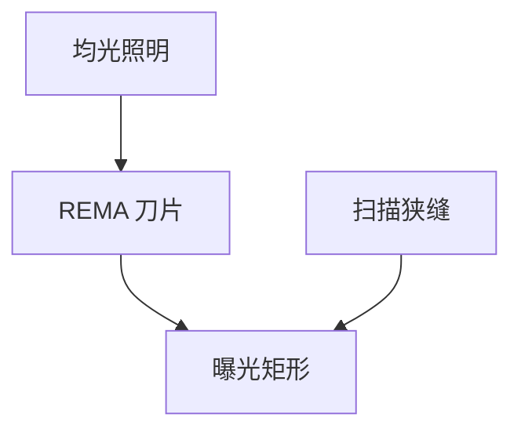

# 掩模遮挡刀片 REMA

REMA 刀片挡住不该曝光的掩模区：划片槽、邻场、条码。它切的是场，不是光瞳。

<footer>—— 对照 reticle masking blades 在扫描投影机上的公开功能</footer>

[上一课](/litho/homogenizer-fly-eye)给出满场均匀照明。缺口是：掩模上并非处处要印。REMA（reticle masking）刀片在掩模附近挡光，定义曝光矩形。与 [狭缝](/litho/slit-scan-average) 分工：狭缝是扫描瞬时开口，刀片是这场用哪一块掩模。

## 问题

掩模版上有对准标记、邻 die、 Pellicle 边。若整版照明，边缘图形和金属边会印到晶圆或产生杂散。刀片误差直接是场尺寸与边缘剂量梯度。把场边缘 CD 异常全写成镜头畸变，会漏掉刀片半影。

## 方法

四刀（或等效）围出矩形，随扫描与场尺寸改。半影宽度由刀片离焦与照明 σ 决定，边缘有一段剂量斜坡，小图形不要贴刀片。配方：场大小、刀片余量、是否挡标记。

刀片在物面附近，光瞳整形在照明光瞳。调刀片不会把偶极变成环形；调光瞳不会切场。

## 机制

刀片是几何挡光。衍射在刃口产生半影，高 σ 半影更软。扫描方向上狭缝已经限制瞬时场，刀片主要管静态场边界与非扫描边。

## 边界

下一课照明均匀性沿狭缝的测量，假定刀片已张开到配方场。

## 小结

- REMA 切掩模场，狭缝切扫描瞬时开口。
- 刃口半影是边缘 CD 源。
- 出处：扫描投影机遮挡通识；狭缝课。
