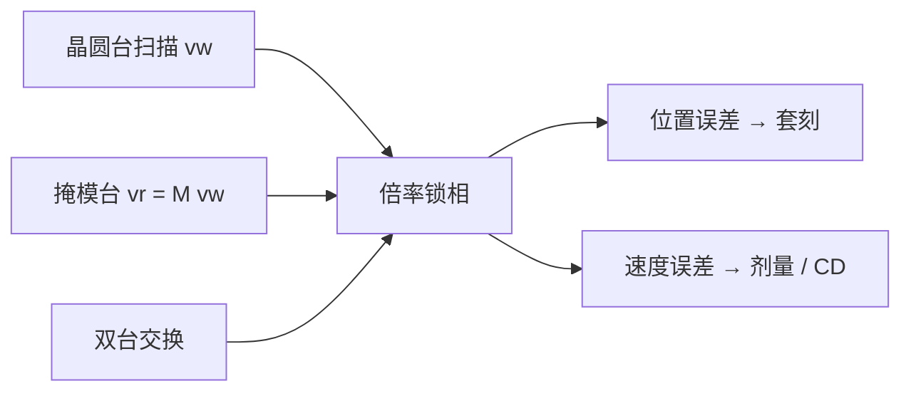

# 掩模台同步

扫描曝光不是晶圆台独自匀速走过狭缝；掩模必须以光学倍率锁住同一条轨迹，同步误差同时变成套刻与有效离焦。

<footer>—— 对照 ASML 对 TWINSCAN 双工件台与扫描同步的公开说明</footer>

[上一课](/litho/euv-maglev-stage)把真空里的支承写成磁浮：气浮被取消，硅片台与掩模台都靠洛伦兹力做六自由度。缺口是两者如何锁在一起。扫描机的像是狭缝里积分出来的，掩模台速度必须按倍率跟上晶圆台，相位误差进 overlay，速度抖动进剂量。双工件台还要求同一套掩模台在交换后立刻锁到另一张晶圆台上。本课钉掩模台同步。随机效应如何把欠剂量写成缺陷，留给后课。

## 问题

投影倍率把掩模平面与硅片平面绑成一对相似运动。0.33 系统约 4×：掩模台扫描速度约为晶圆台的四倍。[High-NA](/litho/asml-high-na) 变形光学在扫描向仍约 4×、狭缝向约 8×，同步合同按方向拆开，不能再用各向同性 4× 的口令。位置环误差在硅片坐标里就是套刻；速度环误差改变狭缝停留时间，变成 CD。

双工件台（TWINSCAN 公开架构）并行的是两张**晶圆**台：一台曝光、一台测量。光学与掩模台仍是一套。交换之后，掩模台必须对新卡盘的网格、高度图和扫描起点重新同步，而不能假设「磁浮已经够准就自然对齐」。缺口是同步伺服与倍率几何，不是再讲一遍失浮安全。

### 双台不是双掩模台

把 dual stage 理解成两套完整扫描机，会把掩模台的动态预算算错。曝光位在换卡盘，掩模台要加速、建立、锁相，建立时间直接吃产能。加速度越大，反力越容易打进物镜；同步带宽越高，计量环的热与振动越不能装糊涂。问题因此是：在一套掩模台上，对交替进入的两张晶圆台保持纳米级扫描锁相。

「同步」在产线口语里有时被说成对准。对准是曝光前读标记、建网格；同步是曝光中掩模与晶圆相对速度/位置的实时锁。本课对象是后者。

## 方法

控制上把扫描轨迹写成时间的函数：晶圆台按场长与剂量决定 $v_\mathrm{w}$，掩模台 $v_\mathrm{r}=M\,v_\mathrm{w}$（$M$ 为该方向倍率），再叠加畸变、热与掩模变形的前馈。位置计量用编码器或干涉仪，闭环把跟踪误差压进套刻与剂量预算。源功率与台速度互锁：功率跌则减速，避免欠剂量条纹——上一课已把这条写在硅片台上，本课补上：减速必须掩模台同时减速，否则倍率锁被自己打断。

High-NA 半场更短，加速段占场长的比例变大，建立时间更金贵。Z 向调焦在薄[胶厚预算](/litho/high-na-resist-budget)下更严，Rx/Ry 调平与扫描同步是同一套短行程自由度上的不同轴，不能把 XY 锁相做好就宣布同步完成。

### 交换之后的锁相

卡盘指纹、夹持变形、上一场留下的热，都让「同一条扫描公式」在两张台上并不相同。产线用匹配套刻与 dedicated chuck 策略来承认这件事。公开叙事能写到的是：双台提高的是测量与曝光的重叠，掩模台是共享资源，同步规格必须按较差的那张卡盘来写。

## 机制

狭缝在硅片上扫过时，每一点的空中像是掩模对应狭缝的瞬时像。若掩模超前或滞后 $\delta x_\mathrm{r}$，硅片上等效位移约 $\delta x_\mathrm{r}/M$，进 overlay。若相对速度比偏离 $M$，狭缝积分的有效曝光时间沿扫描向变化，CD 出现条纹。离焦通道：同步不好时两台的瞬时物像共轭被破坏，等效于局部 $z$ 误差，在薄焦深里与胶厚预算叠加。

计量光路在真空里仍可能用非 EUV 波长，残余气体折射率进误差模型。掩模侧还有 pellicle 质量与热引起的平衡变化，载荷虽小于晶圆台，速度更高，动态更狠。

ASML 不会公开伺服增益。可写的是倍率锁、速度–剂量互锁、双晶圆台共享一套掩模台。不要把专利里的磁钢排列写成教材里的「标准参数」。

## 边界

同步不增加 NA，不增加光子数。它只让扫描投影在套刻与剂量上成立。为产能把速度拉满，随机缺陷会先报警，那是后课的剂量账，不是再加一级掩模台加速度能消灭的。单工件台研发工具可以弱化双台交换，HVM 的 NXE/EXE 公开叙事仍是双晶圆台加同步扫描。pellicle 的质量与热会进掩模台平衡，同步规格要把膜架当作载荷的一部分，而不是只按裸版写。

后课默认：说到扫描同步，已经包含掩模台与晶圆台按倍率锁相，而不是只有硅片台磁浮。

pellicle 框架的热漂移若未进前馈，会在长曝光里表现为扫描向缓变套刻，看起来像「台子在爬」。

评价同步要同时看套刻残差与扫描向 CD 均匀性。只报静态 overlay、不报扫描中的速度噪声，等于只报停车精度。

## 小结

- 扫描曝光要求掩模台与晶圆台按光学倍率锁相，误差进套刻与剂量。
- TWINSCAN 双台并行的是两张晶圆台；掩模台是共享的同步对象。
- High-NA 变形倍率让两个方向的 $M$ 不同，同步合同必须按轴拆开。
- 源功率与速度互锁必须两岸同时执行，否则自己打断倍率锁。
- 出处：ASML 关于 TWINSCAN 双工件台与扫描扫描机的公开说明。
