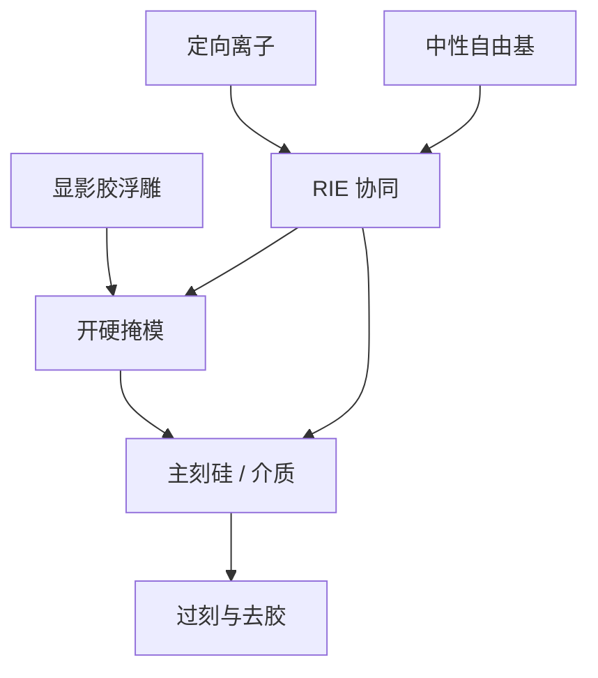

# 反应离子刻蚀转印

显影只留下一层有机浮雕。器件要的是硬掩模或硅上的永久边；把胶图形变成那条边的，是离子与中性自由基的协同，而不是再一次投影成像。

<footer>—— 对照 Coburn–Winters 对等离子体表面协同的论述，以及刻蚀教材把 RIE 写成各向异性转印</footer>

[上一课](/litho/compact-vs-rigorous)把刻蚀收成 OPC 里的紧凑偏置：密度一变，CD 平移一截。缺口是这条偏置在腔体里从哪来。本课钉反应离子刻蚀（RIE）：胶图形如何转到硬掩模和硅。[光刻流程](/litho/litho-process-flow)已经排过「显影之后才转印」；这里不重讲涂胶顺序，只补转移函数的物理。深宽比与负荷如何让速率随开口变，留给[下一课](/litho/etch-loading-ar)。

## 问题

先进节点胶薄，选择比不够直接啃硅或厚介质。产线先把胶转到 SOC / SiARC、氮化物或金属硬掩模，再往下刻。若把显影后 SEM 当成栅极 CD，是把转印偏置算进了镜头。上一课的紧凑核假定存在一个稳定的「胶 → 衬底」映射；映射一漂，全芯片 OPC 跟着漂。

缺口因此是：各向异性从哪来、选择比怎么买、以及为何离子能量与化学不能只拧一个。纯溅射损伤大、侧壁差；纯化学各向同性，细线立不住。RIE 要的是两者协同。

### 胶不是理想二元掩模

胶边有斜角、LWR 和残胶。等离子体先看到的是这层形貌，不是版图。选择比不够时，胶顶被削，开口变宽，CD 随刻蚀时间走。硬掩模的作用是把「成像预算」和「深度预算」拆开：薄胶只负责定义边，纵向深度交给更耐打的膜。这与 [ALD/ALE](/litho/ald-ale) 的循环修整是同一纵向危机的两种回答，本课先停在连续 RIE。

ADI 与 AEI 必须分开报。把刻蚀后 CD 写进扫描仪分辨率规格，是类别错误。

## 方法

RIE 在低气压等离子体里同时提供：垂直入射的离子，以及能与表面反应的中性自由基。Coburn 与 Winters 的经典图像是协同——离子轰击或电子协助让本不会快速挥发的反应进行；关掉离子，化学速率掉下去；只开离子，物理溅射也慢。各向异性来自离子的方向性，侧壁靠钝化膜挡住横向吃。

工艺旋钮是源功率、偏置功率、气压、气体比和温度。偏置抬离子能量，剖面变直，损伤与选择比恶化。聚合物气体（如含氟碳）在侧壁沉积，窗口是「够钝化而不封口」。硬掩模打开后，硅或介质用另一套化学，胶可能已经所剩无几。教材把这条链写成：显影浮雕 → 开硬掩模 → 主刻 → 过刻 → 去胶；每段有自己的终点探测。

### 终点与过刻不是光学焦深

光学窗在剂量–焦点平面；刻蚀窗在终点信号与过刻百分比。开完硬掩模必须过刻，否则局部残膜变短路或开路。过刻吃的是选择比：够，CD 几乎停；不够，CD 随过刻线性漂，上一课的紧凑偏置就不是常数。本课不写某台国产刻蚀机的片/小时，只要求把 AEI 目标从曝光机规格里拆出去。

## 机制

Coburn–Winters 协同把「化学反应」和「离子辅助脱附」乘在一起：表面先被自由基改性，离子再把改性层打掉或激活。侧壁离子通量小，钝化得以留下，剖面各向异性。这与溅射刻蚀的物理打磨不同，也与湿法的各向同性不同。转移函数可以放大或缩小 CD，也可以把 LWR 的高频滤掉、把低频留下，所以「光刻分辨率」若停在显影后，最终栅极边仍可能被这一段改写。

多重图形里，第一次 RIE 的结果是第二次涂胶的形貌，反射与涂覆均匀性都变。[LELE](/litho/lele-multipattern) 不是两次快门，是两次曝光–刻蚀串联。SADP 的 spacer 厚度在这一段定义，不在空中像里定义。

选择比是对特定膜对、特定偏置的窗口，不是材料表上的一个永久数字。换硬掩模或换胶，协同点要重标。

## 边界

本课不是等离子体源设计课，不写 ICP 线圈匝数。也不把 ALE 的「每循环一埃」提前写成 RIE 的升级开关——循环刻蚀在薄膜课。RIE 不修复套刻，不抬 $k_1$；它只把已有浮雕变成衬底图形。损伤、电荷与聚合物残留会进电学变差，看起来像光刻热点，根因在过刻和偏置。

不要用某一代逻辑的良率证明「有 RIE 所以一定差」。转印链的责任隔离是：光学出空中像，胶出浮雕，RIE 出永久边。下一课才问：同样的食谱，为什么密区和疏区、浅槽和深孔速率不同。

出处：J. W. Coburn, H. F. Winters 对离子辅助气体表面化学与等离子体刻蚀机制的公开论述；刻蚀教材中的 RIE 各向异性与选择比。不编造未公开的硅刻蚀速率表。

## 小结

- RIE 用离子与自由基协同，把胶浮雕转到硬掩模和硅，是光刻链的最后一次「成像」。
- 薄胶先转硬掩模；ADI 与 AEI 的 CD 不是同一个量。
- Coburn–Winters 协同解释各向异性与选择比窗口，不是纯溅射也不是纯湿法。
- OPC 里的刻蚀偏置是这一段的紧凑影子，腔体一漂核就谎。
- 深宽比与负荷下一课。
- 出处：Coburn–Winters；刻蚀教材中的图形转印。
