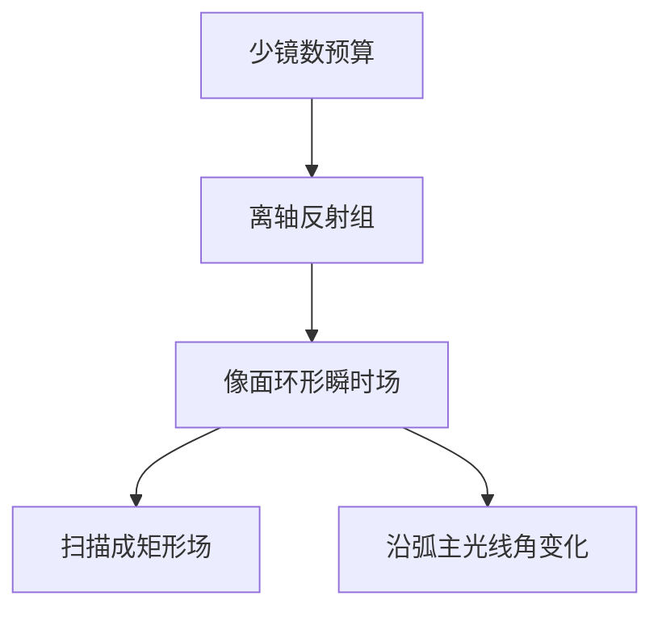

# 环形场

EUV 投影在像面上给出的是一段窄弧，不是浸没机那条直狭缝。扫描把弧扫成矩形场；弧宽就是瞬时焦深和像差都还必须成立的那一条。

<footer>—— 对照 Zeiss / ASML 对 EUV ring-field 扫描的公开光学布局；Bakshi 系统光学</footer>

[上一课](/litho/reflectivity-mirror-count)用 $R^N$ 卡住了镜数。缺口是场：全反射、离轴、环形视场（ring field）是少镜数下仍能控像差的经典解。光瞳里还剩多少填充，留给[下一课](/litho/pupil-fill-ratio)。

## 问题

镜数预算不允许再堆折射式那种多片补偿。EUV 投影用离轴非球面反射组，良好校正的瞬时视场自然落在以光轴为心的窄环上——像面上是一段弧形狭缝。DUV 浸没的直狭缝是折射物镜的远轴设计结果，不能照搬。若强行做大方场、多镜校正，透过率先死。

缺口是把「弧」写成扫描几何，而不是再乘一次 $R$。工件台沿扫描方向把弧扫过场高度，曝光场是矩形；弧的宽度（scan-cross 方向的瞬时场）受像差、多层角谱和焦深限制。High-NA 半场，是环形场在更大 NA 下的再切割，不是另一种物理。

环形场是瞬时像面形状。硅片上的曝光场仍是扫描出来的矩形（High-NA 上是半场矩形）。不要把 ring field 理解成芯片是弧形的。

## 方法

照明把 IF 整形后，沿弧均匀照亮掩模上的共轭狭缝。狭缝宽度进入剂量：$D\sim I\cdot t_{\mathrm{dwell}}$，扫速与弧宽一起定停留时间。均匀性要沿弧长做，沿扫描方向靠速度和脉冲积分。掩模侧主光线角沿弧变化，[斜入射阴影](/litho/euv-oblique-shadow) 和 M3D 偏置随狭缝位置变，OPC 必须带狭缝坐标。

装调与热：弧上各点对应镜子上不同足迹，面形和 MSFR 的指纹会沿弧展开成 CD 图。收集镜径向污染不均，先表现为弧上照度不均。

### 弧宽是剂量也是像差

弧在扫描方向的宽度决定停留时间，也决定瞬时视场有多偏离设计环。加宽弧可以提高光子积分、放慢对源功率的苛求，像差和多层角谱会先越界。收窄弧则相反：像质好、产能要功率补。环形场宽度与 IF 瓦数是同一张表的两边，不能只在照明配方里偷偷加宽。

## 机制

环的半径和宽度来自像差平衡：某些慧差、像散在环上抵消或可容忍。离开设计环，波前迅速超标。这与同步辐射束线的环场光学同族，光刻把它做成扫描狭缝。波长短、公差紧，环更窄；产能就靠扫速和 IF 功率补——又回到功率路线。

High-NA 变形光学在扫描和交扫方向用不同倍率，弧的共轭在掩模上变成「瘦高」的照明区。场切半是为了让镜子口径和 CRA 活在多层角窗里，环形场逻辑不变，只是环的可用长度被裁短。

剂量传感器若只看弧的中点，边缘 CRA 和照度误差会被漏掉。沿弧采样是环形场的计量税。

## 边界

本课不把光瞳填充比写成 etendue 公式，下一课才把源尺寸与光瞳匹配。不重写工件台加速度。弧不是芯片形状：扫描才把瞬时环扫成矩形场（High-NA 上是半场）。出处：Zeiss/ASML ring-field 扫描布局；Bakshi；斜入射课的沿狭缝 CRA。

## 小结

- 少镜数全反射把瞬时场收成窄弧；扫描把弧sweep 成矩形曝光场。
- 沿弧的 CRA、照度和像差都是场相关量，OPC 不能当直狭缝。
- 下一课：弧上的照明在光瞳里填多少。
- 出处：Zeiss、ASML、Bakshi。
