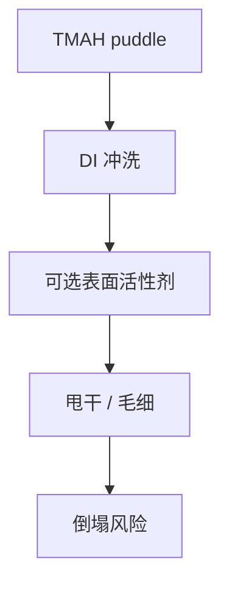

# 冲洗与表面活性剂

冲洗要结束溶解、带走盐，还要决定干燥时缝里还剩什么液体。表面活性剂改接触角，是倒塌课的液体旋钮。

<footer>—— 对照显影后 DI 水漂洗与 surfactant rinse 公开实践</footer>

[上一课](/litho/tmah-developer)停在碱液里。缺口是换成水（或含表面活性剂的漂洗）：停显影、降离子、为干燥做准备。主干 [图形倒塌](/litho/pattern-collapse) 已写毛细力；本课把轨道上的冲洗接到那一课，不重推弯月面公式。

## 问题

碱不冲干净，会继续咬、会留盐晶体。纯水冲洗的表面张力高，高深宽比线在干燥时对拉。表面活性剂降低 $\gamma$、改接触角，减轻倒塌，但可能留有机残、改后续刻蚀。把倒塌只写成「胶太高」，会漏掉这瓶漂洗液。

## 方法

多步：DI 水喷淋或 puddle，可选表面活性剂漂，再甩干。时间与转速影响残留液膜。超临界 CO₂ 干燥是另一条资本路径，本课只点名，不展开设备。

表面活性剂配方是供应商黑盒。换胶常要换漂洗，缺陷与倒塌窗口一起动。

## 机制

冲洗把溶解产物浓度打下去，溶解反应停。干燥时若缝中仍是高 $\gamma$ 液体，毛细压差最大。表面活性剂吸附在胶与水界面，降 $\gamma$，也改变是否铺展进缝。

## 边界

本课不替代倒塌课的力学。下一课专写倒塌抑制的其他手段（深宽比、硬化、溶剂）。

## 小结

- 冲洗停显影，并设定干燥液体。
- 表面活性剂是倒塌–残留的权衡。
- 出处：倒塌课；轨道漂洗通识。
