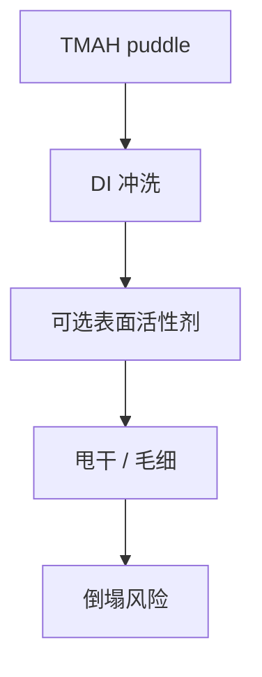
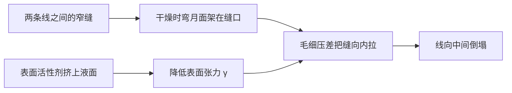

# 冲洗与表面活性剂

冲洗要结束溶解、带走盐，还要决定干燥时缝里还剩什么液体。表面活性剂改接触角，是倒塌课的液体旋钮。

<footer>—— 对照显影后 DI 水漂洗与 surfactant rinse 公开实践</footer>

[上一课](/litho/tmah-developer)停在碱液里。缺口是换成水（或含表面活性剂的漂洗）：停显影、降离子、为干燥做准备。主干 [图形倒塌](/litho/pattern-collapse) 已写毛细力；本课把轨道上的冲洗接到那一课，不重推弯月面公式。

## 问题

碱不冲干净，会继续咬、会留盐晶体。纯水冲洗的表面张力高，高深宽比线在干燥时对拉。表面活性剂降低 $\gamma$、改接触角，减轻倒塌，但可能留有机残、改后续刻蚀。把倒塌只写成「胶太高」，会漏掉这瓶漂洗液。

术语翻译：表面活性剂（surfactant）就是「让水变得不像水」的小分子——一头亲水、一头亲油，挤在水面（或水与光刻胶的界面）上，把液面往内缩的劲儿泄掉一大半，于是干燥时拉线的毛细力也跟着变小。

## 方法

多步：DI 水喷淋或 puddle，可选表面活性剂漂，再甩干。时间与转速影响残留液膜。超临界 CO₂ 干燥是另一条资本路径，本课只点名，不展开设备。

```mermaid
flowchart TD
  ALK["TMAH puddle"] --> DI["DI 冲洗"]
  DI --> SURF["可选表面活性剂"]
  SURF --> DRY["甩干 / 毛细"]
  DRY --> COL["倒塌风险"]
```

表面活性剂配方是供应商黑盒。换胶常要换漂洗，缺陷与倒塌窗口一起动。

## 机制

冲洗把溶解产物浓度打下去，溶解反应停。干燥时若缝中仍是高 $\gamma$ 液体，毛细压差最大。表面活性剂吸附在胶与水界面，降 $\gamma$，也改变是否铺展进缝。

数字实例：纯水的表面张力约 $0.072\ \mathrm{N/m}$，加足表面活性剂后常能压到 $0.025\ \mathrm{N/m}$ 上下——不到原来的四成。毛细拉力大致随 $\gamma$ 走，等于把干燥时拉线的「手劲」直接砍掉一半以上。

```mermaid
flowchart LR
  GAP["两条线之间的窄缝"] --> MEN["干燥时弯月面架在缝口"]
  MEN --> CAP["毛细压差把缝向内拉"]
  CAP --> COL["线向中间倒塌"]
  SURF["表面活性剂挤上液面"] --> LOW["降低表面张力 γ"]
  LOW --> CAP
```

## 边界

本课不替代倒塌课的力学。下一课专写倒塌抑制的其他手段（深宽比、硬化、溶剂）。

## 小结

- 冲洗停显影，并设定干燥液体。
- 表面活性剂是倒塌–残留的权衡。
- 出处：倒塌课；轨道漂洗通识。

常见误区：以为冲洗只是「把脏水换成清水」的物理动作，实际上它同时是化学开关——残留碱一停，显影立即刹车，线宽就定格在这一步。冲洗水温和时间漂了，CD 会跟着漂。
