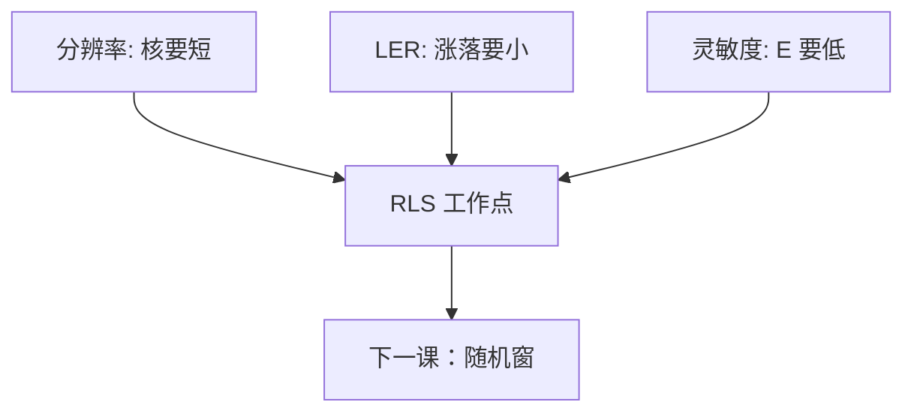

# RLS 三角

分辨率要核小，LER 要核大或光子多，灵敏度要光子少：三个顶点不能同时钉在最优。胶与剂量的选择是在三角形里挪点。

<footer>—— 据 Gallatin / Bristol 对 resolution–LER–sensitivity 权衡的公开论述；Naulleau 的随机实验语法</footer>

[上一课](/litho/stochastics-vs-nils)把光学 NILS 写成随机增益。缺口是材料侧不能再假装「更敏、更锐、更光」可兼得：这就是 RLS 三角。主干 [EUV 胶](/litho/euv-resist) 已经点过名字。本课把它接到本课程的核、计数与 Z 因子上。均值 E–D 窗外还要切随机窗，留给[下一课](/litho/stochastic-process-window)。

## 问题

Resolution：有效模糊（电子核 + 酸核 + 显影）必须短于半节距预算。LER：同一套涨落，核短则高频毛、光子少则幅度大。Sensitivity：$E_\mathrm{size}$ 低则扫描快、源功率够用，但 $N$ 小、尾肥。加淬灭、降 PEB：核短、分辨率好、灵敏度差、有时 LER 高频升。加剂量：LER 与缺陷降，灵敏度这项「变差」（从产能看）。加吸收 / 金属胶：同样 $E$ 下 $N$ 升，但团簇与沾污换一套 R。

缺口不是再讲 CAR 循环，而是：后课改配方时必须声明挪的是哪一角，禁止只报「更敏」或只报「LER 3 nm」。Z 因子是三角上的一个标量投影，投影方向随定义变。

### 光学不取消三角

NILS 升高，同样材料点的 LER 与缺陷改善，看起来三角缩小。目标 CD 若跟着缩，R 角更紧。RET 是在光学上买裕量，不是删除材料三角。[pag-quencher](/litho/pag-quencher) 的一对加载是 R 与 S 之间最常用的配方轴。

不要把三角画成等边必然。有的胶族 L 角被团聚钉死，加剂量也降不到地板以下。那是化学地板，不是几何课。

## 方法

画图：横轴 $E_\mathrm{size}$，纵轴 LER，参数是模糊或节距；另一张看缺陷率。资格：同一节距、同一 NILS 协议下比胶，否则在比光学。改一个旋钮（PEB、负载、胶厚、剂量）必须同时报 R、L、S 三个读出——CD 能否分辩、谱或 $3\sigma$、清场/到尺寸剂量。

与[酸扩散](/litho/acid-diffusion-lwr)：$\ell$ 是三角里明确的核旋钮。与二次电子核：EUV 上即使 $\ell\to 0$，R 角仍被 $G_e$ 卡住。

## 机制

信息论口语：更少的光子要在更小的体积里做更确定的决定，统计不允许。模糊把体积做大，确定些，边糊。化学增益把一个光子变成许多酸，灵敏度好，但把出生位置的随机放大——Ito 的增益在 DUV 买产能，在 EUV 薄胶上把 L 角推出来。金属氧化物提高吸收，是在 S 角用截面付钱，而不是用增益付钱，L 角换成团簇。

Gallatin 把 LER 写成模糊与剂量的函数，定性就是这个三角。定量预因子随胶变，本课不抄某一拟合当定律。

干法显影与 MOR 会改三角的材料边，不删除顶点。后两课换胶族，三角语言保留。

## 边界

不把某篇 SPIE 的「最佳模糊 5 nm」写成所有层。不重导瑞利 $k_1$ 来当 R 的定义——R 这里是胶核与半节距预算，不是镜头公式。下一课把三角上的点放进剂量–焦平面：有的点平均 CD 窗还在，随机窗已经关上。

## 小结

- RLS：核短、光子多、剂量低不能同时最优。
- 改 PEB / 淬灭 / 吸收 / 剂量都是在三角上挪点，必须三报。
- NILS 改光学增益，不删除三角；目标缩则 R 更紧。
- Z 因子是投影，不是第四个独立物理。
- 出处：Gallatin / Bristol RLS；Naulleau；主干 [euv-resist](/litho/euv-resist)。
