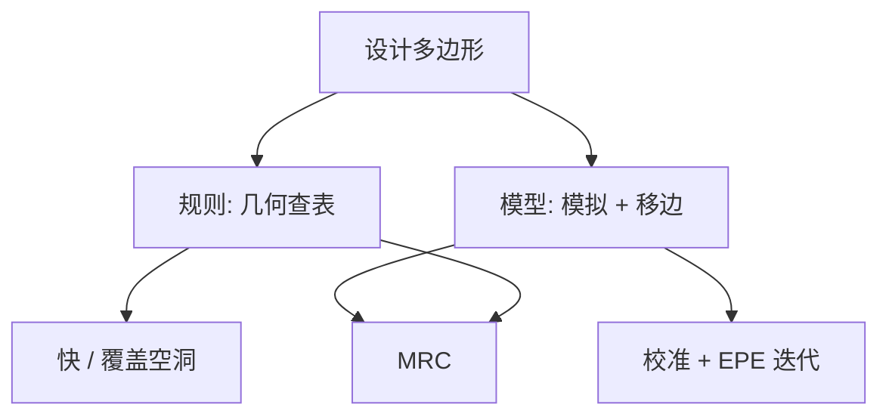

# 规则 OPC 对模型 OPC

查表把邻域编成有限条几何规则；成像模型把邻域写成可计算的算子。全芯片能迭代，是因为模型够快，不是因为规则被写得更细。

<footer>—— 对照 Cobb 对模型基 OPC 与快速空中像的表述；RET 史亦见 Schellenberg</footer>

[上一课](/litho/opc)已经把 OPC 收成：在掩模上预畸变，补偿光学、胶与蚀刻写进轮廓的邻域算子。缺口是两种工程实现还没有对照。早期用查表：看见线端就加锤头、看见拐角就加衬线；图形一复杂，表炸。Cobb 把修正写成带成像反馈的迭代，用稀疏空中像和可变阈值胶模型让全芯片模型基成为可能。本课钉规则对模型。光源与掩模如何一起选，留给[下一课](/litho/smo)。

## 问题

规则 OPC 的输入是局部几何类别（宽度、间距、线端、内/外角），输出是预先标定的偏置或衬线尺寸。它快，因为一次模式匹配。它不准，因为真实空中像依赖光学直径内的全部开口，二维组合不是一张二维表能穷尽的。禁戒节距、助条、非曼哈顿都会让规则失配：表上「看起来同类」的边，印出来 EPE 可以差出窗口。

模型 OPC 的输入是校准过的前向模型，输出是碎片的法向移动，直到 EPE 或 PV-band 落入容差。计算贵，但邻域算子被显式求值。缺口是：在哪一代、哪一层，规则的覆盖已经破产，必须把签核从查表换成模拟。

### 规则不是「低保真模型」

把规则理解成模型的粗糙版，会漏掉表示差异。规则没有空中像，只有几何 if-then；它对光源、NA、胶扩散的依赖全藏在表的标定夜。换照明或换胶，表作废。模型把这些依赖写在 TCC 与抗蚀剂参数里，换工艺是换校准，不是重写一万条衬线规则。Schellenberg 对 RET 的综述口吻正是：分辨率增强从规则花样走向基于模型的全芯片修正。

衬线、锤头、内缩这些几何零件，规则和模型都会用。差别不在零件目录，而在零件的尺寸是查表还是模拟决定。

## 方法

规则流：抽取边环境 → 查表 → 应用偏置 → 可选的 MRC。标定用一维线和少量测试图形。模型流：切碎片 → 模拟 → 算 EPE → 移动 → 直到收敛或撞 MRC。Cobb 的关键不是「多迭代几次」，而是：Hopkins 成像用相干系统叠加（SOCS）做成对稀疏点廉价的求值，再用可变阈值胶模型把强度变成边位置，使反馈环在全芯片上可跑。

混合仍存在：规则先放 SRAF 或先修线端，模型再收 EPE；或只对热区上模型。65 nm 之后逻辑的默认签核是模型；更老或更松的层可以留在规则，以省 CPU。EUV 掩模 3D 让「一张 DUV 规则表」彻底失效，因为阴影随取向变，不是平移不变的几何偏置。

### 表的爆炸与模型的校准墙

规则的失败模式是覆盖空洞：未列入的二维热区在硅上才出现。模型的失败模式是校准空洞：模型在计量点上很准，在未建模的像差或随机尾部上很假。两者都不是「算法正确就结束」；规则要维护表，模型要维护校准片。

## 机制

规则把邻域算子投影到低维几何特征。投影有零空间：许多光学上不同的环境共享同一条规则，修正必然妥协。模型在每个碎片上求算子，零空间小得多，但逆问题仍欠定，要靠碎片长度、MRC 和迭代步长正则化——后课 ILT 会把欠定再放大。

计算复杂度：规则约与边数线性；模型是边数 × 迭代 × 每次模拟的光学直径。Cobb 用稀疏采样而不是密网格填满芯片，才让后者进 TAPOUT 日历。GPU 加速的是模型路径，见 [计算光刻](/litho/computational-litho-gpu)，规则表不需要 GPU。

不要把「模型 OPC」理解成严格电磁。量产模型是紧凑光学加紧凑胶；严格 Maxwell 是热区抽查。后课会对照紧凑与严格，本课只钉查表对模拟。

## 边界

规则并未在历史上消失：测试图形、人工热区修补、以及模型失败时的应急补丁仍可能是规则。模型 OPC 假定前向模型够准；未建模项变成系统偏差。随机缺失孔不是均值 EPE 问题，模型迭代加再多衬线也抹不平泊松尾。

后课默认：说到 OPC，若无说明，就是模型基全芯片迭代；规则只作为对照或辅助。

引用 OPC 精度时写清规则还是模型、是否含蚀刻、是否 PV-band。用规则标定片上的 CD 去给模型流「对赌」，不是同一场考试。

## 小结

- 规则 OPC 按几何类别查表，快但不能覆盖二维邻域组合。
- 模型 OPC 用成像与胶模型迭代最小化 EPE；Cobb 的稀疏空中像使全芯片可计算。
- 换光源或换胶：规则要重做表，模型要重校准。
- EUV 取向相关阴影让纯几何规则系统性失配。
- 出处：Cobb，模型基 OPC 与快速成像；Schellenberg 对 RET / OPC 的公开综述。
