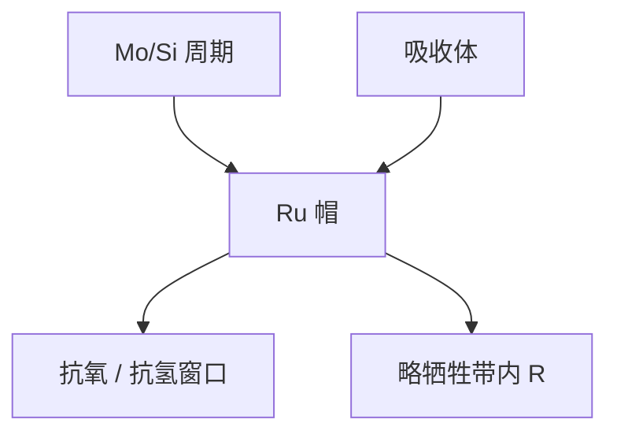

# 钌覆盖层

Mo/Si 怕氧、怕氢、怕碳。几纳米钌当帽：保住布拉格周期，自己尽量少吃带内反射率，还要允许氢刻锡。

<footer>—— 据 Bajt 等对 Ru 帽层；Bakshi 多层与表面化学</footer>

[上一课](/litho/euv-phase-shift-mask)无论二元还是相移，工作面都是多层顶。缺口是这层顶在真空、氢和 EUV 下怎么活：量产公开的覆盖层是钌（Ru）。黑边要把场外多层弄黑，留给[下一课](/litho/black-border）。

## 问题

硅顶层在空气或残余水里氧化，周期膨胀、对比下降；氢自由基可以刻碳也可以攻击错误的帽；锡若落到无帽界面，清洗会连硅一起伤。需要一层薄帽：13.5 nm 吸收尽量小、连续、抗氧、在氢等离子体中相对惰，并且不把 MSFR 抬起来。钌是公开选中的折中，不是「最不吸收的元素」。

缺口是帽层合同，不是再讲 Mo/Si 周期公式。掩模空白和投影镜都用帽，但掩模还要在上面刻吸收体、修缺陷、装 pellicle，帽的针孔就是相位坑。

帽层厚度是反射率与保护的折中，公开量级是数纳米。太厚，峰值 $R$ 掉；太薄，针孔和扩散。不要把某张 TEM 照片的厚度当全球规格。

## 方法

沉积：在多层完成后加 Ru，有时带超薄阻挡以免 Ru 与 Si 互扩散。掩模厂再在帽上沉积吸收体并图形化，刻蚀必须停在帽上或可控地微侵，不能把布拉格堆挖穿——除非故意做黑边。氢清洗假设帽在，收集镜课已经用过这个假设。

计量：峰值 $R$、氧化前后差、氢暴露后的起泡与应力、缺陷密度。针孔在光化检验上表现为相位缺陷，打印阈值随照明变。

### 大气暴露是掩模帽的额外税

投影镜几乎不离开真空；掩模要进出盒、检验机和大气。钌减缓氧化，但不能无限次暴露。帽上的自然氧化层改一点 n、k 和应力，反复进出后 $R$ 和相位指纹会走。存储与搬运的惰性气氛是帽层合同的一部分，不是设施附录。

## 机制

Ru 在 13.5 nm 的光学常数允许薄层仍有可接受透过（作为帽，不是作为吸收体）。它减缓氧向硅的扩散，并提供氢刻锡时的化学终点：SnH₄ 走，Ru 尽量留。Bajt 等的多层帽层工作表明，帽同时改应力和轻微相移——吸收体 + 帽 + 多层是同一块电磁物。氢植入起泡若发生在帽–多层界面，MSFR 和局部相位一起坏，氢等离子体课的不可逆项在掩模上同样成立。

掩模帽与投影镜帽配方不必相同：掩模还要兼容吸收体刻蚀和大气暴露；投影镜几乎不离开真空。不要写成一种 Ru 膜打天下。

## 边界

本课不写场边缘如何把多层蚀穿做成黑边，下一课才写。不重写收集镜清洗流量。帽的针孔按相位缺陷管，按吸收体缺陷管会漏检。出处：Bajt Ru capping；Bakshi；Madey 表面化学；氢等离子体课。

## 小结

- 钌帽保护 Mo/Si 对抗氧和氢，并给刻蚀一个可停的表面，代价是一点 $R$ 和潜在针孔。
- 吸收体、相移层和缺陷都坐在帽上，帽是掩模电磁的一部分。
- 下一课：场与场之间那圈「不该反光」的黑边。
- 出处：Bajt；Bakshi；ASML/SEMATECH 帽层公开讨论。
