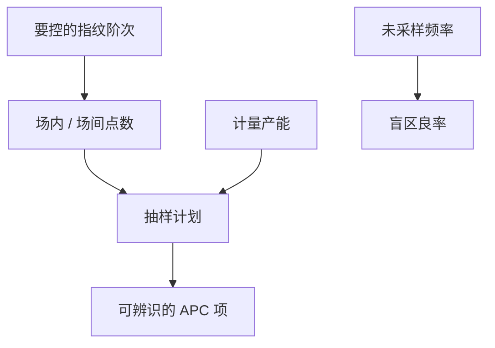

# 抽样计划

抽哪些场、哪些片、哪些垫，决定 APC 看见哪张指纹、SPC 看见哪类漂移；没抽到的空间频率在控制里等于不存在。

<footer>—— 对照半导体计量抽样与 SEMI 对计量策略的通称；套刻高阶拟合对采样密度的公开要求</footer>

[上一课](/litho/feedforward-feedback-r2r)要前馈与反馈。缺口是可观测性：每批量 2 片 × 9 点，看不见边场弓形，高阶校正会去拟合噪声。本课钉抽样计划。控制图如何用这些点判决，留给[下一课](/litho/spc-control-chart）。

## 问题

计量产能有限：CD-SEM 慢，套刻较快仍不是每场全垫。抽样是空间（场内、场间、晶圆半径）、时间（每片/每批/每 N 批）和产品（哪些层全检）的合同。欠采样：指纹混入残差，APC 补错项，边场良率死。过采样：扫描机等计量，WIP 堆积，或用过时数据补未来批次。

缺口是**与模型阶次匹配的采样**，不是「越多越好」。[高阶套刻](/litho/high-order-overlay) 已说项一开就需要密读数；本课把这句话写成计划：开哪些项，就必须有哪些点。

### 产品图形对专用垫

套刻垫和 CD 垫不代表 SRAM 拐角。抽样若只在划片道，APC 会把器件偏置当不存在。关键层应对产品内或专用阵列抽样，与对准树一致。PWQ 是鉴定抽样，不能替代量产抽样。

边缘场与部分场（后课）若从不进样本，边缘良率问题会在客户失效里首次出现。

## 方法

设计：对目标指纹的空间频率做 Nyquist 式估计（工程上：场内点数 ≥ 校正项自由度的数倍）。分层：监控用稀疏，触发后加密，异常批全检。与缺陷检测抽样不同：缺陷是稀疏事件，CD/套刻是连续场——计划不要混用同一张图。动态抽样：APC 残差或 SPC 告警后加测，属同一合同。

计划要写进层食谱：默认点、加密点、禁止永远跳过的边缘场。ASML 对高阶 overlay 的公开要求，本质上就是「开项必须有点」；本课把这句话从套刻推广到 CD 地图。

## 机制

校正模型是多项式或扫描仪项，参数估计的方差随点数与布局走。点都在场心，高阶项不可辨识，估计器会把噪声当弓形。时间上，批内第一片代表不了热漂移后的稳态——扫描机热课已有；抽样应含热态片。偏差：永远抽同一 slot 会与轨道某一涂胶路径混杂。

未采样的空间频率在控制里等于不存在。边缘场若从不进样本，高阶项在刀口无约束，器件却在那里。

## 边界

不把某厂的「每批 4 片」写成标准。不重写 CD-SEM 算法。缺陷检测的抽样在良率课另写。

后课默认：抽样阶次 ≥ 控制阶次。下一课 SPC 用这些点画图，但不创造未测到的信息。

## 小结

- 抽样必须覆盖要补偿的空间频率与热态。
- 划片垫不自动代表产品图形。
- 动态加密是计划的一部分，不是临时救火。
- 出处：计量抽样与高阶套刻采样公开要求；SEMI 计量策略通称。
