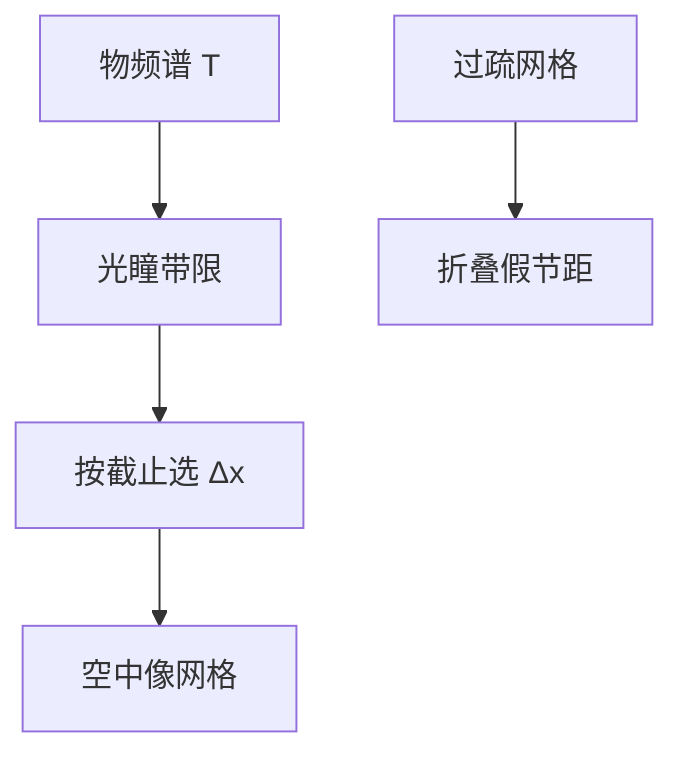

# 采样定理与成像

带限的像可以被离散点完全决定；网格粗过 Nyquist，折叠进来的不是「数值噪声」，而是假节距。

<footer>—— Shannon 采样定理；光学带限与复原见 Goodman, Introduction to Fourier Optics</footer>

[上一课](/litho/fourier-pairs-convolution)把成像收成卷积与傅里叶对。缺口是：计算光刻与计量都在**网格**上工作，还没有说格子必须有多密，才不把光瞳截止以外的假频率写进空中像。本课钉采样定理在成像里的用法。点扩散的连续核留给[下一课](/litho/psf-airy)。不要把 Nyquist 频率写成产线 $k_1$。

## 问题

上一课的 $T(\mathbf{f})H(\mathbf{f})$ 是连续函数。机器里的掩模是多边形或像素，空中像是阵列，SEM 轮廓是采样点。Shannon：若信号频谱支撑在 $|f|\lt f_c$，间隔 $\Delta x\le 1/(2f_c)$ 的样点决定全部连续函数。光学像的 $f_c$ 由光瞳给出，不是由设计节点名给出。

缺口因此是给空中像一条可写进网格的截止，而不是再列一次 rect–sinc。把「画得更密」当成精度，会在已经带限的像上浪费点；把网格取得比截止更疏，会让本不该进瞳的节距从折叠里冒出来——OPC 会去修一个光学上不存在的齿。

### 两条截止不要混

相干场的带限是 $\mathrm{NA}/\lambda$（像方）；非相干强度的带限是 $2\mathrm{NA}/\lambda$，因为 $|U|^2$ 的谱是场谱的自相关。[MTF 课](/litho/mtf-optics)已经写过这两条。采样必须声明采的是场还是强度：采强度，间隔要按 $2\mathrm{NA}/\lambda$ 的 Nyquist；采复振幅再平方，网格可以按场截止来，平方在离散上完成。部分相干介于两者之间，工程上按强度截止取样最安全。

掩模侧还有一次采样：电子束写像素、ILT 的像素掩模、曲线掩模的折线。那是物体 $t$ 的离散，不是像的离散。物体可以有锐角（谱不带限），系统靠光瞳把像变成带限。不要用掩模像素去代替像面 Nyquist。

## 方法

像方空间频率以 $\mathrm{NA}/\lambda$ 归一时，单位圆是相干截止。强度网格：

$$
\Delta x \lesssim \frac{\lambda}{4\,\mathrm{NA}}
$$

对应 $2\mathrm{NA}/\lambda$ 的 Nyquist（再留一点抗混叠余量）。这是计算网格，不是「能印多细」——后者仍读[瑞利课](/litho/rayleigh-litho)的工艺式，本课不重写。

抗混叠：连续光瞳硬切已经带限；数值上若先把物体 raster 成比光瞳更粗的 FFT，等于先混叠再滤波，假频进了通带。正确顺序是：物体频谱按光学截止铺足够零（或解析变换），乘 $P$，再逆变换到满足 Nyquist 的像面。

### 计量采样是另一条链

CD-SEM 的像素、散射测量的衍射级，受探测器与光学的另一套截止约束，不要把「仿真 Δx」抄进量测配方。本课只约束成像计算与掩模光栅化相对投影截止的关系。

## 机制

带限函数的信息量由截止面积决定。光瞳是有限圆，空中像的自由度大致是每个光学面积 $(\lambda/\mathrm{NA})^2$ 里若干个数——这就是为什么全芯片还可以用稀疏点加核来算，而不是每纳米一个独立像素。混叠的机制是周期延拓的谱叠进基带：看起来像某禁戒节距「突然有对比」，其实是邻区谱的折叠。

扫描狭缝沿扫描向做时间平均，等效于再乘一个 sinc 型的传递，并不放宽 Nyquist；它只再低通一次。不要把扫描平均当成可以加粗网格的许可证。

### 后课默认的接口

说到离散空中像，默认网格满足强度 Nyquist，FFT 窗口盖住光学直径。SOCS 核、OPC 碎片求值都建立在这条带限上。下一课的 PSF 是连续核；落到网格时用本课的间隔去采样它。

## 边界

定理假定等晕、平移不变、理想带限。场点换 TCC、矢量通道、薄膜栈沿 $z$ 的驻波，都不取消横向带限，只改变要采的是哪一张 $I(x,y)$。禁止把 Nyquist 与 $k_1$ 互相换算成「节点分辨率」。也不引用未公开的 OPC 引擎缺省网格表。

## 小结

- 空中像由光瞳带限；采样间隔由截止决定，不是由节点名决定。
- 强度截止 $2\mathrm{NA}/\lambda$，场截止 $\mathrm{NA}/\lambda$；声明采的是哪一个。
- 过疏网格制造假节距；过密网格不增加光学信息。
- 掩模像素与像面 Nyquist 是两次离散。
- 下一课：连续核 PSF / Airy。
- 出处：Shannon；Goodman, *Introduction to Fourier Optics*。
