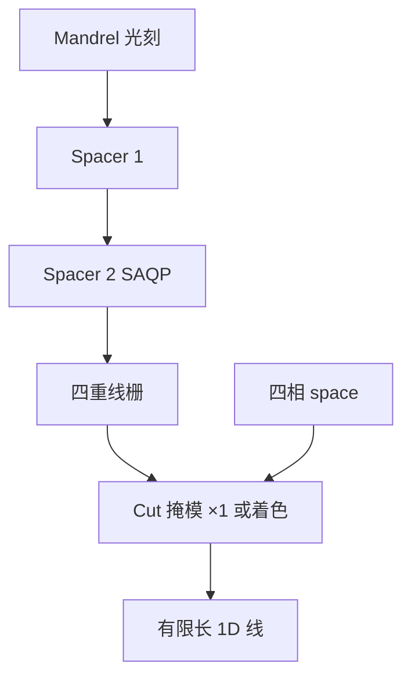

# SAQP 加切断

四重侧墙把节距劈到单次光学到不了的密度；晶体管要的仍是有限长的线，切断掩模在栅格上把四重线打断。

<footer>—— 据一维 SAQP + cut 工艺通称整理</footer>

[上一课](/litho/cut-mask-dpt)把切断掩模写成自对准线栅上的第二次图形：切的是线，套刻是切对线。缺口是芯轴已经走了两轮 spacer 的情形——SAQP 的线更密、相更多，切的 $k_1$ 与对准更紧。本课钉 SAQP 加切断。浸没多重的代价账留给[下一课](/litho/duv-multipattern-cost），这里只钉 1D 几何。

## 问题

切断课的默认图像往往是 SADP：一轮侧墙，节距减半，再切。SAQP 再劈一次，最终节距约是 mandrel 的四分之一，线密度更高，切缝对准每一根线的裕量更小。切孔之间的间距若仍按器件栅格，单次切层更容易撞光学地板，于是切自己也要多重着色——「线四重自对准、切双重/三重」。

缺口因此是四重 + cut 的组合，不是再讲一遍弯月面式的切断定义。把 SAQP 写成「切也可以自对准」，会漏掉终止位置仍是光刻套刻。把切层当成第四轮 spacer，几何上也不对：spacer 不能在任意格点停线。

### 1D 工艺包

逻辑鳍、某些栅与金属轨道用固定节距 1D + cut，正是因为 SAQP 擅长这件事、不擅长二维任意拐角。Cut 多边形的并集定义哪里不要线；过切吃邻线的风险随节距变小而升。奇偶（以及四相）线宽若已分裂，同一套刻误差在窄相上更致命。

先切 mandrel 再长两轮 spacer，与先做完 SAQP 再切线，切的对象不同，套刻预算不同。本课承认两种顺序，不编哪家产线用哪一种。

## 方法

几何：mandrel 光刻一次（仍受单次 $k_1$）→ spacer1 → spacer2 → 得到四重线栅 → cut 曝光（一次或染色多次）在允许格点打断。OPC：mandrel 与每一张切版分开建模；切的 MEEF 对孔/缝图形，不是对长直线。计量：四类 space 分列（不要只用奇偶两桶），切位置相对最近线的 overlay，欠切/过切缺陷分类——检验课的 ADI inspect 在切层上往往比线层更关键。

与 LELELE 对照：SAQP+cut 的线与线之间不靠三次线层 overlay，靠薄膜；有限长度靠切 overlay。二维结仍难。选哪条路是 DTCO，不是光学课的唯一解。

### 切层多重

切缝太密时，切层走 LELE 着色：同色切间距回到单次窗，异色切受套刻限制。公开 1D 策略里「线自对准、切多重」是这句话，不要把全部密度都算进 spacer 次数。

## 机制

两轮保形膜把周期除以四，线宽主要由第二轮（及前轮残留）薄膜厚度定义。切断不改周期，只改连通性：在指定格点把线刻断。套刻误差 $\delta$ 让切缝中心偏离目标线中心：$\delta$ 大于半个 space 就碰邻线。SAQP 的 space 更小，同一 $\delta$ 更致命——这是为什么切层 overlay 规格往往紧过 mandrel 层。Walking 让四相 space 不等，切缝的「安全走廊」按最窄相设计。

先切芯轴：切的是疏一倍或疏四倍的 mandrel，光学容易，但切误差会被后续 spacer 映射到最终线终止位置，传递函数不同。两种流程的缺陷图不同，检验食谱不能共用。

不要把 SAQP+cut 的扫描次数理解成「只有一次光刻」。Mandrel 一次 + 每张切版一次，加两轮薄膜与回刻。wph 会计按模块加，下一课代价会算这笔，本课不编数字。

## 边界

不写某代鳍的纳米节距，不编切层张数。EUV 做 mandrel 或做 cut 是后课混合策略。二维金属若强行走 SAQP+cut，拐角要靠额外切/块，设计规则会先于光学把人赶回去。

下一课把浸没多重走到商品节点的掩模张数、过机与套刻代价收成账；本课只要求承认：四重线仍然要切，切仍是光刻。奇偶课的四相表在这里变成切的安全走廊：最窄 space 决定 $\delta$ 还能滑多远，平均节距合格不够。

## 小结

- SAQP 把节距四重劈开；有限长度仍靠切断掩模，套刻是切对线。
- 更密的线让切 overlay 与切层多重成为一阶；四相 space 都要进安全走廊。
- 先切 mandrel 与后切线是两种传递，缺陷图不同。
- 这是 1D 工艺包，不是任意二维布线。
- 最窄那一相 space 决定切的套刻还能滑多远。
- 扫描次数是 mandrel + 切版，加上两轮薄膜，不要只数一次光刻。
- 出处：gridded 1D / SAQP + cut-mask 的工艺通称。
