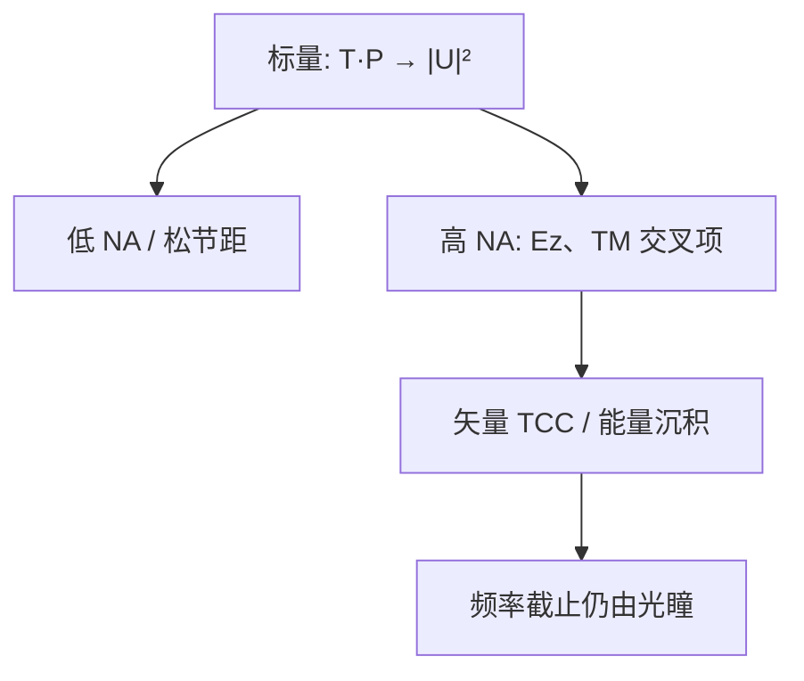

# 高 NA 下标量近似失效

傅里叶骨架假定一个标量 $U$ 与一只光瞳；孔径角一大，电场的纵向分量不能再丢，模方也不再等于胶里的能量。

<footer>—— 电磁边值见 Born &amp; Wolf；高 NA 光刻的标量失效对照 Mack / Flagello</footer>

[上一课](/litho/speckle)把过强空间相干的随机纹理收掉。至此补层的标量骨架——对、采样、PSF、CTF/OTF、TCC/SOCS——已经齐。缺口是：**这副骨架何时不能当最终强度用**。主干已有[矢量成像](/litho/vector-imaging)与 [TE/TM](/litho/te-tm-polarization)；本课只标失效判据，不重写 Jones 通道。浸没把夹角再做大，留给[下一课](/litho/immersion-vector-imaging)。不重推 $k_1\lambda/\mathrm{NA}$。

## 问题

标量傅里叶光学：亥姆霍兹标量解、光瞳乘法、像面 $I\propto|U|^2$。推导暗用：偏振与传播方向解耦、光线与光轴夹角足够小、界面上 s/p 差可忽略。当 $\mathrm{NA}\gtrsim 0.7$，边缘光线的 $E_z$ 不可忽略；TM 一对衍射级的 $\mathbf{E}_1\cdot\mathbf{E}_2^*$ 随 $2\theta$ 下降。标量对比、标量 NILS、标量 Airy 都偏乐观。

缺口不是再从麦克斯韦方程讲起，而是给已经写过的卷积一个**适用范围**：低 NA、松节距、不谈偏振的层，骨架继续当计算核；密线、浸没、High-NA EUV，骨架只保留「频率仍由光瞳切」，强度改成能量沉积。

### 失效不是截止变了

相干截止仍是光瞳边缘对应的空间频率，采样 Nyquist 仍按那条截止来。变的是 $H$ 从标量 $P$ 换成矢量传递，PSF 从一只 jinc 换成偏振相关的能量核。把「标量不够」理解成「要改 $\mathrm{NA}$ 定义」会去拧瑞利式，而不是去换成像模型。

干式 ArF $\mathrm{NA}=0.93$ 已经要小心；浸没 1.35 必须默认矢量。孔和二维图形更早付税，因为不能让两向同时走纯 TE。主干矢量课给了接口，本课只把它接到傅里叶骨架的边界上。

## 方法

诊断：同一掩模、同一 $S$，比较标量 $I$ 与胶内吸收 $I_\mathrm{abs}$。密线的对比差随 $\theta$、偏振出现，最佳焦距就已经存在，不是离焦才有。Flagello 把分层薄膜与高 NA 一起算：Fresnel 系数让 s/p 权重再偏一次，失效比「真空里的矢量叠加」更早。

计算策略：SOCS 仍可用，核改成矢量 TCC 的本征函数。Abbe 法则每个源点带 Jones。不要为了「坚持标量」去把有效 $k_1$ 人为加大——那是把偏振税藏进工艺因子。

### 与薄膜课序的预告

胶与 BARC 的分层改变的是沿 $z$ 的驻波和界面系数，即使低 NA 也存在。高 NA 把大角度塞进同一栈，角谱每一条光线的反射不同，标量薄膜也一起失效。后课薄膜干涉先从近轴 Fresnel 讲；本课只警告：高 NA 必须把薄膜和矢量绑在一起。

## 机制

标量把两束光的干涉可见度写成 1。电磁学里可见度乘的是偏振点积与介质里的能量权重。夹角增大，点积下降，暗区抬高，阈值处斜率变缓——NILS 掉，而 MTF 若仍按标量 OTF 画会撒谎。像差相位仍乘在每个矢量通道上，所以 Zernike 敏感度也要在矢量像上扫，不能在标量 Airy 上扫完当数。

## 边界

本课不选浸没液、不选照明偏振产品图。也不把标量模型说成「错误」：它是零阶，OPC 校准可以把一部分误差吃进胶模型，换 NA 或换偏振后校准作废。禁止引用未公开的「标量误差纳米表」。

## 小结

- 标量卷积骨架在大孔径角下给出偏乐观的 $|U|^2$。
- 光瞳截止与采样规则仍在；变的是传递核与能量定义。
- 失效在最佳焦距就存在，不是焦深公式的一部分。
- 矢量 SOCS / Abbe 是原骨架的通道升级。
- 下一课：浸没如何把这件失效变成默认。
- 出处：Born &amp; Wolf；Flagello；Mack；主干矢量成像课。
