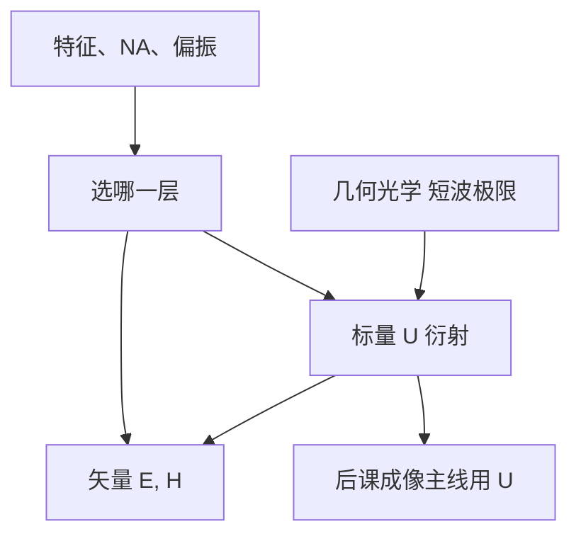

# 标量衍射的适用边界

标量衍射用单一复振幅 $U$ 代替矢量 $\mathbf{E}$；当线宽与波长可比、偏振与多层边界变得重要时，必须回到麦克斯韦的全部分量。

<footer>—— 据 Born &amp; Wolf, Principles of Optics 与 Mack, Fundamental Principles of Optical Lithography 对标量近似的讨论整理</footer>

[上一课](/litho/coherence-length-prep)说明有限带宽与时间相干。电磁与几何光学课程至此收束于一个判断：后课大量用标量 $U$ 做衍射，何时可信？本课是本课程最后一课。下一课转入 [MOSFET 与栅长](/litho/mosfet-gate-length)——器件为何需要图形，而不是把成像积分提前写完。单色波、折射率与光程的课程接口，要等到器件课结束之后的 [单色波、折射率与光程](/litho/em-wave-index)。

## 问题

从 [麦克斯韦方程到波动方程](/litho/maxwell-to-wave) 起，有时用矢量（[偏振](/litho/polarization-states)、[菲涅尔](/litho/fresnel-coefficients)），有时用标量（[平面波](/litho/plane-wave-k)、[透镜方程](/litho/thin-lens-equation)）。缺口是：什么条件下标量错得不可接受？本课只谈建模层次，不把产线分辨公式当作本课的定理。

标量默认：偏振可平均或单一、孔径上给定 $U$ 后自由空间传播、薄膜与衬底的矢量耦合已吸进有效边界。这些在低 NA、特征远大于 $\lambda$ 时常常够用。高 NA、窄缝、金属多层会把 s/p 差异和三维边界抬到一阶。

### 标量失败不是「几何光学失败」

几何光学是 $\lambda\to 0$ 的光线极限；标量衍射是中间层；矢量电磁是完整层。特征缩小先打破的是几何（要衍射），再在 NA 与材料变极端时打破标量（要矢量）。不要把「要算衍射」与「必须 FDTD」当成同一句话。

Kirchhoff 型标量：孔径上 $U$ 等于未扰动入射再乘透过率。掩模厚度、侧壁与多层会破坏这个假设。Mack 把光学光刻的成像链写在标量 Hopkins 框架里，并明确矢量与三维掩模是修正项。

## 方法

标量：$( \nabla^2+k^2)U=0$，给定边界上的 $U$，用角谱或惠更斯–菲涅尔传播。倾向适用：中低 NA、特征 $\gg\lambda$、偏振对比弱、薄膜已折成有效透过率。失效信号：p/s 反射差显著、窄缝 TE/TM 传播不同、掩模三维阴影、金属色散与等离子体效应。

矢量：保留 $\mathbf{E}$、$\mathbf{H}$ 与界面条件。严格解用于掩模与薄膜栈的关键图形；全芯片日常仍跑标量，再对库做矢量校正。本课不教求解器，只划边界。

## 机制

历史顺序是：先光线，再标量衍射，再在节点推进后把矢量当校正。日常引擎仍是标量，因为全芯片要快。本课定位：知道何时标量是零阶、何时必须加矢量补丁，而不是在每一处重推麦克斯韦。

三层次按问题选。画共轭与倍率用几何；算空中像用标量 $U$；掩模三维与高 NA 偏振用矢量。后一课程从单色 $U$、折射率与光程重新展开成像，默认读者已经接受这条分层，并且已经知道器件为什么要图形。

标量失败的典型现场是：同一套光学模型对线和孔的预测偏差方向不同，或 TE/TM 空中像差出一截工艺窗口。那不是「再调一次 $k_1$」能吸收的，而是模型层级选错。本课把这条经验写成边界，不把求解器当内容。器件课接下来只问图形对象，不再升级麦克斯韦。

## 边界

本课不教 FDTD 或严格耦合波的实现，也不讨论电子束、纳米压印。抗蚀剂化学、照明部分相干的 Hopkins 交叉系数，属于成像主线，不在本课写完。下一课起解释 MOSFET 栅、CMOS 成对、半节距与节点名——图形化的对象，不是成像公式。

后课默认：标量 $U$ 是窄带、偏振可控制时的工作马；高 NA 与三维掩模要矢量验证。光学前置课程在此结束。

## 小结

- 几何 → 标量衍射 → 矢量电磁，按特征、NA 与材料升级，不是越完整越好。
- 标量快，适合全芯片；高 NA、三维掩模、强金属层需要矢量。
- 本课程不把成像主线写完；下一课改问器件为何要图形。
- 单色波与光程在器件课之后才作为成像课程的第一课。
- 出处：Mack, *Fundamental Principles of Optical Lithography*；Born &amp; Wolf, *Principles of Optics*。
