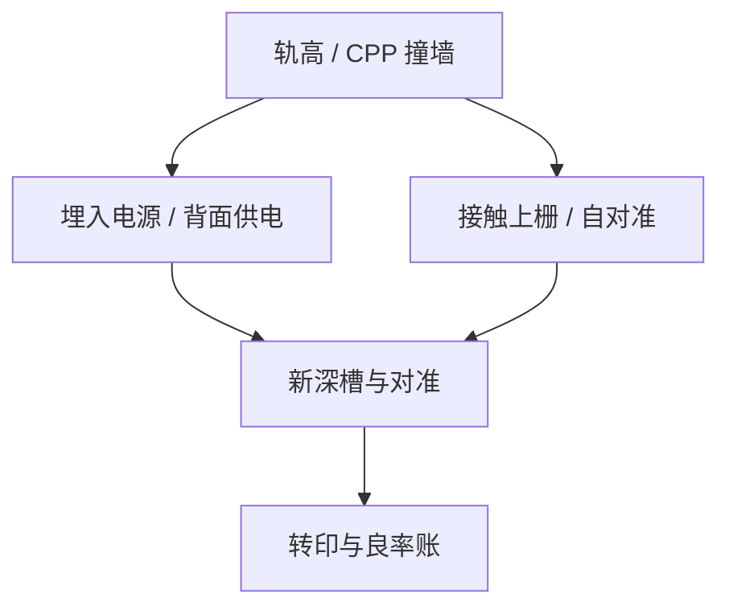

# 缩放助推器

节距不能再靠 $k_1$ 往下挖时，密度从结构来：埋入电源、接触上栅、自对准隔离一类助推器，改的是单元几何，不是再买一档 NA。

<footer>—— 对照 imec 对 scaling boosters（BPR、CFET 前的单元助推）的公开路线图叙述</footer>

[上一课](/litho/standard-cell-track-height)把轨高收成整数约束。缺口是：轨已经很少，仍要面积，就得把电源或接触从拥挤的中间层挪走。[DTCO](/litho/dtco-patterning) 点过助推器；本课钉图形化含义。SRAM 如何单独玩一套几何，留给[下一课](/litho/sram-cell-patterning）。

## 问题

缩放助推器（scaling boosters）是一组结构选项：埋入式电源轨（BPR / buried power rail）、接触上栅（contact over active gate）、自对准栅隔离、有时背面电源分配。它们让标准单元在同一金属节距下少占逻辑轨，或让 via 不再挤在栅与扩散的缝里。代价是新的关键层：深槽电源、高深宽比接触、背面套刻、以及新的硬掩模栈。

缺口是**助推器引入哪些新图形化层**，不是重讲器件纳米片。把助推器当「免费密度」会漏掉：深槽 ARDE、对准到埋入层、以及中间层金属反而更密带来的 tip 规则。

### 不是每一助推器都是光刻问题

有的密度来自器件堆叠（CFET）或背面互连，光刻只是其中一层对准与深孔。本课只写与前道光刻直接相关的：新掩模、新深宽比、新套刻对。CFET 与封装有自己的课，不在这里展开晶体管静电。

BPR 把电源从 M1 拿走，逻辑金属的可印性变好，但埋入槽的刻蚀与填充变成良率项。DTCO 必须把槽的 PWQ 算进节点，而不是只报单元面积。

## 方法

对每一候选助推器列：新增层、节距、对准到谁、深宽比、是否自对准。用 LFD/LRC 评估：中间层热点是否真下降、新层是否可 PWQ。与 [自对准](/litho/euv-sapt-hybrid) 的关系：能自对准的接触少吃套刻，助推器才划算；纯 LELE 去套一个埋入槽，预算可能比减轨省下的面积更贵。

评估输出是「允许进库的助推器集合」，不是宣传片上的百分比密度。

每个允许的助推器要带 PWQ 与对准树附件：深槽层对准到谁、标记如何开窗、失败时是否可回退到非埋入电源库。没有回退路径的助推器等于把节点赌在一条未鉴定的刻蚀上。

## 机制

单元面积 $\approx$ CPP × 轨高。助推器减小有效轨高或允许更紧的 CPP，但把难度转移到垂直加工：离子必须打到槽底，选择比与钝化变成主课序下一门的对象。套刻上，埋入层成为新的参考，对准标记与应力翘曲（后课）会改关键层策略。

## 边界

不编造某逻辑节点未公开的 BPR 尺寸。不把助推器写成大模型或量化金融。背面供电的封装/衬底工艺只点名套刻，细节留给集成课的对准与形貌。

后课默认：密度助推器是新关键层，不是免费的规则放松。下一课 SRAM 有自己的助推与多图形约束，不能直接套逻辑轨高。

## 小结

- 缩放助推器用结构换密度，并新增深槽、对准与硬掩模层。
- 中间层热点下降必须用新层的窗口来买单。
- 自对准决定套刻账是否划算。
- 出处：imec scaling booster / BPR 公开论述；DTCO 路线图叙述。
