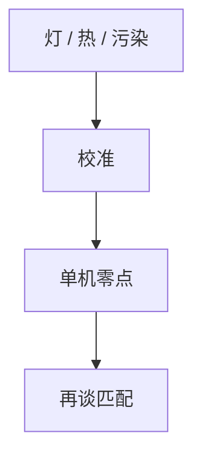

# 扫描仪校准周期

校准把剂量、焦点、网格和照明瞳拉回机台自己的零。周期太疏，指纹爬出预算；太密，稼动被校准吃掉。

<footer>—— 对照 scanner calibration / baseline；[机台匹配](/litho/tool-matching)</footer>

[上一课](/litho/tool-recipe-software)保证执行的是那张配方。缺口是硬件零点会漂：灯、镜头、尺、空气。本课钉校准周期，曝光机单元收到这里；EUV 源从下一课程另起。

## 问题

激光老化改剂量；热改网格；污染改瞳。在线传感器能追一部分，不能替代离线基准。只做匹配不做单机校准，两台会一起慢慢歪。

## 方法

分层：班次快速检查（剂量、焦点）、日/周网格与照明、月度像差或换件后全套。触发：超 SPC、换激光、动镜头后强制。时间进稼动的计划停，不要和故障混报。与轨道热板校准分开记账。

## 机制

校准片或机内传感器给出偏差，写入校正表。若校准片本身有指纹，会把片指纹写进所有产品。标准片要计量溯源。

## 边界

本课不写 EUV 源校准和掩模厂。下一课程从 EUV 进阶起，源与真空是另一套零点。

## 小结

- 校准维护单机零点；匹配维护机差。
- 周期是预算与稼动的折中，要按漂移源分层。
- 出处：剂量焦点课；SEMI 校准通识。
