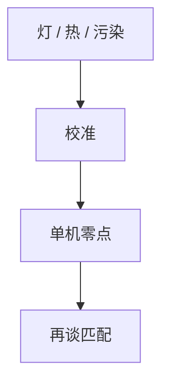
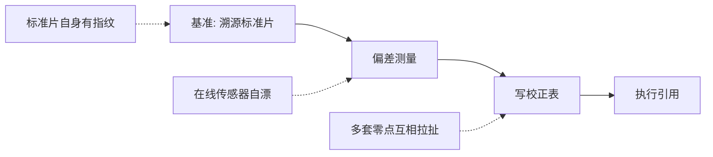

# 校准周期

校准把剂量、焦点、网格和照明瞳拉回机台自己的零。周期太疏，指纹爬出预算；太密，稼动被校准吃掉。

<footer>—— 对照 scanner calibration / baseline；[机台匹配](/litho/tool-matching)</footer>

[上一课](/litho/tool-recipe-software)保证执行的是那张配方。缺口是硬件零点会漂：灯、镜头、尺、空气。本课钉校准周期，曝光机单元收到这里；EUV 源从下一课程另起。配方管执行对不对，校准管零点在不在，两层错会互相掩护。

## 问题

激光老化改剂量；热改网格；污染改瞳。在线传感器能追一部分，不能替代离线基准。只做匹配不做单机校准，两台会一起慢慢歪。

术语翻译：校准是把单台机器的零点调回「它自己该在的位置」；匹配是把两台机器的零点调到「彼此一致」。先有各自的准，才谈得上互相像。

展开：漂移源各有时间常数——激光老化改剂量，天到周；热与蠕变改网格与正交，随环境与产量走；污染改瞳，最慢也最隐蔽。在线传感器（机内剂量、焦面）追得上快漂，但自身没有绝对基准，要靠低频离线校准喂参考。只做匹配不做单机校准的陷阱：两台一起歪时机差看着不变，绝对偏移却在爬——匹配掩盖整体漂移。

## 方法

分层：班次快速检查（剂量、焦点）、日/周网格与照明、月度像差或换件后全套。触发：超 SPC、换激光、动镜头后强制。时间进稼动的计划停，不要和故障混报。与轨道热板校准分开记账。

工程流程：账本分三层——班次/日做剂量与焦点快检，用在线传感器加短循环监控片；周做网格、正交与照明均匀性；月或事件后做全套，含像差与瞳。触发式插单校准接在 SPC 报警后：超限即补针对性校准，不等整周期。时间记账与稼动课对齐：别把校准藏进生产时间，报表失真则周期权衡没法算。

直觉类比：按漂移速率分配校准周期，像家务分级——碗（剂量/焦点）每顿洗，地板（网格/照明）每周拖，窗帘（像差/瞳）每季拆一次。全按季度做，碗会臭；全按顿做，人被家务吃掉。

```mermaid
flowchart TD
  DRIFT["灯 / 热 / 污染"] --> CAL["校准"]
  CAL --> ZERO["单机零点"]
  ZERO --> MATCH["再谈匹配"]
```

校准不是越勤越好：每次校准都把「偏差测量加测量噪声」写进表，周期短于噪声水平时，校准在制造套刻散布。周期下限由测量噪声与漂移速率之比决定。

## 机制

校准片或机内传感器给出偏差，写入校正表。若校准片本身有指纹，会把片指纹写进所有产品。标准片要计量溯源。

写透一点：校准链是「基准 → 偏差测量 → 校正表 → 执行引用」。链上每一环都可能写进假零点：校准片自身有指纹（胶厚、图形密度不均）就把片指纹写进所有产品，所以标准片要计量溯源并定期外校。多套零点还会互相拉扯：剂量用机内传感器、套刻用片上基准，周期不同步时一格把网格拉向东、另一格按片场拉回西，零点缓慢摆动。分层的本质是按漂移速率分配机时：快漂配短周期，慢漂配长周期，单一周期要么浪费机时、要么放走漂移。

```mermaid
flowchart LR
  REF["基准: 溯源标准片"] --> MEAS["偏差测量"]
  MEAS --> TAB["写校正表"]
  TAB --> EXEC["执行引用"]
  B1["标准片自身有指纹"] -.-> REF
  B2["在线传感器自漂"] -.-> MEAS
  B3["多套零点互相拉扯"] -.-> TAB
```

## 边界

本课不写 EUV 源与真空侧的零点，也不写掩模厂的版检测量；校准只保「回到自己」，不保两机一致——机差归匹配课。在线传感器自身漂移时，校准链的输入先坏：传感器要随标准件复验，否则校准越准越错。

常见误区：以为在线传感器读数稳定就等于机器没漂。传感器自己也会漂——它只保证「前后可比」，不保证「绝对正确」；绝对基准必须定期由外部标准件喂给它。

## 小结

- 校准维护单机零点；匹配维护机差。
- 周期是预算与稼动的折中，要按漂移源分层。
- 本单元收束：下一课程从 EUV 起，源与真空另起一套零点。
- 出处：剂量焦点课；SEMI 校准通识。
