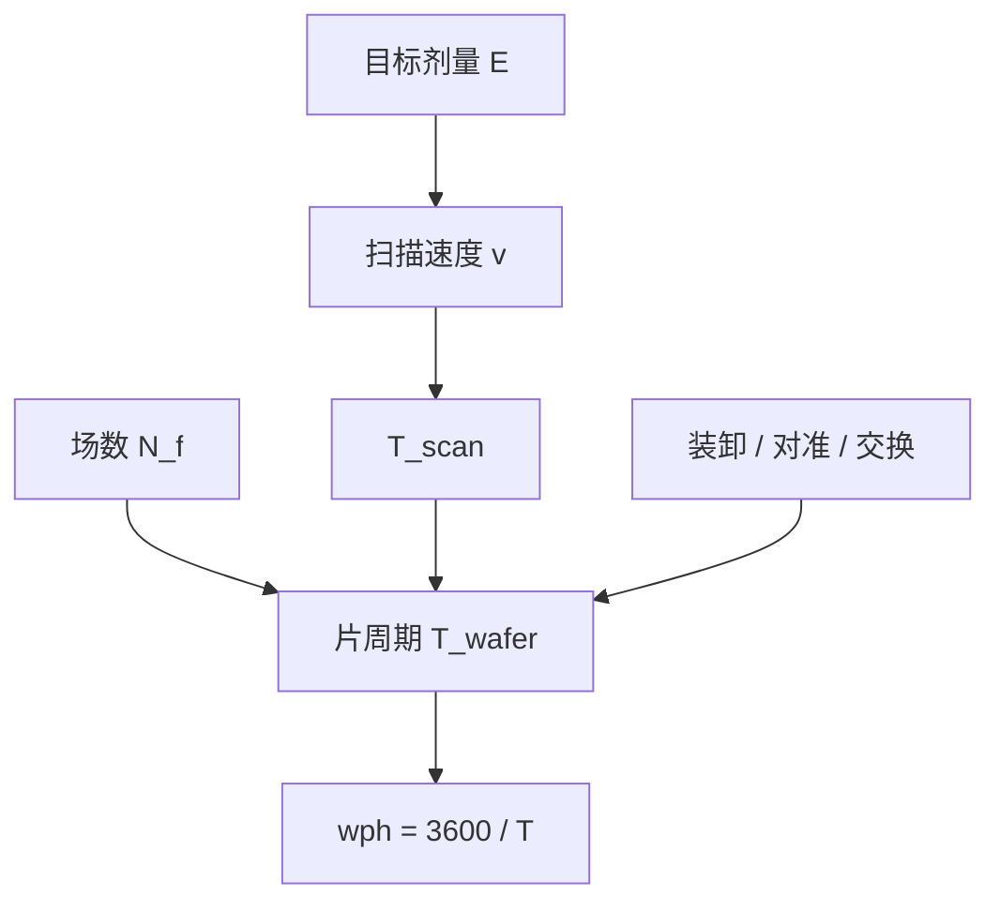

# 扫描仪产能会计

每小时晶圆数是片周期的倒数；剂量、扫描速度、场数与测量开销进同一条加法，不是镜头「更快」的同义词。

<footer>—— 据 ASML 对扫描机产能（wph）与剂量–速度关系的公开表述整理，不编机型产量</footer>

[上一课](/litho/dose-control)把晶圆面剂量锁进传感器闭环，并留下一句：目标剂量高，要么降扫描速度，要么要更强的脉冲。缺口是把这句话写成片周期会计。本课钉 wph。故意走焦扩窗留给[下一课](/litho/focus-drilling)，不在这里改焦轴。

## 问题

剂量环保证 $E$ 进窗。产能问的是：进窗的这一场，整片要多久。单位是 wafers per hour（wph），即 $3600/T_\mathrm{wafer}$。$T_\mathrm{wafer}$ 至少含：装卸与台交换、对准与调平、每个曝光场的步进稳定、以及狭缝扫过场长的时间。上一课的 $E\propto v^{-1}\int I\,\mathrm{d}y'$ 在这里变成约束：剂量设定升高，扫描速度 $v$ 往往下降，曝光项变长。

把 wph 写成「光源功率」一个数，会漏掉场数、步进、双台测量是否被曝光盖住。把宣传册某一机型的峰值 wph 抄到所有层，又忽略了该数字总是在指定剂量、指定场尺寸、指定片尺寸下测的。缺口是会计恒等式，不是再调一次衰减器。

### 指定剂量才有 wph

厂商公开产能几乎都带「at $X\,\mathrm{mJ/cm^2}$」。胶钝、EUV 随机要加剂量，会计立刻改。本课不引用、不外推任何具体 wph 或毫焦数当产线事实；只保留这层依赖关系。双工件台把测量与曝光并行，片周期近似 $\max(T_\mathrm{expose},T_\mathrm{measure})+T_\mathrm{swap}$，细节已在 [TWINSCAN](/litho/twinscan-dual-stage)，本课把它收成开销项，不重讲两张卡盘。

不要把数据表 wph 乘以良率再叫出片。扫描机会计停在「片离开卡盘」；涂胶显影、计量、复工不在 $T_\mathrm{wafer}$ 里。本课也不编某代厂的每小时出片。

## 方法

把片周期拆开写，而不是估一个总秒数：

$$
T_\mathrm{wafer}\approx T_\mathrm{oh}+N_\mathrm{f}\,(T_\mathrm{step}+T_\mathrm{scan}).
$$

$T_\mathrm{oh}$ 含装片、交换、全局对准一类不随场数线性涨的项；$N_\mathrm{f}$ 是场数；$T_\mathrm{scan}$ 是场长除以 $v$，而 $v$ 受剂量与脉冲能量上限约束。缩小场、减场数、降剂量、提高可用光功率，是四条不同的杠杆，不能合成「优化扫描机」。

对账时声明：晶圆直径、场网格、是否边缘场、剂量、是否 focus drilling（下一课会拉长有效曝光）。换胶灵敏度是改 $E$ 从而改 $v$，不是改镜头 NA。

### 与套刻、均匀性的耦合

加密对准与调平网格加 $T_\mathrm{measure}$。双台下，只要测量仍短于曝光，边际产能代价接近零；单台则线性吃 wph。剂量均匀性与扫描速度也耦合：太快时脉冲数变少，脉间涨落压不下去，上一课的 $1/\sqrt{N}$ 变差。会计合格不等于窗合格。

## 机制

每个晶圆点必须在狭缝下积分到目标 $E$。光源瞬时功率给定时，只能靠停留时间——也就是 $v$——凑积分。场与场之间还要步进、稳定，扫描投影不是连续一条缝扫完整片。因此产能的物理上限先是「光够不够」，再是「台动得是否跟上」，最后才是「测量是否挡住镜头」。ASML 公开叙事把浸没与 EUV 的产能都绑在指定剂量上，原因在此：光学链路定了到达晶圆的瓦数，胶定了要多少毫焦，两者相除就是最短曝光时间。

EUV 还要计膜透过、收集器寿命对可用功率的侵蚀；那是后课光源与膜，本课只把它们记成「可用 $I$ 下降 → 同一 $E$ 下 $v$ 下降」。不要在这里编源功率瓦数。

同一台机，植入层低剂量与关键金属高剂量可以差出完全不同的 wph。层策略会计要按层加，不能用关键层的表值代表整条流水线。

## 边界

本课不写任何机型的出厂 wph，不把公开演示场尺寸当成你厂的 tape-out 网格。也不讨论轨道涂胶节拍——那是另一台设备的 $T$。Focus drilling 会把一场拆成一段焦上的积分，等效曝光项变长，下一课再把这笔记到窗上，本课的公式形式仍适用，只是 $T_\mathrm{scan}$ 或场次数增加。

复工、送计量、换掩模的准备时间不属于扫描仪内部会计，却会吃车间产能。把 wph 直接当 FAB 产出，是类别错误。

## 小结

- wph 是片周期的倒数；片周期是开销、场数、步进与扫描之和。
- 剂量经扫描速度进入会计；公开产能必须带剂量条件。
- 双台并行的是测量与曝光，不是两个镜头。
- 不编机型 wph、不编厂级出片；只保留恒等式与杠杆。
- 走焦会拉长曝光项，下一课再写入窗的取舍。
- 出处：ASML 对扫描机产能与剂量条件的公开关系；Levinson 对曝光时间与产线节拍的讨论。
