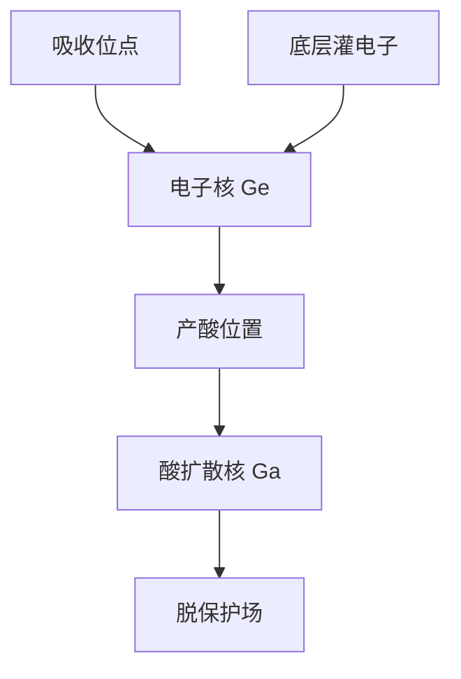

# 二次电子模糊模型

92 eV 的吸收不是一个点：级联二次电子把产酸事件涂成几纳米的核。这颗核不随 $\lambda/\mathrm{NA}$ 缩放。

<footer>—— 据 Naulleau 对 EUV 二次电子模糊；Kozawa 对电离产酸路径的公开论述整理</footer>

[上一课](/litho/acid-quencher-counting)把酸写成点计数。缺口是 EUV 上这些点并不钉在吸收位点：[二次电子产额](/litho/euv-secondary-electron)已经说明产额与热化距离；本课把它收成可卷积的模糊模型，供平均场与后课 MC 共用。不要重推光学 PSF 或瑞利判据。Monte Carlo 如何抽样这颗核，留给[下一课](/litho/stochastic-monte-carlo)。

## 问题

DUV 上 PAG 光解接近「光子在哪、酸在哪」（再加后课酸扩散）。EUV 上能量先变成光电子与级联，热化电子附着才产酸。空间上等价于：吸收剂量场卷积一颗电子核 $G_e(r)$，再进入 PAG 转化。Naulleau 把这颗核叫做二次电子模糊：它砍潜像 NILS，也决定上一课的有效体积。

缺口不是再讲产额 $Y$，而是：工程模型用什么形状（高斯、指数、双高斯）、如何与酸扩散核 $G_a$ 串联，以及为何 High-NA 缩小光学 PSF 之后这颗核仍在。

### 两颗核不要并成一颗就忘账

紧凑模型常把 $G_e*G_a$ 收成一颗有效高斯。换 PEB 主要动 $G_a$；换底层、换高 Z、换密度主要动 $G_e$。并成一颗之后，改烘箱会「看起来电子核也变了」。资格实验必须能拆。

不要把二次电子模糊写成全球 2 nm 常数。公开论述给的是纳米量级，随材料与密度变。本课钉可卷积的地位，不编射程表。

## 方法

平均场：剂量 → 吸收 → $G_e$ 卷积 → 平均酸 → $G_a$（PEB）→ $m$ → 显影。随机：在吸收点抽样电子轨迹或直接从 $G_e$ 抽产酸位置，再抽碱。量测：降 PEB 看高频 LER 是否还剩一块不随烘箱消失的地板——那块更像 $G_e$ 与链尺寸。换 underlayer 看底部偏置与灵敏度，是界面电子，不是镜头离焦。

与[吸收与模糊](/litho/euv-absorption-blur) 光学课序的拆法对齐：本课把同一语言接到胶模型，不重做薄膜光学。

## 机制

一次吸收打出多个电子–空穴，电子在弹性/非弹性散射中降能，直至热化被 PAG 或陷阱捕获。核半径由热化距离与捕获截面决定。产额 $Y$ 是积分结果：高 $Y$ 往往伴随更远或更多的次级事件，灵敏度与模糊同向动——不是免费光子。[随机效应](/litho/euv-stochastics) 已指出模糊既加偏置也减方差；本课指出执行它的是 $G_e$。

界面：底层电子向上注入，底部 $G_e$ 不对称，footing。这是黏附课之外的电子几何，轮廓仿真要能加源项，而不是只加光学 $I(z)$。

金属氧化物没有长程 $G_a$，有效核更接近 $G_e$ 与团簇尺寸。并核时不要把 CAR 的 PEB 高斯抄过去。

## 边界

不写轨迹蒙特卡洛的截面数据库。不把 CXRO 计量工具上的核当成 NXE 胶规格。光子散粒仍在吸收位点抽样；电子核是条件分布。下一课把这两步写成可运行的 MC。

Flare 是远程光学台基，不要与 $G_e$ 混。调焦补不了电子核。

## 小结

- EUV 产酸位置 = 吸收位点卷积电子核 $G_e$，再卷积酸核 $G_a$。
- 核不随 NA 缩放；High-NA 光学更锐也砍不掉它。
- 改 PEB 与改底层必须能拆两颗核。
- 模糊同时降 NILS 与降计数方差。
- 出处：Naulleau 二次电子模糊；Kozawa 电离产酸；主干[二次电子产额](/litho/euv-secondary-electron)。
