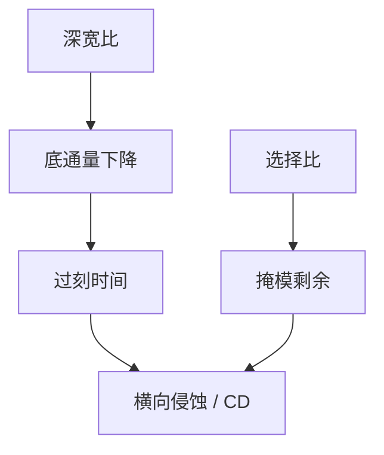

# 选择比与 ARDE

选择比买的是「胶还在、衬底已经到底」；深宽比一升，底部通量先掉，选择比窗口和 CD 一起走样。

<footer>—— 对照刻蚀工程对 selectivity 与 ARDE 的通称；[深宽比与负荷](/litho/etch-loading-ar) 已钉几何</footer>

[上一课](/litho/plasma-basics)给出离子与中性通量。缺口是材料差与开口几何：胶/硬掩模/介质之间要比速率，同时高 AR 孔底速率下降。[ARDE 课](/litho/etch-loading-ar) 已写宏/微负荷几何；本课在集成门补**选择比窗口如何被 ARDE 收窄**，不重推通量随深度的公式。LER 如何被转印或抹平，留给[下一课](/litho/ler-transfer-smoothing）。

## 问题

选择比是两材料刻蚀速率之比。薄胶、厚介质或深接触要求高选择比，否则胶顶削完、CD 放宽、硬掩模打穿。提高选择比常靠聚合物保护或降离子能量，却与各向异性、残留和速率打架。ARDE 让深孔比浅槽慢，过刻以最深特征为准时，浅特征已被横向侵蚀——选择比再高也救不回过刻时间。

缺口是**集成窗口**，不是再定义 ARDE。OPC 刻蚀核若只有密度、没有 AR，via 与槽的 AEI 会分家。via–金属协同课的 enclosure 在 AEI 上被这条窗口改写。

### 过刻是选择比的隐藏税

为了清干净 ARDE 慢的特征，全球加过刻。过刻吃的是侧壁、底脚和硬掩模余量。选择比规格必须带「在规定过刻下」这一句。只报瞬时选择比，量产清残时已经超预算。

选择比随开口宽度变：孤立宽槽与密孔不是同一个数。食谱窗口要对代表图形矩阵，而不是对空白片速率。

## 方法

矩阵：不同 AR、开口率、材料栈（胶/SiARC/SiN/氧化物）。计量：深度（截面、光学）、顶 CD、底 CD、硬掩模剩余。与 [ADI/AEI](/litho/adi-aei) ：选择比失败常表现为 ADI 稳、AEI 放宽或打穿。硬掩模下一课会把胶选择比压力转移；本课先量化「不转移时窗口有多窄」。

EUV 薄胶几乎强制硬掩模，本课的数字用来说明为何强制。

过刻规格要写在食谱和 OPC 核说明里：例如「以最深 via 清底为准的过刻百分比」。换腔体或换硬掩模厚度，过刻税重算，选择比窗口跟着重开。这与刻蚀模型校准课的「换配方即新模型」是同一合同在集成侧的写法。

## 机制

底部离子与中性因散射、电荷、消耗而随深度衰减，速率下降即 ARDE。选择比 = $R_\mathrm{film}/R_\mathrm{mask}$。过刻时间 $\propto$ 最慢特征 / 平均速率。横向侵蚀 $\propto$ 过刻 × 侧壁速率；侧壁速率由钝化与离子角尾决定。紧凑核用多层密度近似这些，但深孔阵列与逻辑槽若共用一个核半径，残差会在 via 层爆发——残差分析课的空间相关在此再现。

## 边界

不重复写出蚀速率表。不把 ALE 当本课默认；[ALD/ALE](/litho/ald-ale) 是另一条降 ARDE 的路，此处只承认连续 RIE 的窗口。

后课默认：选择比必须在规定过刻与代表 AR 下谈。下一课看边粗糙度在转印中是被放大还是被平滑。

## 小结

- 选择比窗口含过刻；ARDE 决定过刻有多长。
- 薄胶使选择比与 CD 强耦合，推动硬掩模。
- 刻蚀核要对 AR 敏感的层单独校准。
- 出处：RIE 选择比与 ARDE 通称；Coburn–Winters 传统；前课几何不重写。
