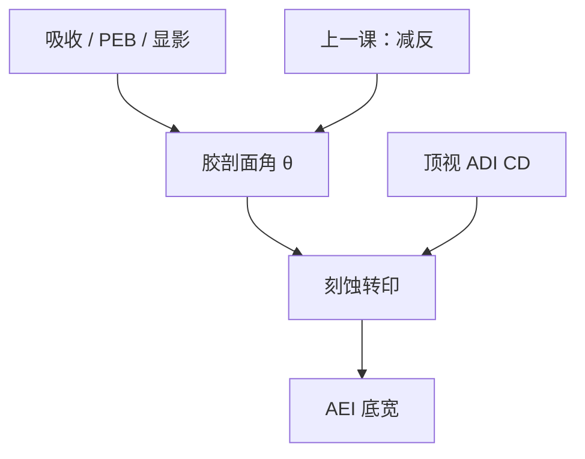

# 侧壁角

顶视 CD 合格，剖面仍可以是锥或倒锥；刻蚀看见的是这张斜面，转印后的底宽不必等于胶顶宽。

<footer>—— 据 Levinson 对抗蚀剂剖面与刻蚀转印的讨论整理</footer>

[上一课](/litho/standing-wave-barc)用 BARC 压掉驻波波纹，侧壁不再按 $\lambda/(2n)$ 起皱。缺口是：平均剖面角还在——吸收、显影前沿与 PEB 仍会给出锥形或倒锥。本课钉侧壁角。金属氧化物胶与 CAR 的分叉，留给[下一课](/litho/euv-resist）。

## 问题

ADI 顶视 CD 是某一焦平面（或算法认定的）宽度。刻蚀等离子体打的是三维浮雕：顶宽、底宽、残胶、圆角。侧壁角 $\theta$（相对衬底）决定横向还有多少胶可被打掉、底宽相对顶宽如何走。[ADI 对 AEI](/litho/adi-aei) 已经要求两套 CD 分开报；本课补的是偏置的几何来源之一：斜面，而不只是「腔室吃掉几个纳米」。

理想 $\theta=90^\circ$。正锥（$\theta<90^\circ$，底比顶宽或顶比底宽，视定义）让刻蚀后底 CD 与胶顶 CD 系统偏离。倒锥（倒八字）容易塌、去胶难、局部阴影。把所有 AEI 偏置写成微负载，会漏掉当天 PEB 或吸收把角走掉的情况。

### 波纹被压平不等于直角

BARC 去掉的是高频 $z$ 振荡。体吸收（上部剂量高于底部，或相反）给出缓慢的锥。显影时间过长，边沿被暗侵蚀修成喇叭。PEB 的横向扩散把阈值轮廓外推，角也会变。这些是平均几何，不是 LCDU。

侧壁角的计量要剖面 SEM 或 AFM/散射测量，不能从顶视 CD 反推唯一的 $\theta$。同一顶宽可以配许多剖面。OPC 若只拟合顶视，刻蚀模型会把角的误差当成各向异性。

## 方法

表征：裂片或 X-SEM 量顶、底、角；工艺窗除 CD 外把 $\theta$ 与残胶列为判据。E–D 窗若只切顶视 CD，边沿可能已经倒锥。控制：胶厚与吸收（Dill B、PAG 吸收）、PEB、显影时间、BARC 是否清底。Focus drilling 把多张离焦像叠起来，等效 NILS 下降，角往往更差——成像课末尾的走焦在这里兑现在剖面上。过显影修圆角、吃暗区，顶视 CD 还能用剂量拧回来，角已经走了，AEI 不会跟着顶视走。

刻蚀转移：各向异性好时，胶斜面仍会在硬掩模上留下与剩余厚度、选择比有关的偏置。选择比不够，斜面被打薄，底 CD 跟着重影。转印函数必须吃 $\theta$，不能只吃 ADI 均值。

### 与 $R(m)$ 的衔接

Mack / Notch 的陡度 $n$ 大，前沿更贴着等 $m$ 面，角更直，同时对驻波残差更敏感。BARC 把 $I(z)$ 拉平，角才主要由横向 ILS 与 $R(m)$ 决定。两课是串起来的：先减反，再谈平均角。

## 机制

正胶若顶部吸收强、底部剂量不足，底部转化不够，显影后容易出现正锥（底部更宽的胶墙，或清不干净）。漂白（DNQ）或部分透明可以缓解。CAR 薄膜、BARC 之后，角更多由边缘 ILS、酸横向扩散与过显影决定。倒锥常见于表面难溶（T-top、表面淬灭）：顶部阈值高，腰部先溶。表面难溶与 BARC 不足可以同时存在：波纹叠在倒锥上，X-SEM 要能分开「高频皱」与「平均角」。

刻蚀时，离子方向相对斜面有一入射角，溅射产额与聚合物沉积随角变，所以同一腔室、不同 $\theta$ 的来料，AEI 不同。侧壁角因此是光刻交给刻蚀的边界条件，不是镜头 NA 的别名。硬掩模可以「冻结」某一剖面再往下走，但冻结的是已经斜了的开口，不是把角纠正回 90°。

负胶或 NTD 的「留下区」在曝光区，吸收与表面效应的符号会反。角的判据仍是转印，不要把正胶的锥形口令抄过去。

## 边界

本课不写某家 RIE 的射频功率表，不把 FinFET 鳍的角度规格当成光刻胶角的同义词——器件侧壁是后续多次转印的结果。EUV 随机缺失是孔的有无，不是平均 $\theta$；下一课换记录介质时，角与随机要分开报。

不要发明「$\theta>85^\circ$ 则良率 99%」的换算。出处里的 Levinson 把剖面当作转印输入，具体合格区由工艺包定。抗蚀剂化学主干到 CAR 的平均剖面为止；金属氧化物是另一套溶解/交联，角要重测。

顶视 CD 可以用剂量拧；角往往要用吸收、PEB 或显影时间。两个执行器不要抢同一个 SEM 数。

## 小结

- 侧壁角是浮雕几何；顶视 CD 不能唯一决定它。
- BARC 压波纹之后，吸收、PEB、显影仍给出平均锥或倒锥。
- 刻蚀偏置吃 $\theta$ 与选择比，AEI 底宽不必等于 ADI 顶宽。
- 倒锥常见于表面淬灭 / T-top；正锥常见于底部剂量不足。
- 下一课比较 CAR 与金属氧化物胶，默认本课的剖面语言仍适用。
- 出处：Levinson, *Principles of Lithography*；Mack 对显影剖面与转印的讨论。
