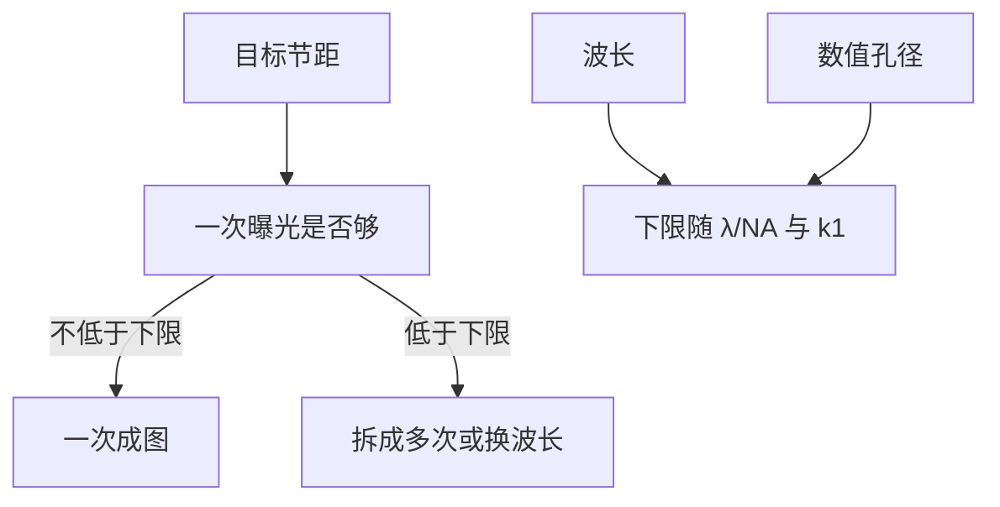

# 多重图形化之前的单次曝光极限

波长与孔径给定之后，一次曝光能稳定印出的最小节距有下限；再缩小只能把一次图形拆成多次，或换更短的波长。

<footer>—— 据 Mack, Fundamental Principles of Optical Lithography 对 $k_1$ 与节距极限的整理</footer>

[上一课](/litho/contact-via-line)说明孔与线都要图形化。当 [互连半节距](/litho/interconnect-halfpitch) 或接触多晶节距继续缩小，一次图形化是否还够？本课建立节距与 $\lambda$、NA、工艺因子 $k_1$ 的工程关系，说明「为何要多次图形化」这一动机。不把后课的部分相干成像与胶显影链写完，也不替代成像课程里对分辨判据的专论。

## 问题

器件课已经给出要印的对象：栅、分区、金属节距、孔。光学前置给出了波与孔径语言。工程上更窄的一问：这一层节距能否一次完成？近似地，最小节距随 $\lambda/\mathrm{NA}$ 变，再乘一个不能无限压低的 $k_1$。当目标节距低于一次可实现的下限，必须把图形拆开做，或换波长。缺口是这条下限的存在，不是掩模版怎么画。

### $k_1$ 不是可以任意调的无量纲装饰

$k_1$ 把照明、掩模、工艺窗口收成一个数。它可以因分辨率增强而下降，但有对比度与工艺窗口的地板。把 $k_1$ 当成「想多小就多小」，会以为单次曝光没有极限。Mack 把光学光刻的节距极限写成这种形式，正是为了让路线图与工具参数能对话。

1:1 线空时节距 $p\approx 2\times\mathrm{CD}$。本课用节距与路线图对齐。完整的分辨表述与工艺因子定义，在后一课程的成像主线里再展开；本课只借用数量级。

## 方法

一次曝光的节距下限可写成

$$
p_{\min}\approx 2\,k_1\frac{\lambda}{\mathrm{NA}}.
$$

同一 $\lambda$ 与 NA，$k_1$ 有经验下界。浸没式深紫外在 NA 接近 1.3 量级时，一次节距落到约四十纳米量级（随 $k_1$ 与工艺而变）。更密的金属或栅相关节距，就要双重、四重，或把 $\lambda$ 换到极紫外。本课给出分叉：够则一次成图，不够则拆分或换波长。

孔层不一定与线层撞上同一条 $p_{\min}$：孤立孔的对比度与密集线不同，有时线先要拆分、孔仍一次，或反过来。本课公式是密集线空的尺子，用来解释「为何次数会增加」，不是给每一层出一张曝光菜单。具体哪一层先拆，看该层节距表，仍与节点名脱钩。

## 机制

这条下限解释产业节奏：在同一波长上延寿，靠的是把一层图形拆成几次套刻与填充，成本与对准风险上升；换波长则把整条 $p_{\min}$ 曲线下移。器件课需要的是「为何图形化次数会增加」，不是扫描仪内部模块。

拆分图形的代价是套刻与工艺步骤：两次图形必须拼回同一层节距，对准误差会吃掉线宽预算。这与 [接触孔、通孔与线](/litho/contact-via-line) 的套刻是同一类合同，只是现在合同发生在「本应是同一层」的两次定义之间。器件课到此只需承认：一次不够时，次数本身变成图形化问题。成像如何把对比度撑到某个 $k_1$，留给后一课程。

前道与后道哪一层先撞墙，取决于该层节距，不是取决于节点名——与 [节点名不再等于栅长](/litho/node-vs-gate-length) 一致。下一课 [前道对后道图形化](/litho/feol-beol-patterning) 把这些层排进制造顺序。

经验 $k_1$ 下界大约 0.25 量级是密集线空、要有可用窗口时的口诀，不是定理。Mack 强调工艺窗口地板；本课借用数量级，不把 0.25 写成物理常数。

## 边界

本课不推导部分相干传递函数，不写双重图形化的具体分劈算法，不写极紫外光源。抗蚀剂对比度与光学邻近效应校正属于成像与图形转移主线。本课只断言：一次有下限，多次与换波长是两条出路。

$k_1$ 的地板随工艺窗口要求变：能接受的对比度越低，看起来 $k_1$ 能更小，但缺陷与套刻会先翻车。后课默认：目标节距一旦低于一次下限，图形化策略必须改。下一课把前道与后道的层序串起来。

## 小结

- 一次曝光的最小节距随 $k_1\lambda/\mathrm{NA}$ 变化，$k_1$ 有地板。
- 低于下限只能拆成多次图形化，或换更短波长。
- 这是器件课需要的「为何做多次」动机，不是成像专论。
- 哪一层先撞墙看该层节距，不看节点名。
- 出处：Mack, *Fundamental Principles of Optical Lithography*。
