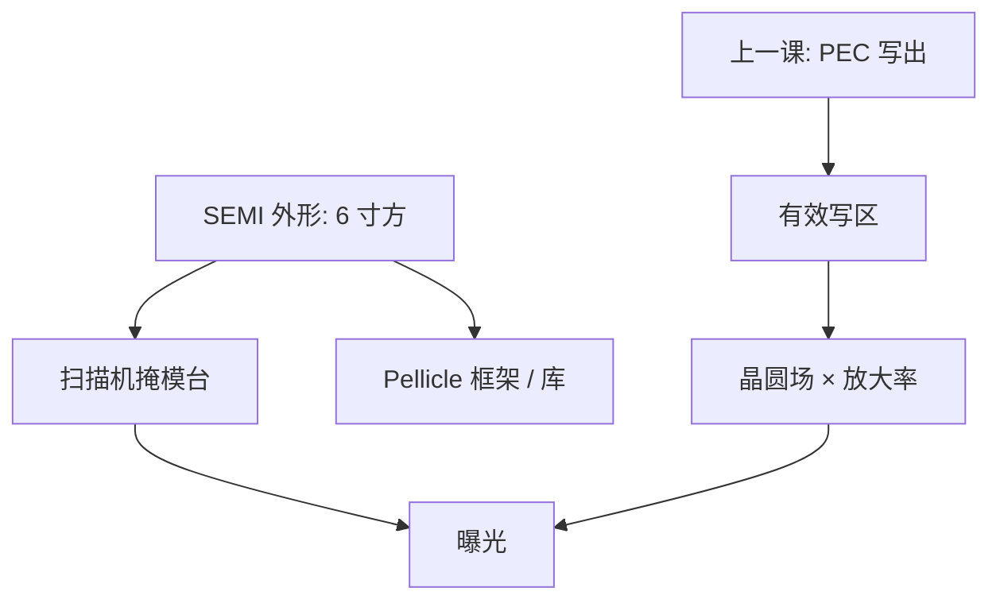

# 6 寸掩模

扫描机认的版是 6 英寸见方的那块石英：尺寸是 SEMI 标准，不是某代节点的设计参数。

<footer>—— 据 SEMI 对光掩模基板外形尺寸的通称，以及 6 寸（152 mm）reticles 的产线惯例</footer>

[上一课](/litho/ebeam-mask-pec)把写版邻近钉成 PEC。缺口是承载这些图形的基板：夹具、库、 pellicle 框架、扫描机掩模台，都按同一外形来。本课钉 6 寸掩模。多重图形从下一课序的 [LELE](/litho/lele-multipattern) 另起，不在这里染色。

## 问题

PEC 在一块有限的石英上写出铬或吸收体。这块板的边长、厚度、平坦度决定：能写多大的曝光场、掩模台怎么夹、投影放大率怎么约定。产业默认是 6 英寸正方形基板（通称 6" reticle，边长 152 mm 量级），厚度也按 SEMI 相关规范的外形系列走。本课不把某一条款的毫米公差抄成工艺常数，只钉：标准外形是 6 寸方，不是晶圆那种圆片，也不是「按芯片大小裁一块」。

缺口因此是机械与标准，不是再卷积一次电子核。把场尺寸写成镜头随便取，会漏掉 6 寸有效区减去 pellicle 框架与条码之后剩下的那块；把 EUV 版想成另一种边长，会漏掉 EUV 公开上仍沿用同一外形家族、改的是反射膜系与厚度/夹持细节。

### 6 寸不是光学 NA

放大率（DUV 透射常见 $4\times$）把晶圆场映回版上的面积。6 寸给出版侧最大面积预算；镜头像场再截一刀。两者一起决定 $N_\mathrm{f}$ 和产能会计里的场数，但 6 寸本身不提高 NA。更大基板（公开讨论过的 9 寸一类）会改写模机、库、扫描台，量产主流没有换成它来「多印一点」。

报掩模规格时声明外形系列与膜系（二元铬、衰减相移、EUV 多层），不要只说「6 寸所以 CDU 更好」。CDU 来自写与刻，不来自边长。

## 方法

产线接口：掩模台真空或机械夹持按 6 寸设计；pellicle 框架按 6 寸有效区安装；自动化库的槽位、条码位置按同一外形。换外形等于换整条物流。写模：有效写区小于基板边长，边缘要留夹持与检测。上一课的拼接场次数与这块有效区有关——版更大，单场光学未必更大，写拼接可以更多或更少，取决于写模策略，不要假设 6 寸「自动减少 PPE」。

EUV：反射、无（或有特殊）pellicle、吸收体厚，但公开平台仍按 6 寸家族进掩模台。夹持、热、背面缺陷是 EUV 掩模课，本课只承认外形连续，膜系不连续。

### 后课默认

说到 reticle，默认 6 寸方基板、DUV $4\times$ 透射，除非声明 EUV 反射或特殊放大。说到场尺寸，先查镜头像场与 6 寸有效区谁先截断。

## 机制

投影光刻把掩模当作物面。物面必须有标准夹持几何，否则每块版的弯曲、倾斜进套刻与焦面。SEMI 一类标准把边长、厚度、倒角、标识区统一，让掩模厂、扫描机、检验机共用机械接口。光学上，$4\times$ 意味着晶圆 26 mm 量级的场在版上约 100 mm 量级，6 寸（152 mm）边长刚好留下边框给 pellicle 与条码——这是历史收敛，不是瑞利式推出来的。

热：6 寸石英的热容量与夹持导热，进入掩模加热课；外形给定后，功率与吸收才是变量。PEC 与 6 寸正交：散射核不认边长，但靠边的图形缺邻居，长程 PEC 要处理「版外无图形」的边界。

不要把「6 寸」写成 EUV 不能用大场的原因。EUV 场受反射镜头与 anamorphic 设计限制，基板外形是约束之一，不是唯一约束。

## 边界

不引用未核对的 SEMI 条款号当数字来源，不编 9 寸为何失败的内幕。不把掩模缺陷检验波长写进本课。下一课序 LELE 会一张层用两块 6 寸版，物流与套刻预算加倍，外形仍是同一标准。

晶圆是 300 mm 圆，掩模是 152 mm 方：不要在示意图里画成一样的圆片。pellicle 面积小于基板，有效光学区再小一圈，场规划必须用有效区。写模 PEC 的长程核在这块有限方板上有边界：版外无图形，边框 CD 与中心密度区不同，外形因此间接进入 mask CDU。

## 小结

- 量产 reticle 默认 6 寸正方形基板，外形由 SEMI 一类标准约束。
- 边长定夹持、库、pellicle 与有效写区，不定 NA。
- EUV 沿用外形家族，改膜系与夹持，不在本课展开。
- 场尺寸由镜头像场与 6 寸有效区共同截断。
- 晶圆是圆片、掩模是方板；pellicle 再截一圈有效光学区。
- 6 寸不定 CDU；CDU 来自写与刻，不来自边长。
- 出处：SEMI 光掩模基板外形通称；扫描机掩模台对 6 寸版的公开接口惯例。
