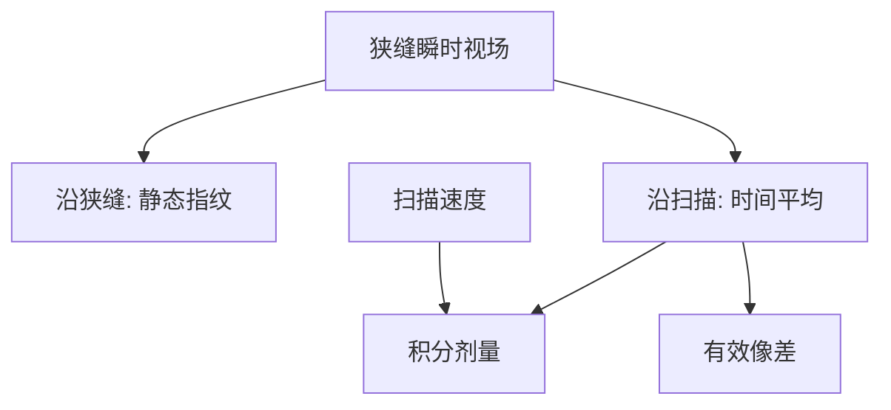

# 狭缝与扫描平均

扫描方向上，晶圆每一点看见的是狭缝里那一段镜头与剂量的时间平均；垂直狭缝的方向没有这场平均，指纹会留下。

<footer>—— 据 ASML 对 step-and-scan 狭缝照明与扫描积分的公开描述整理</footer>

[上一课](/litho/stepper-vs-scanner)钉死了步进器整场一闪、扫描机狭缝同步扫。缺口是那场运动学里已经点到、却还没写成算子的那一句：沿扫描方向，像差与剂量被积分；沿狭缝方向，瞬时视场仍是静态的。本课写这个平均。[剂量闭环](/litho/dose-control)怎样把积分值锁到 $\mathrm{mJ/cm^2}$，留给下一课。

## 问题

扫描机的瞬时照明是一条与扫描方向垂直的狭缝。掩模与晶圆按缩比同步走，狭缝扫过整场。上一课说「镜头只需在狭缝里做到均匀」。缺口是：均匀是对谁而言——是狭缝里每个 $x$ 当场合格，还是扫完之后每个晶圆点只关心积分？

沿扫描方向（常记为 $y$），每个曝光点依次穿过狭缝的前缘到后缘，收到的剂量是狭缝剖面 $I_\mathrm{slit}(y')$ 的积分，收到的有效像差是这段路径上镜头指纹的加权平均。沿狭缝方向（$x$）没有这场时间平均：照明不均匀、像散随 $x$ 变，会直接印成场内 CD 与套刻指纹。把扫描机理解成「整场镜头突然变好了」，会漏掉各向异性。

### 平均不是免费消像差

扫描平均能压掉沿 $y$ 快速变化的分量，压不掉沿狭缝几乎不变的场曲、像散，也压不掉与扫描同步误差耦合的动态项。同步一抖，平均核被加了一个位置噪声，套刻预算里的扫描机项就会抬头——上一课运动学已经警告过，本课只把它读成「平均核被扰动」。

ASML 浸没公开场常见 $26\,\mathrm{mm}$（狭缝方向）$\times 33\,\mathrm{mm}$（扫描拼出）。$26\,\mathrm{mm}$ 受瞬时像场限制，不能靠「再扫一会儿」变宽。不要把两个轴的规格写成同一个镜头直径。

## 方法

把狭缝剖面写成扫描方向上的权重。晶圆点的剂量

$$
E \propto v^{-1}\int I_\mathrm{slit}(y')\,\mathrm{d}y',
$$

$v$ 是扫描速度。像差有效值是同一权重对狭缝内 Zernike（或波像差）的积分。产线表征因此拆成两张图：across-slit（$x$）均匀性与像差指纹；along-scan 则查速度稳定性与狭缝剖面是否对称。

步进器没有这条积分，全场静态图就是曝光图。扫描机的「场内 CD 更匀」主要来自 $y$ 向平均，不是因为玻璃突然没有像差。比较两台机器的镜头指纹，必须声明是静态狭缝图还是扫描后的有效图。

### 与照明光瞳的关系

光瞳（$\sigma$、环形、偶极）在曝光过程中仍由照明决定，并不被扫描「平均成圆瞳」。扫的是物面狭缝，不是把光瞳转一圈。偶极沿 $x$ 或沿 $y$ 时，场内指纹与扫描轴的相对取向会变，OPE 曲线也会变，但机制不在本课重讲邻近。

## 机制

准分子脉冲在扫描方向上被一串脉冲铺成连续剂量。狭缝宽度、脉冲频率与 $v$ 共同决定每个点吃到多少个脉冲。$N$ 太少，脉间涨落会印成沿扫描的剂量纹；下一课的闭环正是为这场积分服务的。剖面中间亮、两头收，是为了边缘连续；若剖面歪，平均焦点与平均像散会偏，表现为沿扫描的 CD 斜率。镜头沿 $y$ 的热漂移若慢于一场扫描，会被这场平均吃掉一部分；沿 $x$ 的热则整场留下。偶极照明若把能量集中在瞳的左右，狭缝两端的有效像差可以差一截——平均核的权重不再均匀，CD 指纹会跟照明模式走。

动态同步误差（掩模台与晶圆台相对）让狭缝里的物点对不准像点，等效在平均时混入横向抖动与离焦。这是步进器没有的通道，也是套刻预算里扫描机项的来源之一。

浸没喷淋头跟着狭缝走，流体的「狭缝」与光学狭缝要对齐。那是浸没课的流体缺口。本课的平均算子在干式与浸没上形式相同，只是介质不同。

## 边界

本课不把 EUV 真空扫描的磁浮细节搬进来，也不讨论狭缝宽度的具体毫米数作为万能规格——随机型与照明模式变。剂量如何用能量传感器闭环，是下一课；本课只给出 $E$ 与 $v$、狭缝剖面的关系。胶灵敏度会倒逼 $v$，化学在抗蚀剂课写，这里不展开 PAG。

不要把「扫描平均」写成可以替代镜头装配。$x$ 向不合格，扫得再稳也留在场上。照明模式一换，狭缝两端的有效像差权重会变，平均核不是与光瞳无关的几何常数。

## 小结

- 扫描方向对剂量与像差做加权时间平均；狭缝方向留下静态指纹。
- 剂量 $\propto$ 狭缝积分 / 扫描速度。
- 同步抖动扰动平均核，进入套刻与有效焦深。
- 场的两个边长物理意义不同，不可都当成镜头一次成像的圆。
- 出处：ASML 对扫描投影、狭缝照明与 TWINSCAN 的公开说明；Levinson 对 step-and-scan 的讨论。
