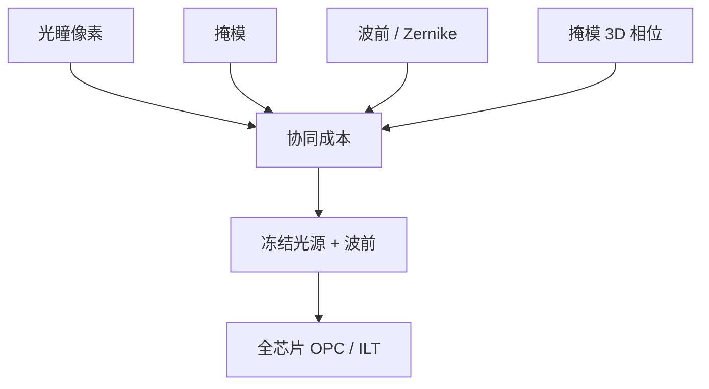

# 波前与 SMO+

光源和掩模决定通带里有哪些级；投影光学的波前决定这些级以什么相位相加。把像差排除在优化之外，等于假定镜头已经是理想瞳。

<footer>—— 对照 ASML 对光源–掩模–投影光学协同（SMO+ / SMLO 一类）的公开论述</footer>

[上一课](/litho/pupil-source-map)把照明瞳面收成可实现的像素图，并冻结给全芯片 OPC。缺口是投影侧。EUV 掩模三维带来焦点漂移与对比衰退，仅靠改光源像素往往把能量挤进无效率的角落，或把套刻侧瓣抬起来。ASML 公开把波前（透镜可调的 Zernike / 相位）放进与光源、掩模同一套协同，产品叙事里称为 SMO+ 一类能力。本课钉像差进协同。像素级逆问题如何正则，留给 [ILT](/litho/ilt-curvilinear)。

## 问题

理想 SMO 假定投影瞳只是一个硬截止。真实物镜有残余像差，EUV 还有掩模厚膜引入的等效相位，随节距和取向变。最佳焦点因此不是一个数，对比在离焦时掉得比薄掩模模型更快。只优化光瞳像素，等于用照明去硬补一层本该用波前对消的相位。

扫描仪并不是任意波前发生器。可调的是一组低阶 Zernike 或等效操纵器行程，有范围、有场相关、有与套刻的耦合。缺口是：在照明器可行集、掩模 MRC、以及透镜波前行程的乘积上，把窗口交做大，同时不把 overlay 和光瞳效率赔光。

### SMO+ 不是「再跑一次 SMO」

名字里的加号指的是优化变量族变了：光源 + 掩模 + 投影光学（公开文献里亦称 SMLO、SMPO、PMWO）。在此之上，它理解成同一套像素光瞳多迭代几次，会漏掉相位自由度。波前改的是级间相位，光源改的是哪些级被点亮，两者不可互换。

不要把 SMO+ 输出的 Zernike 当成镜头出厂像差的「故障单」。那是为特定层注入的相位，用来对消掩模 3D 一类系统项。出厂像差仍有自己的规格，两套数不要加在同一张表里装糊涂。

## 方法

流程在 clips 上联合或交替更新：光瞳像素、掩模碎片、以及允许的波前系数。成本仍是 PV-band、MEEF、ILS，外加波前 RMS 惩罚、照明效率、以及套刻/像移项。公开 EUV 例子把瞳、掩模、波前一起用来压掩模 3D 引起的对比衰退，从而在亚 40 nm 节距孔上换单次窗口，而不是立刻双重。

全芯片仍不能让每个单元拥有自己的波前：波前与光源一样是场级（或扫描狭缝级）全局量。实践是：协同在代表性图形上定一套照明 + 波前，冻结后做 OPC/ILT。场内残余用扫描仪原有的校正环去跟，而不是让 ILT 去拟合每一场的镜头指纹。

### 相位注入与套刻

为压 M3D 而加的非对称光瞳或像散项，可能带来像移与 overlay 侧瓣。公开工作明确把「波前/光瞳协同是否伤套刻」列为要验证的项，而不是默认免费。因此 SMO+ 的验收必须同时看成像窗与套刻，不能只报 NILS。

## 机制

空中像是各照明点、各衍射级的相干叠加再对光源积分。波前在投影瞳上乘相位 $e^{i\Phi(\rho)}$，改变级间干涉的焦深与最佳焦点。掩模 3D 的等效相位随节距变，$\Phi$ 选得好可以对消一族图形的漂移，对其它图形则是新的像差。所以目标必须是窗口交，并限制 $\Phi$ 的 RMS，以免未抽样图形被牺牲。

与上一课的分工：光瞳像素改强度分布（哪些方向被照明）；波前改相位（被照明的级如何对齐）。只动强度，相位失配仍在；只动波前，通带形状仍可能错。加号的意义是这两类自由度一起走。

Zernike 编号与软件约定随工具而变。写规格时用「哪一阶、多少 mλ」并声明场位置，不要只说「加了像散」。

## 边界

SMO+ 不增加 NA，不缩短波长，也不取消随机悬崖。它用相位行程去换对比与焦点对齐，行程有限，场相关像差不能被一组全局 Zernike 抹平。未进入 clips 的图形可能在注入相位后更差，必须全芯片监护。计算比 SMO 更重，但仍属定规则阶段；日历墙在 OPC/ILT。

后课默认：冻结的不仅是光瞳图，还可以包含一层为该层注入的波前；ILT 在这个已经非理想的瞳里求逆。

引用 SMO+ 收益时写清：相对的是仅 SMO 还是固定环形光源，是否含掩模 3D，套刻有没有一起报。只展示孔阵列对比，是选题偏差。

## 小结

- SMO+ 把投影光学波前与光源、掩模放进同一目标函数。
- 波前改级间相位，用来对消掩模 3D 一类系统项，不是把镜头「修到零像差」。
- 波前是场级全局量，只能在 clips 上定再冻结。
- 非对称解必须验证套刻，不能只报成像窗。
- 出处：ASML 公开的 SMO+ / 光源–掩模–透镜（波前）协同论述。
