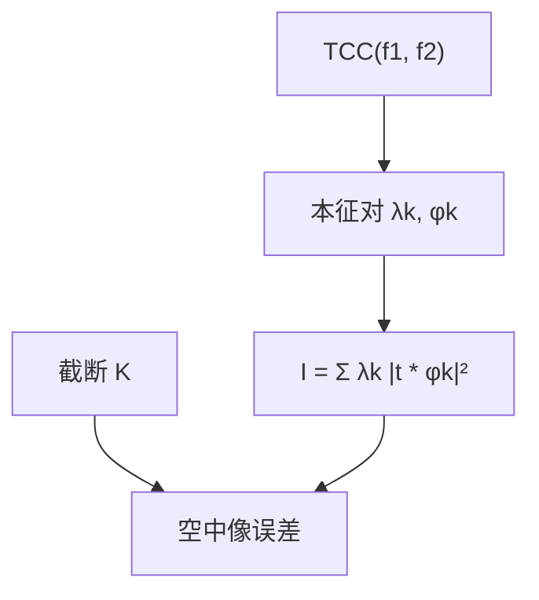

# SOCS 分解

四维 TCC 是厄米核；本征展开把它写成少数相干系统的强度和。截断的是数值秩，不是另一套成像原理。

<footer>—— Hopkins 核的本征分解；光刻上的和差相干（SOCS）见 Cobb 的模型基 OPC 表述，以及 Pati &amp; Kailath 对双线性核 SVD 的光学讨论</footer>

[上一课](/litho/abbe-vs-hopkins)对照了扫源与预计算 TCC。缺口是：四维核直接往全芯片上套太重，主干 Hopkins 课只点到「可以本征展开」，还没有把**和差相干系统（SOCS）**写成可调用的接口。本课钉分解与截断。时间 / 空间相干的物理差别留给[下一课](/litho/temporal-spatial-coherence)。不重推 $k_1$，不引用未公开的引擎缺省秩。

## 问题

空中像 $I=\iint T(\mathbf{f}_1)T^*(\mathbf{f}_2)\,\mathrm{TCC}(\mathbf{f}_1,\mathbf{f}_2)\,e^{2\pi i(\mathbf{f}_1-\mathbf{f}_2)\cdot\mathbf{x}}\,d^2\mathbf{f}_1 d^2\mathbf{f}_2$。把 TCC 看成对 $(\mathbf{f}_1,\mathbf{f}_2)$ 的厄米核，存在本征系统 $\{\phi_k,\lambda_k\}$，使得

$$
I(\mathbf{x})=\sum_k\lambda_k\bigl|(t*\phi_k)(\mathbf{x})\bigr|^2
$$

（空域写法：每只 $\phi_k$ 是一个相干核，$\lambda_k\ge 0$ 为权重）。这就是 SOCS：Sum of Coherent Systems。缺口因此是把上一课的核变成**可截断的相干通道和**，而不是再扫一遍源点。

完全相干：秩 1，回到单只 PSF。完全非相干：秩高，通道多。部分相干通常只要数十个主通道就能让空中像误差落到 OPC 可接受的范围——这是计算事实，不是新的衍射理论。

### 截断是误差预算

丢掉小 $\lambda_k$ 等于丢掉弱相干通道。误差在开阔区、大位移交叉项上往往更可见。报「用了 SOCS」必须声明保留几阶、误差范数怎么验，不能把秩写成物理 $\sigma$。换照明或换镜头指纹，本征系统全换；旧核的前几阶不能继承。

Pati &amp; Kailath (JOSA A, 1994) 从双线性成像写 SVD；Cobb 把它接到全芯片碎片求值。本课要的是接口：强度是加权相干像之和。GPU 与稀疏网格是工程，不是定义。

## 方法

数值上把离散 TCC 做成矩阵（或用源点积分构造等价算子），求前 $K$ 个本征对。每个 $\phi_k$ 与物体做一次卷积（或 FFT 乘），模方加权相加。这比 Abbe 扫成百上千源点通常更省，因为 $K\ll N_s$ 在平滑照明下成立；环形、多极照明的有效秩会升高。

等晕假设：一场点一副核。扫描狭缝上镜头指纹随场变，则 $K$ 套核随场插值，不是「全场一张 SOCS」。矢量 TCC：每个偏振块分别分解，或拼成更大的核再分解——通道数再乘，定义不变。

### 与傅里叶骨架的关系

每一通道仍是[第一课](/litho/fourier-pairs-convolution)的卷积。SOCS 没有引入新的变换对，只是把部分相干的切片基底从「源点」换成「TCC 的本征函数」。源点基底不正交；本征基底按能量排序，所以能截。

## 机制

TCC 的平滑来自光瞳与源都是有限支撑的积分核，故奇异值衰减。衰减快，低秩好用；源上细节多（极细偶极、像素化 SMO），衰减慢，Abbe 或更高 $K$ 更合适。这就是上一课「何时扫源、何时预计算」在秩语言里的答案。

OPC 每动一条边，只需用同一组 $\phi_k$ 更新局部卷积，不必重分解——前提是照明与 $P$ 没变。这是模型基 OPC 能全芯片迭代的光学理由之一，规则表做不到这一点。

## 边界

SOCS 是薄物体、等晕、Hopkins 框架内的算法。掩模 3D 让 $T$ 依赖入射角，严格分解对物体不独立；实践用域分解或 Abbe。胶模糊是额外卷积，可乘在通道上，不是 TCC 的本征值。禁止把某代计算光刻软件的默认 $K$ 写成物理常数。

## 小结

- SOCS：TCC 本征展开，强度为加权相干像之和。
- 截断 $K$ 是数值误差，换照明必须重分解。
- 每通道仍是傅里叶卷积骨架。
- 矢量与场相关只增加核的套数。
- 下一课：通道背后的时间相干与空间相干。
- 出处：Hopkins (1953)；Pati &amp; Kailath, *JOSA A* (1994)；Cobb 对 SOCS / 模型 OPC 的表述。
