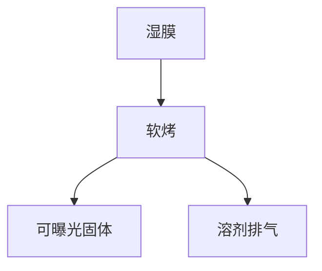

# 软烤与溶剂

软烤把旋涂液膜收成可曝光固体：溶剂残留决定扩散、粘附和空洞，温度均匀性决定 CD 的热地图。

<footer>—— 据 Mack 对 PAB / soft bake 与溶剂残留的论述整理</footer>

[上一课](/litho/trilayer-soc-sog)把层铺上。缺口是：还是湿的。本课钉软烤（PAB，post-apply bake）：赶溶剂、定自由体积。主干已有 [PAB 与溶剂残留](/litho/pab-solvent) 在胶化学补层——若该课已写，本课只补**轨道热板实现**，不重做玻璃化温度。后课显影假定烤完。

## 问题

溶剂留太多：曝光后酸扩散异常、真空放气、粘附差。烤过头：膜致密、敏感度漂移、甚至提前降解 PAG。径向与片间热不均匀，等价于每场不同 $d$ 和不同动力学。[热板均匀性](/litho/hotplate-uniformity) 后课展开地图；本课钉「为什么必须烤」和溶剂的角色。

## 方法

热板或接近式烘烤，温度–时间是胶的契约。排气把溶剂带走，避免在膜上再凝。多层分别烤，底层烤温可能高于成像层，以免把上层再溶。残留用称重、FTIR 或厂内代理指标跟，不在本课发明光谱。

接近式烤减少颗粒接触，热阻更大，均匀性更依赖气隙控制。接触式热阻小，颗粒风险高。轨道选型是缺陷与 CDU 的权衡。

## 机制

溶剂塑化聚合物，自由体积大，PEB 时酸更好走。烤走溶剂，体积收缩，应力可致裂纹——尤其厚 SOC。残留溶剂还改变折射率，轻微移动摆动曲线。

## 边界

本课不是 PEB。PEB 在曝光之后，驱动酸扩散，见 [PEB 温度](/litho/peb-bake)。下一课显影液如何接触固体膜。

## 小结

- 软烤赶溶剂，把旋涂膜变成曝光对象。
- 过与不及都改扩散与光学有效厚度。
- 出处：Mack 对 PAB 的论述；轨道热板实践。
