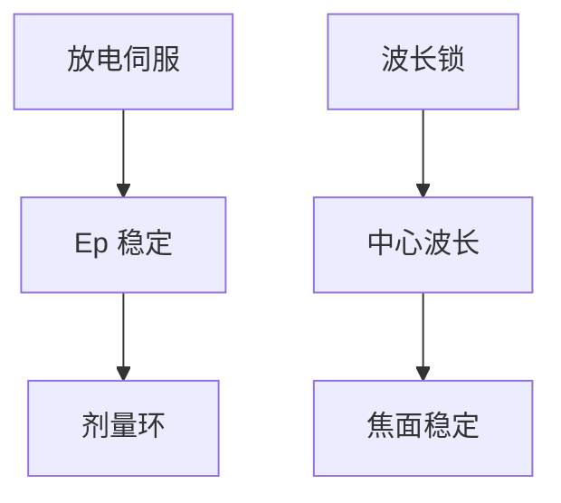

# 光源功率稳定

闭环能修慢漂；激光自己不稳，剂量环会饱和或把噪声锁进每场。稳定是光源规格，不是胶的事。

<footer>—— 接续 [脉冲能量](/litho/pulse-energy-rep-rate)、[剂量传感闭环](/litho/dose-sensor-loop)</footer>

[上一课](/litho/dose-sensor-loop)把机台环说完。缺口回到激光头：高压、气体、温度如何让 $E_p$ 与中心波长在闭环带宽内足够平。本课收束「从激光到狭缝」，下一单元进物镜。

## 问题

放电高压抖、腔温漂、气流不稳，造成脉冲能量与波长的 1/f 噪声。剂量环积分若干脉冲，对场内仍可能留下条纹。波长不稳则焦面抖，像 [色差](/litho/chromatic-bandwidth) 的时变版。只加厚胶窗口，不修光源，是用化学买光学。

## 方法

激光侧：能量伺服（放电高压）、波长锁（压窄元件微调）、冷却与气体流控。规格：脉冲能量 σ、波长 σ、在目标带宽内的时间。与机台环分工：激光修快变量，剂量环修慢变量与场间。

刚换气后的瞬态最差。量产配方应规定「换气后丢弃的脉冲或场数」，不要第一场就当黄金 CD。

## 机制

准分子增益对粒子数与温度敏感。伺服把增益钳在工作点。锁波把光栅角度或温度当执行器。两者都有执行器行程：到顶就只剩机台降速。

## 边界

物镜加热是下一单元：即使光源完美，镜头仍会自己变。不要把镜头热漂写成激光不稳。

## 小结

- 光源稳定约束 $E_p$ 与波长的快变量。
- 与剂量环分层；换气瞬态要丢弃。
- 出处：脉冲与剂量课；准分子伺服通识。
