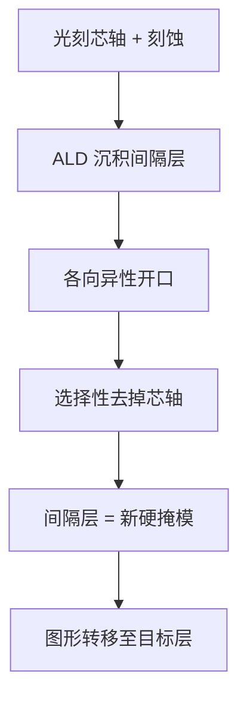
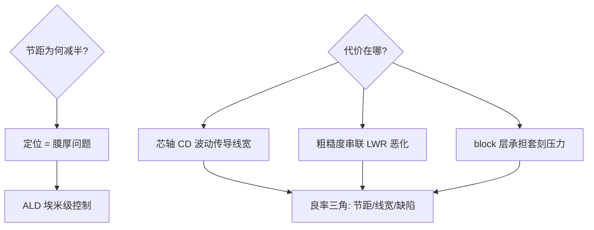

# spacer-etch-sadp

SADP 不靠镜头画第二条线，靠第一层图形当模具：沉积一层、刻一个方向，间隔层自己长出半节距的墙。

<footer>—— 据 ASML/TEL SADP 工艺文献；NEC/东芝 32nm 闪存量产记录</footer>

[后 Hyper-NA 的极限讨论](/litho/post-hyper-na-limits)把「光刻分辨率到头了」摆在桌面，本课是图形化的第一条出路：**自对准双重图形化（SADP）**——用光刻画一次粗线，靠薄膜沉积与定向刻蚀长出间隔层，把节距折半。它是 20nm 之后闪存与逻辑的量产主力。本课不做 LE3/LE4 的推广计数。

## 问题

193i 浸没式单次曝光的分辨率极限约 38–40nm 半节距，而 NAND 要 15nm 以下。双重曝光（LELE 两次光刻）受套刻精度折磨——两条线各自的位置误差直接相加。缺口：**自对准**——第二条线不是「画」出来的，是从第一条线的侧壁「长」出来的，位置由薄膜厚度决定，精度是埃米级而非套刻级。

术语翻译：间隔层（spacer）= 沿芯轴侧壁各向异性沉积出的薄膜墙，厚度 = 目标半节距；芯轴（mandrel/芯轴）= 被刻蚀掉的临时图形；block（阻断层）= 切断不需要的间隔层的第二层光刻。

数字实例：目标 30nm 节距。光刻画 60nm 芯轴 → 沉积 15nm 氮化硅间隔层（两侧各 15）→ 刻掉芯轴 → 剩两条间隔层，中心距 60-15-15=30nm。节距由膜厚决定，膜厚控制 ±0.5nm 级——比任何套刻都准。

## 方法

SADP 流五步：光刻芯轴并刻蚀；各向异性沉积间隔层（ALD 保均匀）；间隔层开口（刻穿顶部、留住侧壁）；选择性刻掉芯轴；以间隔层为硬掩模转移图形到目标层。若需要的是「线」的补集（沟槽 vs 线条），间隔层本身就是答案——芯轴定义线，间隔层定义槽，两次使用各取所需。需要 cut/block 时再叠一层光刻，套刻要求只作用在「切断」而非「定位」。

直觉类比：像用蜡笔在墙上画粗道子，再沿道子两边贴胶带、撕掉蜡笔——两条胶带的位置由「道宽 + 胶带厚」决定，不由手抖决定；胶带厚度是纳米级可控的，手抖不是。

## 机制

自对准的本质是**把定位问题转化为膜厚问题**。套刻误差是光刻机与晶圆的系统性错位（几十纳米级、需昂贵的对准开销），而间隔层厚度由 ALD 的每周期生长量（约 0.1nm/周期）决定，晶圆内均匀性 <1%。代价在三处：**线宽由芯轴与膜厚共同决定**——芯轴 CD 波动直接传导；**LWR（线宽粗糙度）叠加**——芯轴边缘粗糙度与间隔层粗糙度串联恶化；**block 层回归**——切断间隔层的光刻承担了全部随机图形，其套刻误差决定良率上限，这也是 SADP 时代 overlay 计量被推到 <2nm 的原因。

常见误区：把 SADP 与 LELE 混为一谈——LELE 两条线两次光刻、误差相加，SADP 一条线长两条、误差是膜厚级；另一误区是「间隔层越薄越好」——膜厚即半节距，膜厚崩塌意味着节距崩塌，SADP 的分辨率红利与膜厚工艺窗口是同一枚硬币。

## 边界

SADP 只能做**周期性图形**：随机逻辑的 cut/block 密度高时收益被 block 层套刻吃掉，故 SRAM/闪存先吃红利、逻辑后跟进。EUV 时代 SADP 的角色变化：EUV 单次即可 30nm 节距，SADP 从「分辨率救星」转为「节距倍增 + 缺陷兜底」的选择。SAQP（四重图形化）把间隔层做两轮，节距再折半，但缺陷叠加让良率管理成为核心工艺。与[虚拟填充与密度规则](/litho/dummy-fill-density)的接续：SADP 对图形规律性的要求，正是密度规则必须Preserve 的前提——图形化与填充是一对约束。

直觉类比：SADP 像「描红」——不用再手写第二个字（二次光刻），把第一个字的笔画轮廓描一圈（间隔层），字与字的间距由描边厚度决定；描边均匀（ALD）比再写一次（套刻）工整得多。

## 小结

- SADP = 芯轴光刻 + 间隔层沉积，节距折半且定位转膜厚问题。
- 芯轴 CD 与粗糙度传导、block 层套刻是三大代价。
- 周期性图形的主场；SAQP 再折半、EUV 时代转型为节距倍增器。
- 出处：ASML SADP 技术白皮书；TEL 间隔层工艺文献；IEEE IITC SADP 缺陷研究。
