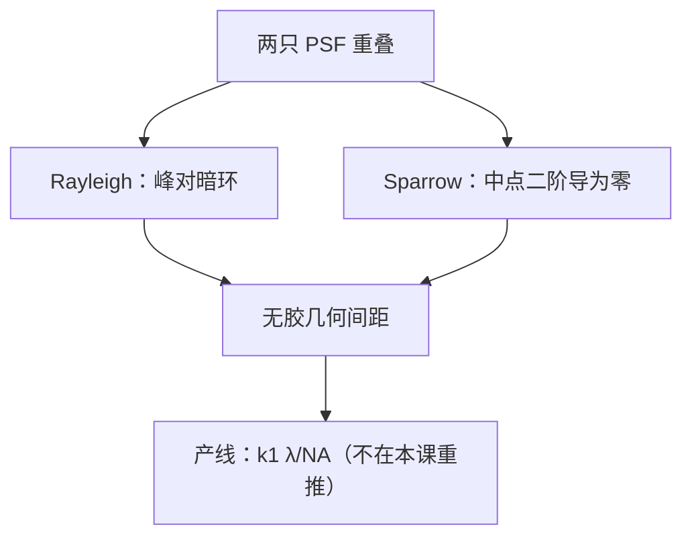

# Sparrow 对 Rayleigh 判据

两点刚可分辨，可以定义为中间还剩一点下凹，也可以定义为中间已经走平。系数不同，物理仍是两只核的重叠。

<footer>—— Sparrow (1916) 对光谱分辨的定义；Rayleigh 的两针孔习惯读法见 Born &amp; Wolf</footer>

[上一课](/litho/ctf-otf)给出了 CTF / OTF 的支撑与形状。缺口是：显微镜教材里的「刚可分辨」有不止一种几何，主干[瑞利课](/litho/rayleigh-litho)已经把产线式子钉成 $k_1\lambda/\mathrm{NA}$，补层还缺 **Sparrow 与显微镜 Rayleigh 的对照**——以免后课把 0.47、0.61 和 $k_1$ 三个数混成一个。本课不重推产线 CD 公式。Abbe 法与 Hopkins 法的计算顺序留给[下一课](/litho/abbe-vs-hopkins)。

## 问题

非相干两点，像是两只 Airy（或两只 $|h|^2$）相加。Rayleigh 的习惯说法：一斑的最大值落在另一斑的第一暗环上，中间强度约为峰值的 0.735，看起来刚有鞍。圆孔给出中心距约 $0.61\,\lambda/\mathrm{NA}$。Sparrow（1916，光谱学）改判据：调节间距，直到合成强度在中点的二阶导数为零——剖面走平、即将出现下凹。同一圆孔、非相干下，间距大约 $0.47\,\lambda/\mathrm{NA}$。

缺口不是再画一次 PSF，而是：这两条都是**两点、线性、无胶**的几何，都不是产线 $k_1$。把 Sparrow 写成「更激进的光刻分辨率」，会假造一条没有照明、没有阈值的工艺。

### 相干两点更糟

完全相干、同相两点：场相加再取模方，中间不容易出现鞍，有效分辨比非相干差。反相两点可以出现零，看起来「更好」。光刻掩模的相邻开口相位由照明与物体共同决定，不能套光谱学里的相干两点公式。部分相干落在中间，要用 TCC 算合成强度，不要在 Sparrow 系数上插值冒充 $\sigma$。

Rayleigh 自己讨论的是衍射图样可否分开；0.61 来自 $J_1$ 零点，不是他为光刻写的工艺因子。产线把比例改称 $k_1$，打包照明、掩模与胶，见主干瑞利课。本课只对照两种显微镜/光谱判据。

## 方法

对给定 PSF，沿连线放两个等权点源，扫间距 $d$，看合成 $I(x)$：

- Rayleigh：一峰对齐另一核的指定零点（圆孔 Airy 即第一暗环）。
- Sparrow：$\partial^2 I/\partial x^2|_{x=0}=0$（中点）。

换孔径切趾、换遮拦、换像差，两个系数都变，因为核变了。因此「Sparrow 常数」不是普适物理常数，只是对那只核的一个数。报判据必须声明：相干还是非相干、圆孔还是实际光瞳。

光刻要的不是两点鞍，而是阈值等高线是否在规格内、NILS 是否够。两点判据最多用来读「核有多宽」，与[上一课](/litho/psf-airy)的光学直径是同一类量。

### 与传递函数的关系

正弦物的 OTF 在某个 $f$ 仍大于零，不保证两个亮点按 Sparrow 可分：一个是周期调制，一个是两点脉冲。CTF/OTF 回答频率还在不在；两点判据回答脉冲对的空域重叠。后课禁戒节距走频率，接触孔走二维核重叠，不要混用判据名字。

## 机制

走平（Sparrow）比刚出鞍（Rayleigh）要求两核靠得更近，所以同一只 Airy 下 Sparrow 间距更小。这只说明判据更「乐观」，不说明系统分辨率提高了。胶的阈值可以切在鞍上或切在斜坡上，等效判据随 $I_\mathrm{th}$ 与 $\gamma$ 变，这正是 $k_1$ 存在的原因，本课不把它展开成新公式。

## 边界

Sparrow 原文针对光谱线；搬到投影光刻只作核宽度的对照。禁止用 0.47 替换产线 CD 式中的 $k_1$，也禁止把 0.61 叫成「理论 $k_1$」。矢量成像下两点核随偏振变，判据数字跟着变，定义结构不变。

## 小结

- Rayleigh：峰对暗环，圆孔非相干约 $0.61\,\lambda/\mathrm{NA}$。
- Sparrow：中点二阶导为零，同条件下间距更小（约 $0.47\,\lambda/\mathrm{NA}$）。
- 两者都是无胶两点几何，不是产线 $k_1$。
- 相干两点不能套非相干系数。
- 下一课：同一套核，Abbe 循环对 Hopkins 核。
- 出处：Sparrow, *Astrophysical Journal* (1916)；Born &amp; Wolf；主干瑞利课的 $k_1$ 惯例。
