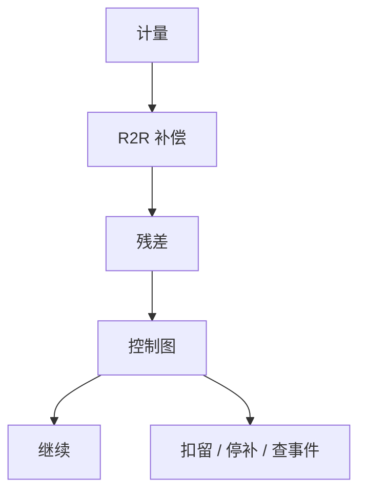

# SPC 与控制图

控制图问的是过程是否仍是同一个过程；规格问的是这一片能不能出货。把规格线画在控制图上当判异规则，两种错误会一起犯。

<footer>—— 对照 Shewhart 控制图传统；SEMI 与半导体厂对 SPC 的通称</footer>

[上一课](/litho/sampling-plan)给出看见什么。缺口是判决：这些点何时算受控漂移（交给 APC）、何时算异常（停机、重工、排除数据）。本课钉 SPC 与控制图。套刻专用回路，留给[下一课](/litho/overlay-control-loop）。

## 问题

Shewhart 图用过程自身的 $\sigma$ 建控制限，检测均值/方差偏移。规格限来自窗口与电学，通常宽得多。过程可以受控却能力不足（限很窄的悬崖），也可以能力充足却失控（突发指纹）。光刻上：剂量缓慢老化应 APC；突然的镜头污染或错版应 SPC 停。混用两条限，APC 会去「补偿」一次装版错误，把后续批带进沟里。

缺口是**异常与补偿的分工**，不是重讲 3σ。Western Electric / Nelson 规则在光刻要谨慎：自相关（R2R 已补过的数据）会让规则误报。应用残差图（补偿后）做 SPC，而不是对原始 CD 再报一次 APC 已知的斜坡。

### 多参数不是多张独立图

CD 与套刻、X 与 Y、场心与边场相关。只看场平均 CD，边场弓形不报警。多元 SPC 或先看关键指纹的残差范数。本课不推 T² 公式，只要求判异对象与抽样、APC 项一致。

错因分层：轨道告警不要停扫描机；套刻失控不要先改剂量。控制图标题应是「谁的执行器」，不是「光刻」一个桶。

## 方法

图：I-MR、Xbar-R、残差 EWMA。分层：机台、腔体、产品、层。规则：限外、趋势、与事件对齐。动作：抑制 APC、触发加密抽样、批次扣留。与工具匹配：机台间差用匹配图，不当成单机失控。数据质量：SEM 收缩、配方换算法应换图，否则假失控。

控制限应在参考计量尺度上建立，并在匹配或算法升级后重建。Shewhart 传统假定独立同分布；光刻数据有自相关，故优先画补偿后残差，规则从简，事件对齐从严。

## 机制

受控过程仍有方差；控制限估计的是这方差。APC 降低了均值漂移后，残差 σ 可能下降，应重建限，否则过敏感。反过来，APC 饱和（打到限幅）应升格为 SPC 异常——能力或扰动已超出控制器。这是「不可再补」的操作定义。

补偿后残差才是受控与否的对象。规格限管出货；控制限管是否还是同一个过程。饱和即异常。

## 边界

SPC 不定位缺陷坐标（那是检测）。不把控制图当良率模型。不发明未公开的厂内规则条数。

后课默认：SPC 看补偿后残差与事件；限幅即异常。下一课把这套逻辑接到套刻网格。

## 小结

- 控制限与规格限分工：受控对出货。
- SPC 应画 APC 残差；自相关数据不要套朴素规则。
- 控制器饱和即 SPC 事件。
- 出处：Shewhart 控制图；SEMI / 半导体 SPC 通称。
