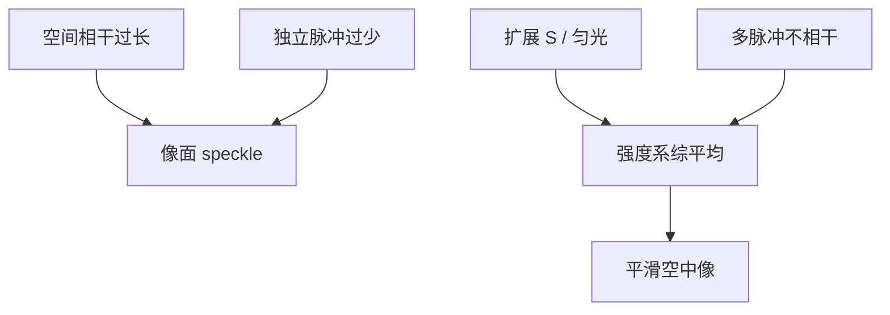

# 光源相干性与 speckle

相干光打在随机相位屏上，像面出现固定颗粒；积分足够多的不相干通道，颗粒才被平均掉。

<footer>—— Goodman, Speckle Phenomena in Optics；互相干接口见 Born &amp; Wolf</footer>

[上一课](/litho/temporal-spatial-coherence)把时间轴与空间轴拆开。缺口是：若空间相干过长、时间积分又不够，空中像会带**斑纹（speckle）**——不是 OPC 没修到的禁戒节距，而是相干叠加的随机干涉图。本课钉光刻为什么必须把 speckle 洗掉。标量骨架在高 NA 何时失效，留给[下一课](/litho/scalar-breakdown-high-na)。

## 问题

理想计算里掩模是确定的 $t(\mathbf{x})$，像是确定的 $I$。真实照明若接近单模、波前碰到粗糙面、多层膜或气体扰动，像面场是随机相幅叠加，强度呈负指数统计，对比接近 1 的颗粒，横向尺度约等于 PSF 宽度。这就是 speckle。

缺口不是再定义横向相干长度，而是：投影光刻的空中像若带着颗粒，阈值轮廓会随颗粒抖动，CD 与孔出现随机缺失的假象——和 EUV 光子泊松不是同一机制，却同样吃良率。准分子激光被设计成许多纵模、照明被设计成填充 $S$，正是为了让 SOCS 通道数足够、时间上平均足够。

### 静态斑与扫描平均

若随机屏相对曝光静止、光源又太相干，颗粒在整段曝光里固定，剂量积分帮不上忙。扫描狭缝的时间平均只沿扫描向糊一次，糊不掉垂直扫描向的颗粒。必须在**照明侧**降低空间相干（扩展源、匀光、衍射光学元件打散），或在时间侧用足够多独立实现（脉冲间互不相干）。EUV 等离子体脉冲之间空间模式也在变，对 speckle 是有利的；不要把它和剂量稳定性混成一个「源质量」分数。

显微镜激光照明、干涉光刻、某些检验工具会故意保留高相干，于是 speckle 必须另管。扫描仪投影成像默认要的是平滑空中像。本课对象是后者。

## 方法

判据：相干体积里独立单元数 $N$。空间上 $N_s\sim$ 源填充的分辨率元；时间上 $N_t\sim$ 曝光时间内互不相干脉冲（或相干时间去除以曝光时间）。强度涨落相对均值约 $1/\sqrt{N_s N_t}$。工程上把 $S$ 做大、脉冲做多，直到颗粒对比远小于工艺对比预算。

计算上：TCC 已经假定源点互不相干并把强度相加——这正是对 speckle 的系综平均。若模拟只用单源点相干成像去代表整场，会人为造出不存在的条纹与颗粒。Abbe 法源点过疏，也会留下假纹理，看起来像 speckle，其实是求积误差。

### 与随机性课的边界

EUV 缺孔、LER 的泊松与化学随机，是光子与分子计数；speckle 是经典相干场的随机干涉。胶不能「平均掉」已经写进剂量图的颗粒，除非再加一层空间模糊——那是在付 NILS 的账。不要把 speckle 写进 RLS 三角里当第四个字母。

## 机制

随机相位使 PSF 旁瓣之间的干涉从相长跳到相消，亮暗斑的特征尺寸跟核走，故颗粒「看起来像分辨率」。降低空间相干等于让许多独立核的强度叠上，对比按 $1/\sqrt{N}$ 掉。这与部分相干降低密栅对比不是同一句话：后者是确定 TCC 对确定物体的调制下降；前者是同一物体上叠加随机纹理。

薄膜界面若有粗糙，也可以做相位屏。DUV 浸没气泡、水印是缺陷，不是经典 speckle 统计；EUV 多层粗糙既贡献散射晕光，也可贡献斑，主干 flare 课管晕光，本课只保留「相干随机干涉」这一条。

## 边界

Goodman 的完全相干 speckle 统计（负指数、对比 1）是极限。部分相干、偏振分集、有限积分都会降低对比。禁止编造某台 EUV 的「speckle 纳米表」。也不要把像素化 SMO 的确定衍射图叫成 speckle。

## 小结

- speckle 是高空间相干加随机相位的颗粒，尺度约 PSF。
- 扩展源与多脉冲独立实现把它平均掉；TCC 默认已经做了源点平均。
- 与光子泊松、与确定的禁戒节距都不是同一机制。
- 单源点模拟会伪造颗粒。
- 下一课：标量卷积骨架在高 NA 的失效。
- 出处：Goodman, *Speckle Phenomena in Optics*；Born &amp; Wolf。
