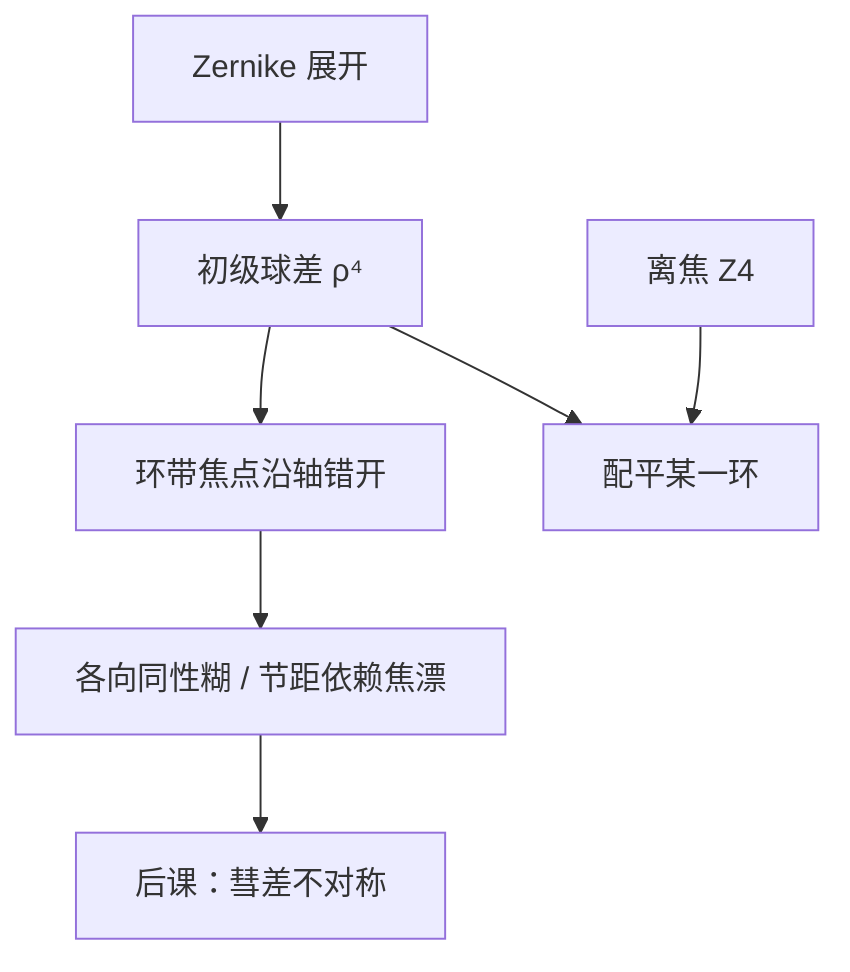

# 球差

Zernike 表已经把光瞳相位展开；初级球差是其中旋转对称的 $\rho^4$ 项——边缘带的焦点相对近轴移动，糊斑仍圆，只是最佳焦面随孔径环走。

<footer>—— Born &amp; Wolf, Principles of Optics 对初级（Seidel）球差的讨论</footer>

[上一课](/litho/zernike-aberrations)把 $W$ 收成系数向量，并声明 Fringe / Noll 不可混号。缺口是：**先把初级球差这一项讲完**，而不是停留在「表上有这一列」。彗差的不对称留给[下一课](/litho/coma-aberration)。不要从瑞利 CD 重讲，也不要引用未公开的镜头球差预算。

## 问题

展开式里球差与离焦都旋转对称，容易被当成同一种糊。离焦是 $\rho^2$（Fringe $Z_4$），初级球差是 $\rho^4$（Fringe 常记在 $Z_9$ 一带，含配平用的低阶项）。边缘光线的光程比近轴多出随 $\rho^4$ 涨的一块，不同孔径环的焦点沿轴错开。缺口因此是这根**带焦点移动**，而不是再解释正交多项式。

轴上点物的几何像差里，球差是唯一不随视场变的初级项（Seidel $S_I$）。视场一离轴，彗差、像散会来；本课先钉轴上。

### 配平不是把球差消掉

加 $Z_4$ 可以把某一个环带的焦点拉回晶圆，RMS 下降，边缘与近轴仍对不齐。计量上的「球差已补偿」往往指配平后的残差小，不是 $\rho^4$ 系数为零。通过焦点的 CD 不对称、等焦点漂移，常常是配平选择的后果。

报球差必须带约定：Noll 与 Fringe 的「第几项」不是同一个多项式。上一课已经警告过；球差是最常报错号的一列。

## 方法

Seidel 初级球差波前 $W\propto \rho^4$（再按孔径与视场的无量纲化写成 $S_I$）。成像核仍圆对称：点扩散是圆斑，没有彗尾，没有 H/V 劈裂。密图形走光瞳边缘，对 $\rho^4$ 最敏感；孤立线频谱更宽，吃到的是配平后的折中。TCC 对每个场点可以乘不同的球差系数——轴上理想不代表狭缝边缘理想。

Born &amp; Wolf 把球差与正弦条件、齐明条件放在一起：设计上用多个折射面抵消 $S_I$，残差进 Zernike。本课不追透镜配方，只要求空中像仿真把这一项乘进 $P$。

### 通过焦点的各向同性

Bossung 在球差下仍近似上下对称的「H/V 同类」，但最佳焦随节距走：不同空间频率对应不同有效环带。这与照明 $\sigma$ 改变环带权重是同一逻辑。不要把它写成像散——像散会把水平和垂直的最佳焦劈开。

热致球差随曝光负荷变。冷态出厂的 $c_9$ 不等于扫描时的 $c_9$。控制上这是镜头加热补偿，与定义无关。

## 机制

相位 $\rho^4$ 在像面与一个圆对称但带球差的核卷积。边缘带相对近轴有额外光程，相干叠加在最佳配平面上仍有残差环。频率上，越靠近截止，权重越靠光瞳边，$\rho^4$ 越大，NILS 先掉——与离焦「高频先死」同构，径向幂次更高，配平曲线不同。

同一套系数乘在 Jones 两通道上。球差不是偏振；TM 已弱的密线对残差更脆。

### 后课默认的接口

说到轴上、旋转对称的残差，先问初级（及高阶）球差与所用配平，再问焦深窗口。彗差、像散、畸变不要塞进这一项。色差会让 $S_I$ 随 $\lambda$ 变，本课单色。

## 边界

球差展开不含杂散光、不含多层膜散射。EUV 反射镜同样用 $\rho^4$ 说话，High-NA 变形光瞳要另写径向坐标。禁止编造未公开的 RMS 毫波数；Born &amp; Wolf 的 Seidel 项与上一课的拟合接口已经够用。截断阶数之外的高阶球差照样吃对比。

## 小结

- 初级球差是旋转对称的 $\rho^4$；离焦是 $\rho^2$，可配平不可等同。
- 糊斑仍圆；最佳焦随孔径环 / 节距走。
- 报系数必须声明 Fringe 或 Noll。
- 与 TE/TM 相乘，不替代矢量损失。
- 不对称的彗差下一课。
- 出处：Born &amp; Wolf, *Principles of Optics*。
