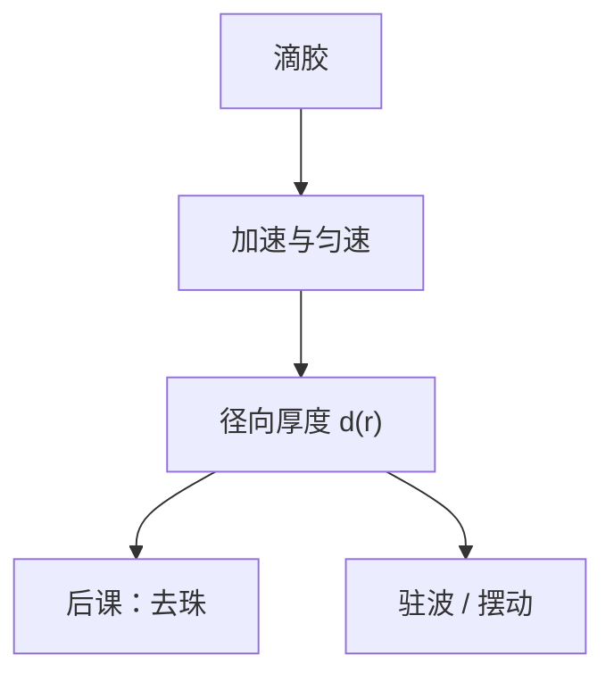

# 旋涂与厚度均匀性

胶厚不是配方桶上的标称纳米数，是转速、粘度和排气把液膜拉成的径向剖面。窗口里的剂量对厚度敏感，均匀性先于 OPC。

<footer>—— 据 Mack / Levinson 对 spin coating 与摆动曲线的论述整理</footer>

[上一课](/litho/dry-resist-develop)把干法显影胶钉成随机性课序的收束。本课是补层「涂胶显影与轨道」第一课：成像与胶化学已经在主干里，缺口转到**曝光前液膜怎么铺成可重复的厚度**。后课 EBR、三层、软烤都默认你会旋涂剖面，不再从 Dill 或瑞利讲起。

## 问题

[摆动曲线](/litho/swing-curve) 与 [胶厚选择](/litho/resist-thickness-selection) 假定厚度 $d$ 是一个数。轨道上 $d=d(r)$：中心厚、边缘珠、缺口处的彗尾。CD 对 $d$ 的敏感经过驻波与吸收，径向几个纳米就能把剂量窗口吃掉。把 CDU 全写成扫描仪剂量，是把涂胶误差派给曝光。

缺口因此是旋涂的控制量：粘度、滴胶量、转速–时间曲线、加速度、杯内气流与排气。不写这些，后课热板与缺陷没有厚度这个前置。

静态滴胶后的加速段决定气泡与条纹；匀速段决定平均厚度。只报最终 rpm、不报加速度，复制不了剖面。

## 方法

工艺窗口用「目标 $d$ ± 规格」加径向扫描（椭偏或光谱）。转速升高，离心力增大，平均厚度下降，近似随 $\omega$ 的幂次减薄（经验幂因胶而异）。边缘珠另课切除。缺口、标记、已有形貌会改局部流场——前层拓扑不是旋涂课能抹平的，要靠 BARC 与平坦化。

## 机制

液膜在旋转坐标系里受离心、粘滞与表面张力。挥发性溶剂在旋的过程中走，粘度随时间升，剖面被「冻」在软烤前。排气过强会局部干边；过弱则溶剂氛不均。同一标称 rpm，杯盖与温湿度变了，等价于换胶。

## 边界

本课不写喷墨或狭缝涂布的面板级替代。不重写 [驻波与 BARC](/litho/standing-wave-barc) 的干涉公式。下一课只切边缘珠，不改中心厚度设定。

## 小结

- 旋涂给出 $d(r)$，不是桶上的标称厚度。
- CDU 有一块来自径向剖面与排气，不是全是剂量。
- 加速度与气流与 rpm 同为一等参数。
- 出处：Mack / Levinson 对旋涂与厚度的工艺论述。
