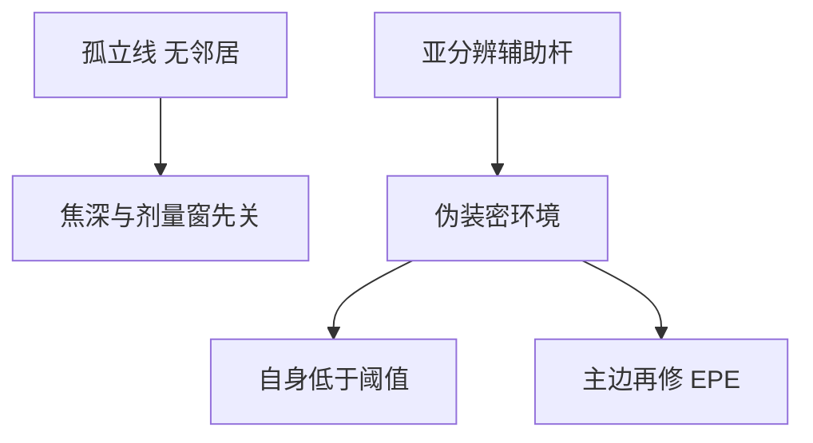

# 亚分辨辅助图形 SRAF

密线靠邻线提供衍射环境；孤立线没有邻居，焦深与剂量窗先关。亚分辨辅助杆把环境伪装成「有邻居」，自己却印不出来。

<footer>—— 据 Mack 对 scattering bars / 辅助图形的论述，以及 Liebchen 等对 SRAF 放置与可印性约束的计算光刻表述</footer>

[上一课](/litho/alt-psm)用 0/π 交替把密线暗区做黑。缺口是孤立与半孤立：同一层里疏的线、线端、孔，工艺窗与密阵列对不上，交替染色也帮不上没有邻居的开口。本课钉亚分辨辅助图形（SRAF、scattering bars）。吸收体厚度让细杆先感到三维，留给[掩模 3D](/litho/mask-3d-effect)，本课仍以薄屏为主。

## 问题

RET 把密栅的 $k_1$ 往下推之后，孤立线的空中像仍接近「单开口衍射」：焦深窄、与密线的最佳剂量错开，E–D 重叠窗口被孤立图形切掉。上一课的相位边只出现在相邻开口之间；孤立线两侧若都是大片铬或大片石英，没有相消环境可借。

缺口因此是在主图形旁插入印不出来的细特征，改变主图形的局部频谱，而不是再做一次交替染色。没有 SRAF，OPC 只能加宽或加锤头，窗口仍按孤立线的焦深走。

### 印不出来是规格，不是意外

辅助杆宽度、与主图形的间距，必须落在「空中像低于胶阈值」的一侧。太宽或太近会印出残影、甚至桥接；太远则等效没有邻居。这是掩模规则（MRC）与可印性检查的交：SRAF 是物体透过率的一部分，却不是设计层上的器件图形。

SRAF 在晶圆上不应作为独立线条存在。把辅助杆画进 GDS 的器件层当真线，是把 OPC 装饰和电学多边形混层。

## 方法

规则型：按主图形宽度与局部密度查表，在两侧放一条或两根散射条，宽度低于分辨率。模型型：在 OPC 循环外（或耦合）优化杆的位置与宽度，目标是 PV-band 或孤立–密线的剂量/焦点交。Liebchen 一类工作把放置写成受 MRC 与「不得印出」约束的优化，而不是手画装饰。

掩模类型：二元或 att 版上最常见；交替版上杆的相位归属会与 0/π 染色打架，要额外规则。照明一换（偶极变环带），杆的最优位置就变，必须与光瞳绑定。

### 与 OPC 主循环的分工

主循环挪的是目标边，让边缘放置误差收敛。SRAF 改的是邻域算子本身：先把孤立环境改密，再让主边微调。只跑主循环、不放杆，等于在错误的 TCC 邻域里修 CD。评价必须看工艺窗口带，不能只看名义剂量下轮廓好看。

## 机制

细杆向掩模频谱注入高频与旁瓣能量，投影光瞳滤掉更高的级，残留部分改变主图形附近的背景与斜率（NILS）。焦点一漂，有邻居的空中像比真孤立更稳，于是孤立线的 DOF 向密线靠拢。这与 alt-PSM 不同：相移改的是相邻开口的相位；SRAF 改的是振幅型邻域，通常不要求 2-染色。

MEF 在细杆上很大：掩模 CD 一点误差，杆可能从「不印」变成「印出」。写入与检测要把 SRAF 当临界小特征，而不是当可忽略的装饰。多层不要共用 SRAF 规则表。

疏密并存时，辅助杆让孤立线的最佳剂量向密阵列靠拢，E–D 重叠才打得开。只把孤立线加宽到与密线同一 CD，焦深仍按单开口走，窗口交还是孤立图形说了算。

接触孔的辅助往往是二维小块或环形碎片，不是栅极两侧的长杆。孔层照搬线层 scattering bar 间距，会在对角方向造旁瓣。

## 边界

SRAF 不替代浸没，也不替代多重图形：它救的是单次曝光里疏密窗口交，救不了 $k_1<0.25$ 的节距。ILT 可以长出曲边助条，思想同类，写入与 MRC 另一套，本课不改写成逆光刻。EUV 上辅助图形仍存在，但阴影与随机效应让「不印」边界更毒，规则不能从 193 nm 薄屏直接复制。

本课不给辅助杆宽度的宇宙常数。具体纳米数随 $\lambda$、$\mathrm{NA}$、胶对比与光瞳变。出处停在 Mack 的 RET 框架与 Liebchen 等对放置优化的公开计算光刻工作。

细杆最先打破 Kirchhoff：宽度接近吸收体厚度时，透过不再等于面积比。后课 M3D 会把这笔收回；本课允许薄屏当零阶。

## 小结

- SRAF 给孤立 / 半孤立伪装密环境，自身设计为印不出。
- 与 alt-PSM 的相位染色分工：一个改邻域振幅，一个改相邻相位。
- 放置受 MRC 与可印性约束，须与光瞳、OPC 绑定。
- 细杆 MEF 高，掩模 CD 误差会让杆印出。
- 三维电磁下一课起算；本课薄屏零阶。
- 出处：Mack 对 scattering bars；Liebchen 等 SRAF 放置与约束优化的计算光刻表述。
